

# Úvod do DPZ, ukázka webových portálů pro prohlížení a stahování družicových dat

## Cíl cvičení

- Stručné seznámení s dálkovým průzkumem Země (úvodní prezentace dostupná zde: <a href="https://geo.fsv.cvut.cz/vyuka/155dprz/cv1/cv1_uvod-do-DPZ.pdf" target="_blank"> **PDF**</a>)
- Seznámení se s webovými portály poskytující družicová data
- Stažení družicových dat pro práci v následujících cvičeních

## Základní pojmy

- **Pixel**: Základní obrazový prvek. Místo, kterému odpovídá jeden měřený údaj. V rastru má jasně dané souřadnice.
- **Pásmo**: Část elektromagnetického spektra vymezená krajními vlnovými délkami. Množství pásem a jejich šířka určuje vlastnosti dat.

### Druhy rozlišení u družicových dat

- **Prostorové**: Udává velikost jednoho pixelu. Dělíme na nízké, střední, vysoké a velmi vysoké.
- **Spektrální**: Počet dostupných pásem. Data můžeme dělit na panchromatická (1 pásmo), multispektrální a hyperspektrální (desítky až stovky pásem)
- **Časové (temporální)**: Frekvence s jakou je družice schopna snímat stejné území na Zemi dvakrát po sobě.
- **Radiometrické**: Udává hloubku pixelu, tj. jakou nejmenší změnu v intenzitě záření dokážeme rozlišit (udáváno v bitech).

### Pasivní vs. aktivní senzory

**Pasivní senzory** zaznamenávají záření z jiných zdrojů, než je senzor. Nejčastěji se jedná o sluneční světlo odražené od zemského povrchu či o tepelné záření, které vydává samotná Země (případně objekty na ní). Nevýhodou pasivních senzorů je, že pokud pracují na optickém principu, tak nemohou pracovat v noci a nedokážou proniknout skrz oblačnost. Oproti tomu **aktivní senzory** využívají svůj vlastní zdroj záření, které vysílají ke zkoumanému objektu (např. Země), a měří množství záření, které se odrazí zpět. Narozdíl od od pasivních senzorů dokážou aktivní senzory získávat informace jak ve dne, tak i v noci. Pokud se navíc jedná radarová data, tak je možné provádět měření i přes oblačnost.

### Zpracovaná vs. nezpracovaná data

**Zpracovaná** data jsou taková data, u nichž byly provedeny základní radiometrické (kalibrace senzoru), geometrické (polohové) a atmosferické korekce. **Nezpracovaná** (raw) data jsou pak data bez zmíněných korekcí.

### Oběžné dráhy družic

Zpravidla se využívají dva druhy oběžných drah: **slunečně synchronní polární** oběžné dráhy a **geostacionární** oběžné dráhy.

- **Geostacionární** oběžné dráhy jsou kruhové dráhy ve výšce přibližně 36 000 km nad rovníkem. Družice na těchto oběžných drahách obíhají kolem Země stejnou úhlovou rychlostí jako je rotace země, a tudíž snímají neustále to samé místo na Zemi. Mezi družice využívající tyto oběžné dráhy patří napr. meteorologické družice.
- **Slunečně synchronní (helio-synchronní) polární** oběžné dráhy jsou přibližně kruhové dráhy ve výšce zhruba 800 km nad Zemí. Družice na těchto drahách přelétají v blízkosti pólů planety, a jak se Země otáčí, tak sledují zemský povrch každý den ve stejný místní čas a za stejného slunečního osvětlení. Na tyto dráhy se umisťují družice, které mají sledovat celý povrch planety.

### Program Copernicus

Jedná se o program EU pro pozorování Země. Je koordinován a spravován Evropskou komisí. Zaměřuje se na sledování atmosféry, pevniny, moří a klimatu. Data poskytovaná programem Copernicus jsou přístupná bez poplatků. V rámci většiny cvičení budou využívána právě data z programu Copernicus.

<iframe width="560" height="315" src="https://www.youtube.com/embed/MGJss4lDaBo?si=stLxSof5nyzOw-K-" title="YouTube video player" frameborder="0" allow="accelerometer; autoplay; clipboard-write; encrypted-media; gyroscope; picture-in-picture; web-share" allowfullscreen></iframe>
<iframe width="560" height="315" src="https://www.youtube.com/embed/vyoXKUuAf5E?si=GHzzrPdsDrmLBjnx" title="YouTube video player" frameborder="0" allow="accelerometer; autoplay; clipboard-write; encrypted-media; gyroscope; picture-in-picture; web-share" referrerpolicy="strict-origin-when-cross-origin" allowfullscreen></iframe>

V rámci programu Copernicus byla vypuštěna řada družic. Tyto družice spadají pod tzv. mise Sentinel. Jedná se o družice Sentinel-1, Sentinel-2, Sentinel-3, Sentinel-5 Precursor (Sentinel-5P) a Sentinel-6. Dále je plánováno vypuštění družic Sentinel-4 a Sentinel-5.

[:material-open-in-new: The Sentinel missions](https://www.esa.int/Applications/Observing_the_Earth/Copernicus/The_Sentinel_missions){ .md-button .md-button--primary .button_smaller target="_blank"}
{: align=center style="display:flex; justify-content:center; align-items:center; column-gap:20px; row-gap:10px; flex-wrap:wrap;"}

## Webové portály

Existuje řada webových portálů nabízející prohlížení a stahování družicových dat. Tyto webové portály lze rozdělit na portály nabízející volně dostupná data a portály nabízející komerční data. Komerční data nabízejí oproti volně dostupným datům často výhodu řádově vyššího prostorového rozlišení, nicméně je potřeba si za ně zaplatit. V rámci tohoto cvičení se podíváme na webové portály s volně dostupnými daty.

### Sentinel Hub EO Browser

- <a href="https://apps.sentinel-hub.com/eo-browser" target="_blank"> https://apps.sentinel-hub.com/eo-browser </a>

Tento webový portál slouží především k prohlížení, vizualizaci a porovnávání dat z družic Sentinel, Landsat a dalších. Je zde možné provádět i základní analýzy, tvořit časosběrná videa či stahovat obrázky s vytvořenou vizualizací. Nicméně samotná družicová data odtud stahovat nelze.

<iframe width="560" height="315" src="https://www.youtube.com/embed/m3pron0C0kE?si=CglaVu4tn8VdAuSP" title="YouTube video player" frameborder="0" allow="accelerometer; autoplay; clipboard-write; encrypted-media; gyroscope; picture-in-picture; web-share" allowfullscreen></iframe>

[:material-open-in-new: About EO Browser](https://www.sentinel-hub.com/explore/eobrowser/){ .md-button .md-button--primary .button_smaller target="_blank"}
{: align=center style="display:flex; justify-content:center; align-items:center; column-gap:20px; row-gap:10px; flex-wrap:wrap;"}

### Copernicus Browser

- <a href="https://dataspace.copernicus.eu/browser" target="_blank"> https://dataspace.copernicus.eu/browser </a>

Copernicus Browser je nově vzniklý webový portál pro stahování dat Sentinel a je součástí tzv. <a href="https://dataspace.copernicus.eu/" target="_blank"> Copernicus Data Space Ecostystem</a>. Navazuje na webový portál **Copernicus Open Access Hub**, jehož činnost byla ukončena na konci října 2023. Na rozdíl od svého předchůdce, kde především starší data byla v tzv. *offline* módu, a uživatel si o ně nejprve musel zažádat, by měl poskytovat veškerá data okamžitě. Kromě stahování umožňuje data i různě vyzualizovat a provádět základní analýzy.

<iframe width="560" height="315" src="https://www.youtube.com/embed/Am93Xi0PZ5o?si=gp6TSlNDp8OvsiMd" title="YouTube video player" frameborder="0" allow="accelerometer; autoplay; clipboard-write; encrypted-media; gyroscope; picture-in-picture; web-share" allowfullscreen></iframe>
<iframe width="560" height="315" src="https://www.youtube.com/embed/LImwmjTidFw?si=hkDG3C3ZSqmcNOfQ" title="YouTube video player" frameborder="0" allow="accelerometer; autoplay; clipboard-write; encrypted-media; gyroscope; picture-in-picture; web-share" allowfullscreen></iframe>

### Collaborative Ground Segment - Czech Republic

- <a href="https://dhr1.cesnet.cz/#/home" target="_blank"> https://dhr1.cesnet.cz/#/homeh </a>

Jedná se o webový portál, který je vizuálně i funkcionálně stejný dřívějšímu Copernicus Open Access Hub. Rozdílem ale je, že poskytuje data pouze pro Českou republiku, která jsou ovšem vždy v *online* módu, a tudíž se o ně nemusí žádat. Postup, jak stahovat data z tohoto portálu, je dostupný zde: <a href="https://geo.fsv.cvut.cz/vyuka/155dprz/cv1/cv1_stazeni-dat-Sentinel-2.pdf" target="_blank"> **PDF**</a>.

### USGS EarthExplorer

- <a href="https://earthexplorer.usgs.gov/" target="_blank"> https://earthexplorer.usgs.gov/ </a>

Webový portál vytvořený agenturou **United States Geological Survey**. Poskytuje řadu satelitních dat včetně dat z družic **Landsat**. Jak stahovat data Landsat z tohoto portálu bude ukázáno v jednom z pozdějších cvičení.

### ASF Data Search

- <a href="https://search.asf.alaska.edu/#/" target="_blank"> https://search.asf.alaska.edu/#/ </a>

Webový portál od <a href="https://asf.alaska.edu/" target="_blank"> Alaska Satellite Facility</a>. Jedná se o užitečný nástroj pro práci s radarovými daty. Více o něm bude zmíňeno v jednom z následujících cvičení.

## Stažení dat Sentinel-2

V následujících cvičení budeme pracovat s daty Sentinel-2. Proto si teď ukážeme, jak tato data stahovat. Pokud nám stačí data jen z České republiky, je možné postupovat již podle zmíněného návodu (<a href="https://geo.fsv.cvut.cz/vyuka/155dprz/cv1/cv1_stazeni-dat-Sentinel-2.pdf" target="_blank">**PDF**</a>) pro stažení dat z <a href="https://dhr1.cesnet.cz/#/home" target="_blank"> https://dhr1.cesnet.cz/#/home</a>. Pokud ale chceme data mimo ČR, použijeme <a href="https://dataspace.copernicus.eu/browser" target="_blank"> Copernicus Browser</a>. Postup by byl pak následující:

**1. Registrace**

Pro stažení dat je potřeba být nejprve zaregistrován a přihlášen. To se provede přes tlačítko ***Login*** v lévé horní části webových stránek.

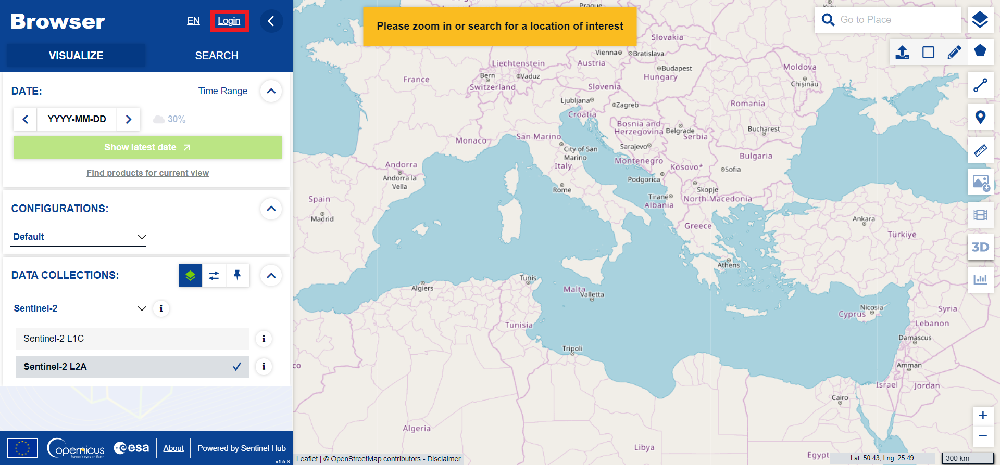
{: style="margin-bottom:0px;" align=center }
<figcaption>Copernicus Browser</figcaption>

**2. Vyznačení zájmového území**

Dále pomocí nástroje ***Create an area of interest***, který se nachází v pravé části, vyznačíme v mapovém okně zájmové území, ze kterého bychom chtěli data stáhnout. Pro účely cvičení vybereme místo s různým krajiným pokryvem, tj. aby se na scéně vyskytovala alespoň vodní plocha, zemědělské oblasti, lesy a zástavba (není žádoucí vybrat si homogenní oblast například pouze s pouští, deštným pralesem či mořem).

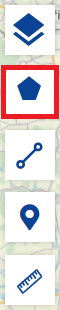
{: .off-glb .process_icon}
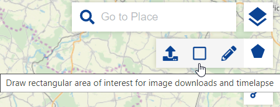
{: .off-glb .process_icon}
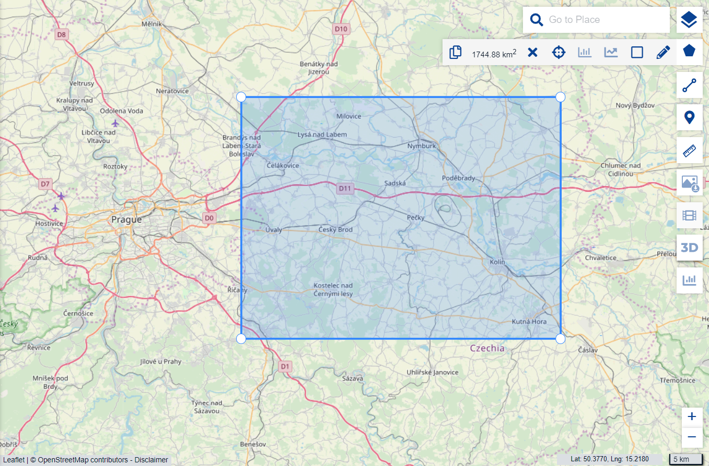
{: .process_container}

**3. Nastavení vyhledávacích parametrů**

V levé části webového portálu se přepneme do záložky ***SEARCH***. Ta se zkládá ze tří částí: ***SEARCH CRITERIA***, ***DATA SOURCES*** a ***TIME RANGE***. Prví část využijeme, pokud známe název hledaného produktu (v tom případě nemusíme vyznačovat zájmové území). Ve druhé části nastavíme, z jaké družice Sentinel požadovaná data chceme, a určíme doplňující parametry. V našem případě chceme data z družice **Sentinel-2** s úrovní předzpracování **L2A**. Dále zvolíme maximální procento pokrytí scény oblačností (ideálně chceme data bez oblačnosti). V poslední části zadáme časové období, v jakém byla daná scéna pořízena (pro účely cvičení zvolíme scénu z **vegetačního** období). Scénu poté vyhledáme tlačítkem ***Search***.

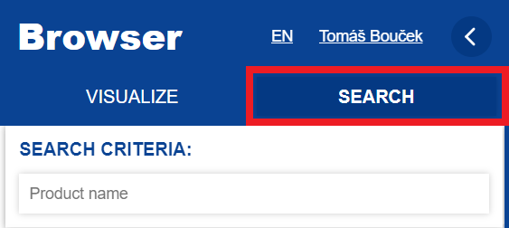
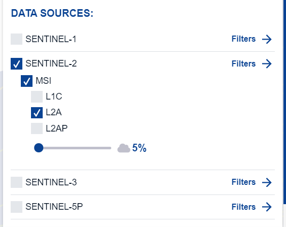
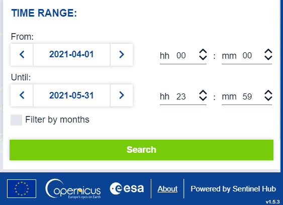
{: .process_container}

**4. Stažení vybrané scény**

Pokud vyhledání scén proběhlo úspěšně, zobrazí se levé části jejich seznam. Zároveň se v mapovém okně zobrazí, kde přesně se dané scény nacházejí. Při najetí kurzorem myši na scénu v seznamu se v mapovém okně zvýrazní i příslušná korespondující oblast scény.

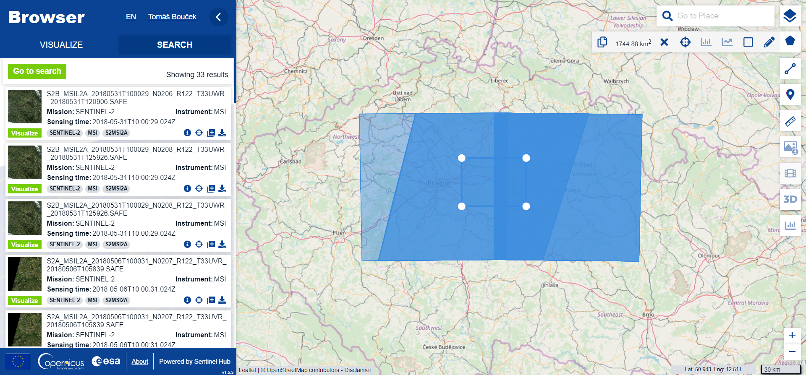
{: style="margin-bottom:0px;" align=center }

Vyhledanou scénu si můžeme v mapovém okně vizualizovat či si o ní zobrazit informace pomocí ikony ***Product info***. Pokud nechceme stahovat celou scénu, v **PRODUCT INFO** je možné stáhnout i jednotlivé soubory (např. jedno konkrétní pásmo).

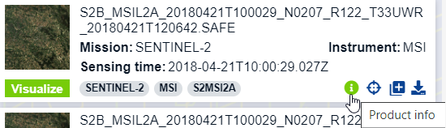
{: .off-glb .process_icon}
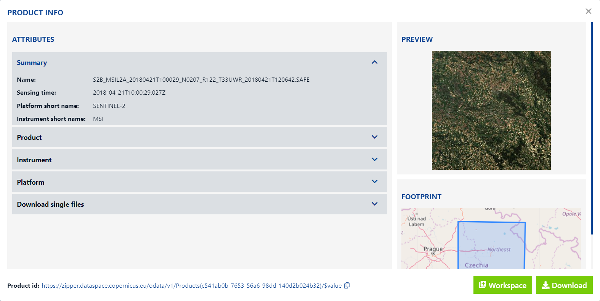
{: .process_container}

Pokud jsme s vybranou scénou spokojeni, pomocí ikony ***Download product*** scénu stáhneme (případně použijem tlačítko ***Download*** v **PRODUCT INFO**). Produkt se stáhne ve formátu **ZIP** a pro práci v softwaru **SNAP** jej není třeba rozbalovat.

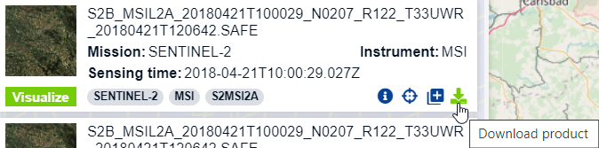{ style="height:134px;"}
{: style="margin-bottom:0px;" align=center }

Někdy se může stát, že pro naše zadané parametry nebude nalezen žádný produkt. V takovém případě je potřeba vyhledávací parametry pozměnit.

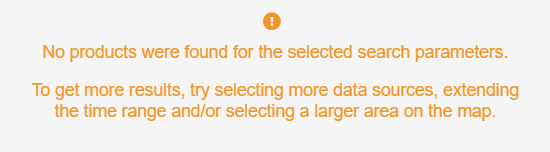{ style="height:122px;"}
{: style="margin-bottom:0px;" align=center }
