<style>
  .md-typeset__scrollwrap {text-align: center ;}
  table th {text-align: center !important;}
  table td {text-align: center !important;}
  h2 {font-weight:700 !important;}                                                                   /* Pokus – zmena formatu nadpisu 2 */
  figcaption {font-size:12px;margin-top:5px !important;text-align:center;line-height:1.2em;}         /* Formatovani Popisku obrazku */
  hr.l1 {background-color:var(--md-primary-fg-color);height:2px;margin-bottom:3em !important;}       /* Formatovani Break Line – LEVEL 1 */
  img,iframe {filter:drop-shadow(0 10px 16px rgba(0,0,0,0.2)) drop-shadow(0 6px 20px rgba(0,0,0,0.2)) !important; object-fit:contain;} /* Stin pod obrazky a videi */

  /* TLACITKA */
  .md-button {text-align:center;transition: all .1s ease-in-out !important;}  /* Button – zarovnani textu */
  .md-button:hover {transform: scale(1.04);opacity:.8;background-color:var(--md-primary-fg-color) !important;border-color:var(--md-primary-fg-color) !important;color:var(--md-primary-bg-color) !important;/*filter: brightness(80%);*/}            /* Button Hover – animace zvetseni a zmeny barvy */
  .md-button:focus {opacity:.8;background-color:var(--md-primary-fg-color) !important;border-color:var(--md-primary-fg-color) !important;color:var(--md-primary-bg-color) !important;}                                                                /* Button Focus – stejny vzhled jako hover */
  .url-name {line-height:1.2;/*padding-top:5px !important;*/}                 /* Button s URL */
  .url-name span:first-child {font-size:.7em; font-weight:300;}               /* Button s URL – format*/
  .url-name span.twemoji {vertical-align:-0px;}                               /* Button s URL – zarovnani ikony*/
  .md-button.button_smaller {font-size:smaller; padding:1px 5px;}             /* Mensi button (bez URL) */

  /* FLEXBOXY */
  .process_container {display:flex !important; justify-content:center; align-items:center; column-gap:calc((100vw * 0.03) - 6px);} /* Kontejner pro content = FlexBox */
  .process_container div {display:flex;}                                                                                           /* Obsah (obrazky a sipky) */
  .process_container .process_icon {width:/*40px*/calc((100vw * 0.01) + 25px); flex-shrink:0;filter:none !important;}              /* Velikost ikony (bacha na mobily) */
  .process_container img {max-height:600px; display:flex;}                                    /* Obrazky ve flexboxech maji maximalni vysku */
</style>

# Ukázka práce v Google Earth Engine

<hr class="l1">

## Cíl cvičení

- Seznámit se cloudovým nástrojem Google Earth Engine
- Umět detekovat spáleniště pomocí dat DPZ

<hr class="l1">

## Základní přehled

<a href="https://earthengine.google.com/" target="_blank"> **Google Earth Engine**</a> je cloudová platforma pro geoprostorovou analýzu, která uživatelům umožňuje vizualizovat a analyzovat satelitní snímky naší planety.

- Code Editor: <a href="https://code.earthengine.google.com/" target="_blank"> **https://code.earthengine.google.com/**</a>
- Dokumentace: <a href="https://developers.google.com/earth-engine/" target="_blank"> **https://developers.google.com/earth-engine/**</a>
- Dostupná data: <a href="https://developers.google.com/earth-engine/datasets/" target="_blank"> **https://developers.google.com/earth-engine/datasets/**</a>
- Ukázky: <a href="https://earthengine.google.com/timelapse/" target="_blank"> **https://earthengine.google.com/timelapse/**</a>
- Tutoriály: <a href="https://developers.google.com/earth-engine/guides" target="_blank"> **https://developers.google.com/earth-engine/guides**</a>

### Code Editor

Code Editor je webové vývojové prostředí Google Earth Engine využívající programovací jazyk JavaScript.

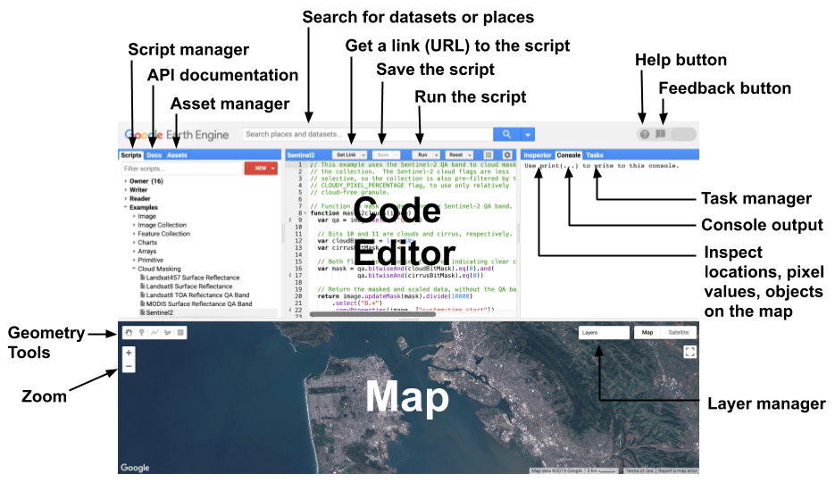
{: style="margin-bottom:0px;" align=center }

### Ukázky JavaScript kódu

```js
print('Hello world!');
```

Zobrazení dat MODIS:

```js
var dataset = ee.ImageCollection('MODIS/061/MOD09GA')
  // filter by dates
  .filterDate('2023-04-01', '2023-06-01');

// Select the bands you want to visualize
var visParams = {
  bands: ['sur_refl_b01', 'sur_refl_b04', 'sur_refl_b03'],
  min: 0,
  max: 5000,
  gamma: 1.4,
};

// add to the map window
Map.addLayer(dataset, visParams, 'MODIS');
```

Zobrazení dat Landsat 9 s oblačností menší než 10 % a s přeškálováním:

```js
var dataset = ee.ImageCollection('LANDSAT/LC09/C02/T1_L2')
  // filter by dates
  .filterDate('2023-07-01', '2023-08-31')
  // filter by cloud cover
  .filter(ee.Filter.lessThan('CLOUD_COVER', 10));

// Applies scaling factors
function applyScaleFactors(image) {
  var opticalBands = image.select('SR_B.').multiply(0.0000275).add(-0.2);
  var thermalBands = image.select('ST_B.*').multiply(0.00341802).add(149.0);
  return image.addBands(opticalBands, null, true)
              .addBands(thermalBands, null, true);
}

dataset = dataset.map(applyScaleFactors);

// Select the bands you want to visualize
var visParams = {
  bands: ['SR_B4', 'SR_B3', 'SR_B2'],
  min: 0.0,
  max: 0.3,
};

// add to the map window
Map.addLayer(dataset, visParams, 'Landsat 9');
```

Zobrazení dat Sentinel-2 s oblačností menší než 10 % a jejich oříznutí na zájmové území:

```js
var sentinel_col = ee.ImageCollection("COPERNICUS/S2_SR_HARMONIZED")
  // filter by dates
  .filterDate('2023-05-01', '2023-06-30')
  // filter for the drawn rectangle
  .filterBounds(geometry)
  // filter by cloud cover
  .filter(ee.Filter.lt('CLOUDY_PIXEL_PERCENTAGE', 10));
  
// Define a function to clip each image in the collection to the geometry
var clipToGeometry = function(image) {
  return image.clip(geometry);
};

// Use the map function to apply the clip function to each image in the collection
var clipped_col = sentinel_col.map(clipToGeometry);

// Select the bands you want to visualize
var visParams = {
  bands: ['B4', 'B3', 'B2'],
  min: 0.0,
  max: 3000,
};

// add to the map window
Map.addLayer(clipped_col, visParams, 'Sentinel-2');
```

Spoustu dalších příkladů lze nalézt přímo v prostředí Google Earth Engine v části **Scripts** → **Examples**.

{ style="height:374px;"}
{: style="margin-bottom:0px;" align=center }

<hr class="l1">

## Detekce spálenišť pomocí Google Earth Engine

V rámci tohoto cvičení využijeme Google Earth Engine pro detekování oblastí zasažených požárem. Konkrétní oblastí našeho zájmu bude národní park České Švýcarsko, kde došlo k požáru v období 23. 7. 2022 - 12. 8. 2022 (v německé části požár trval od 25. 7. 2022 - 19. 8. 2022). Práci začneme tím, že si vytvoříme nový soubor, do kterého budeme náš kód psát. Nový soubor vytvoříme v části **Scripts** → **NEW** → **File**. Protože jsme si ale nevytvořili repozitář, do kterého se soubor uloží, Google Earth Engine nás nejprve vyzve k vytvoření právě nového repozitáře. Teprve poté můžeme vytvořit nový soubor.

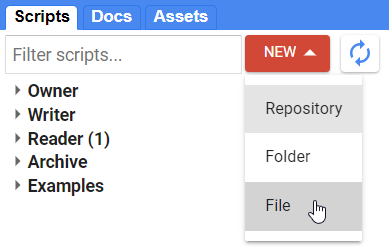
{: .off-glb .process_icon}
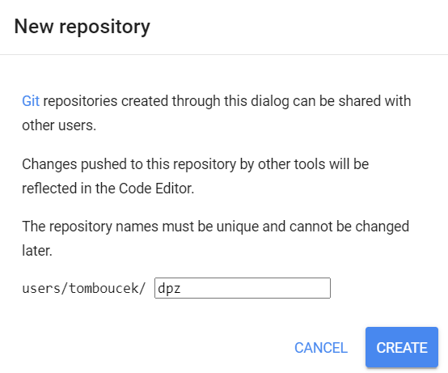
{: .off-glb .process_icon}
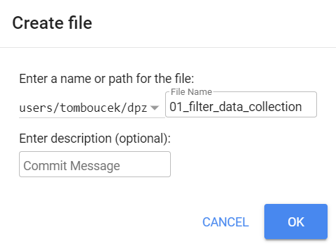
{: .process_container}

Vytvořený soubor najdeme ve **Scripts** → **Owner**, kde si ho i můžeme otevřít.

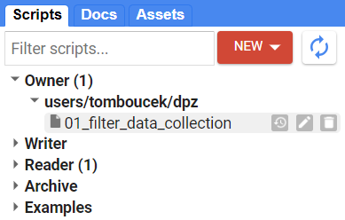{ style="height:198px;"}
{: style="margin-bottom:0px;" align=center }

### Výběr zájmové oblasti a získání dat

Zájmové území si označíme přidáním bodu do mapy. Bod přidáme pomocí funkce ***Přidat značku***, která se nachází v levé horní části mapového okna. Bod umístíme přibližně mezi obce Hřensko a Mezná, tedy na místo, kde požár zhruba vypukl.

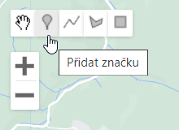
{: .off-glb .process_icon}
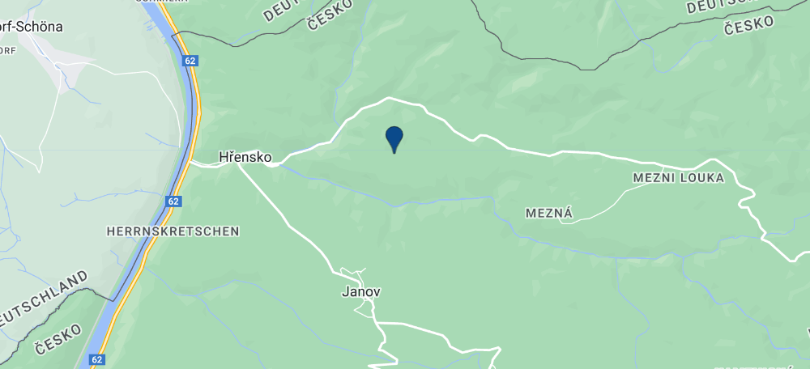
{: .process_container}

Pomocí funkce ***Edit layer properties*** si můžeme vytvořený bod přejmenovat z *geometry* např. na *point*.

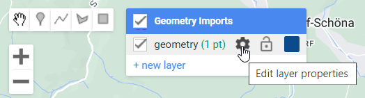
{: .off-glb .process_icon}
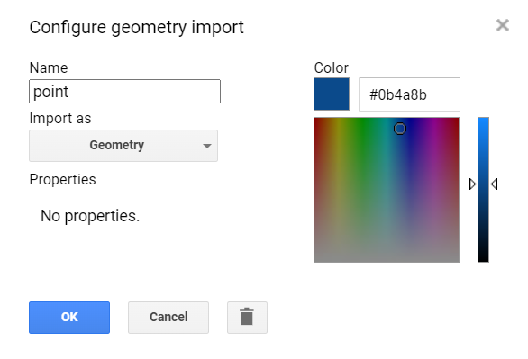
{: .process_container}

Nyní si můžeme vyhledat potřebná data. Konkrétně budeme pracovat s daty Sentinel-2. Bohužel v roce 2022 nebylo v daném místě mnoho bezoblačných scén, proto nastavíme datum na obdomí mezi 1. 4. 2022 - 31. 10. 2022. Jako limit pro oblačnost nastavíme 30 %.

```js
// Filter the Sentinel-2 image collection
var S2 = ee.ImageCollection('COPERNICUS/S2_SR_HARMONIZED') // import data
                  .filterBounds(point) // spatial filter
                  .filterDate('2022-04-01', '2022-10-31') // temporal filter
                  .filter(ee.Filter.lt('CLOUDY_PIXEL_PERCENTAGE', 30)); // metadata filter

// Print data to the Console
print("Scenes:", S2);

// Add True color RGB composite to the map
Map.addLayer(S2.first(),
            {min:0,max:3000,bands:"B4,B3,B2"}, 
            "RGB");
```

Pokud bychom si chtěli zobrazit jiný než první prvek z *ImageCollection*, je potřeba si *ImageCollection* převést na *List*. To můžeme udělat přidáním následujícího kódu.

```js
// Convert ImageCollection to List
var S2List = S2.toList(S2.size());
print(S2List);

// Get second image from the list
Map.addLayer(ee.Image(S2List.get(1)),
            {min:0,max:3000,bands:"B4,B3,B2"}, 
            "RGB 2");
```

Mezi vrstvami v mapovém okně lze jednoduše přepínat pomocí nástroje **Layers** v pravé části mapového okna.

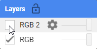{ style="height:80px;"}
{: style="margin-bottom:0px;" align=center }

Při zavření a opětovném otevření Google Earth Engine není mapa vycentrována na naše území. Přidáním následujícího kódu do skriptu se mapa vycentruje na zobrazenou scénu.

```js
// Center the map to the image
Map.centerObject(S2.first());
```

### Maskování oblačnosti

Mohli jsme si všimnout, že na některých scénách je oblačnosti poměrně dost. To pro jakékoliv analýzy není zrovna nejlepší, a je proto potřeba oblačnost zamaskovat. Existuje více možností, jak scény maskovat, a lze k tomu použít i různé vrstvy obsažené v produktech Sentinel-2. <a href="https://developers.google.com/earth-engine/datasets/catalog/COPERNICUS_S2_SR_HARMONIZED#description" target="_blank"> **Zde**</a> je např. ukázka maskování oblačnosti pomocí vrstvy **QA60**, což je maska oblačnosti s rozlišením 60 m. Bohužel pro data od ledna 2022 není tato vrstva stále k dispozici. Lze ale využít i jiné vrstvy, jako např. **MSK_CLDPRB**, což je pravděpodobnost výskytu oblačnosti v pixelu s rozlišením 20 m. Přidáme si tedy do kódu funkci, která zamaskuje oblačnost pomocí vrstvy MSK_CLDPRB, zvolíme nějaký threshold určující, kolikaprocentní pravděpodobnost oblačnosti budeme brát v potaz, a aplikujeme masku oblačnosti na naše data. Můžeme poté porovnat zamaskovaná a nezamaskovaná data.

```js hl_lines="7 8 9 10 11 12 13 14 15 16 17 19 20"
// Filter the Sentinel-2 image collection
var S2 = ee.ImageCollection('COPERNICUS/S2_SR_HARMONIZED') // import data
                  .filterBounds(point) // spatial filter
                  .filterDate('2022-04-01', '2022-10-31') // temporal filter
                  .filter(ee.Filter.lt('CLOUDY_PIXEL_PERCENTAGE', 30)); // metadata filter

// Cloud mask based on MSK_CLDPRB layer
function mask_clouds(image) {
  // Select the MSK_CLDPRB band.
  var cloudProbability = image.select('MSK_CLDPRB');

  // Create a mask for clouds using a threshold.
  var cloudMask = cloudProbability.lt(50);

  // Update the image mask using the cloud mask.
  return image.updateMask(cloudMask);
}

// Apply on image collection
var S2_masked = S2.map(mask_clouds);

// Add True color RGB composites to the map
Map.addLayer(S2.first(),
            {min:0,max:3000,bands:"B4,B3,B2"}, 
            "RGB");
Map.addLayer(S2_masked.first(),
            {min:0,max:3000,bands:"B4,B3,B2"}, 
            "RGB masked");
```

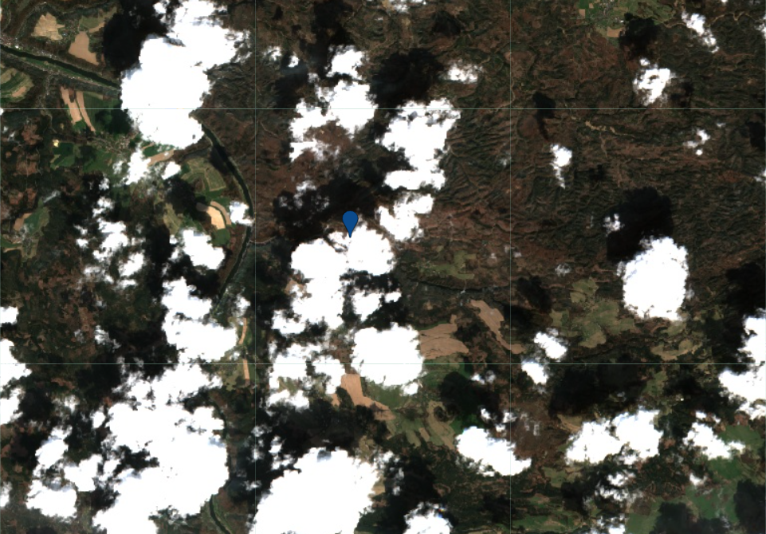
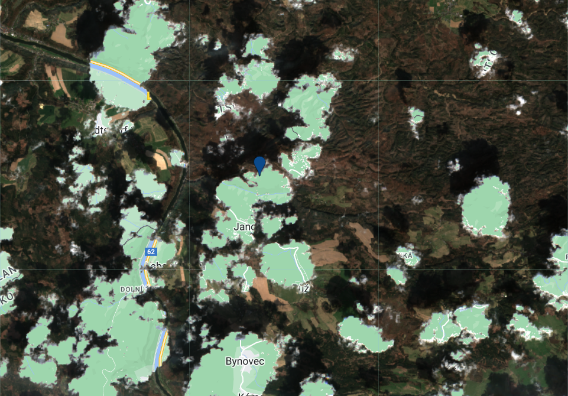
{: .process_container}
<figcaption>Porovnání dat před a po použití masky oblačnosti</figcaption>

Kdybychom se chtěli podívat znovu i na jiné scény, převedeme jako v předchozím příkladu *ImageCollection* na *List*. Správně by se měly maskovat i stíny tvořené oblačností, ale to si když tak zkuste později samostatně.

### Výpočet NBR indexu

Index <a href="https://un-spider.org/advisory-support/recommended-practices/recommended-practice-burn-severity/in-detail/normalized-burn-ratio" target="_blank"> **NBR**</a>, neboli **Normalized Burned Ratio**, je index určený ke zvýraznění spálenišť v rozsáhlých požárních oblastech. Vzoreček pro NBR je následující:

**NBR = (NIR - SWIR)/(NIR + SWIR)**

NBR index pro celou *ImageCollection* spočítáme přidáním následujícího kódu.

```js
// Compute NBR index
function add_NBR(image) {
  return image.addBands(image.normalizedDifference(['B8', 'B12']).rename('NBR'));
}
var S2_nbr = S2_masked.map(add_NBR);
print(S2_nbr);
```

Následně si ho můžeme přidat i do mapového okna. Co se týče oblačnosti, tak před požárem nejlépe vychází scéna z 23. 4. 2022 (tj. druhá scéna v *ImageCollection*), a po požáru pak nejspíše scéna z 25. 9. 2022 (tj. pátá scéna v *ImageCollection*). Proto si budeme znázorňovat tyto dvě.

```js
// Convert ImageCollection to List
var S2_nbr_list = S2_nbr.toList(S2_nbr.size());

// Add layers to map
Map.addLayer(ee.Image(S2_nbr_list.get(1)),
            {min:0,max:3000,bands:"B4,B3,B2"}, 
            "RGB pre-fire");
Map.addLayer(ee.Image(S2_nbr_list.get(4)),
            {min:0,max:3000,bands:"B4,B3,B2"}, 
            "RGB post-fire");
Map.addLayer(ee.Image(S2_nbr_list.get(1)),
            {min: -1, max: 1, bands: ["NBR"]}, 
            "NBR pre-fire");
Map.addLayer(ee.Image(S2_nbr_list.get(4)),
            {min: -1, max: 1, bands: ["NBR"]}, 
            "NBR post-fire");
```

Na obrázku níže můžeme porovnat NBR index před a po požáru. Tmavé plochy znázorňují místa, kde k požáru došlo.

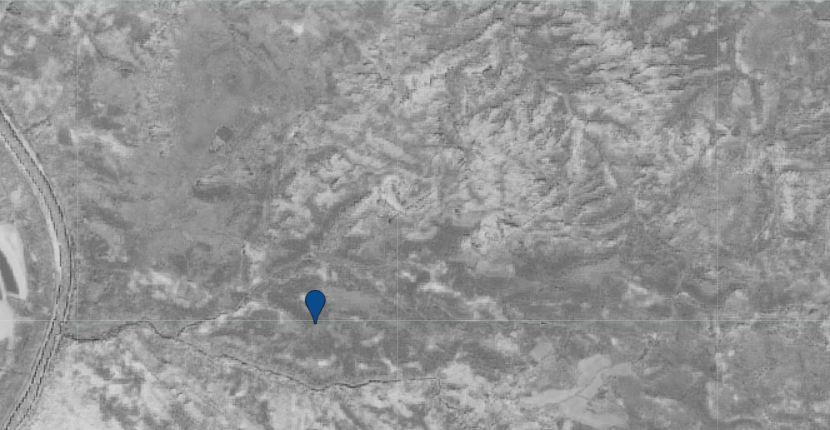
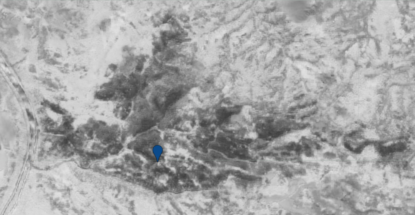
{: .process_container}
<figcaption>Porovnání NBR indexu před a po požáru</figcaption>

Dále si vytvoříme graf znázorňující časovou řadu NBR. Časovou řadu budeme ale znázorňovat jen pro území, kde k požáru opravdu došlo. Proto si toto území nebo jeho část vyznačíme polygonem, který vytvoříme pomocí nástroje **Nakreslit tvar**.

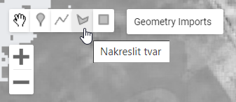{ style="height:117px;"}
{: .off-glb .process_icon}
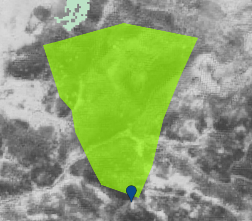{ style="height:358px;"}
{: .process_container}

Nyní pomocí následujícího kódu vytvoříme graf.

```js
// Create Time series chart
var TSChart = ui.Chart.image.series({
    imageCollection: S2_nbr.select(['NBR']),
    region: polygon,
    reducer: ee.Reducer.mean(),
    scale: 10,
}).setOptions({
    title: 'NBR time-series of the burned areas'
});

print(TSChart);
```

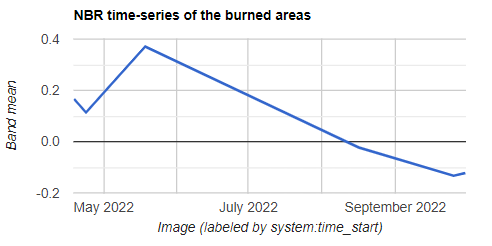{ style="height:197px;"}
{: style="margin-bottom:0px;" align=center }

### Vizualizace spálenišť