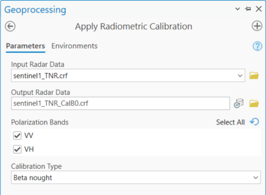
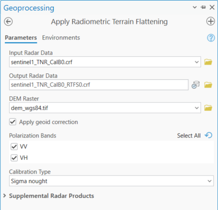
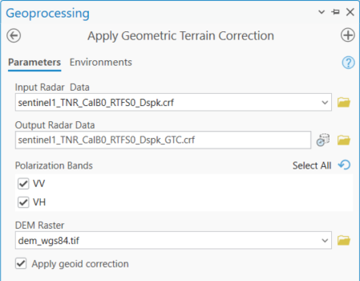
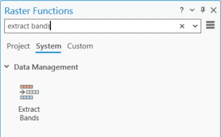
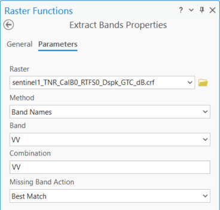

# Detekce zaplaveného území pomocí radarových dat

## Cíl cvičení

- Seznámit se s radarovými daty
- Umět detekovat vodní hladinu pomocí dat Sentinel-1

## Základní pojmy

Výhodou radarových dat je možnost snímání zemského povrchu i za oblačného počasí bez ohledu na denní dobu. Princip aktivního radarového snímání je založen na vysílání mikrovlnného záření k povrchu Země, kde se záření odráží zpět k senzoru, který následně měří fyzikální charakteristiky zpětného odrazu záření. Různé změny na zemském povrchu se projeví v charakteru odraženého záření, proto je možné radarové snímání využít např. při povodních či sesuvech půdy téměř v reálném čase. V oboru zemědělství a lesnictví je vhodný pro monitoring změn lesních porostů a detekce některých zemědělských operací [<a href="https://www.szif.cz/cs/ams-sentinel" target="_blank">https://www.szif.cz/cs/ams-sentinel</a>]. V rámci tohoto cvičení budeme pracovat s daty z družice Sentinel-1. Více o radarových datech se můžete dočíst například v <a href="https://geo.fsv.cvut.cz/vyuka/155dprz/Handbook_Precourse_Sentinel-1.pdf" target="_blank"> **této příručce**</a>.

### **Sentinel-1**

Sentinel-1 je Copernicus mise zaměřená na snímání zemského povrchu pomocí mikrovlnného radaru s využitím **Synthetic Aperture Radar (SAR)**. Celkem byly do této chvíle vypuštěny 4 satelity, z nichž aktivní jsou 3.

<table>
  <thead>
    <tr>
      <th><strong>Družice</strong></th>
      <th><strong>Datum vypuštění</strong></th>
      <th><strong>Aktivní</strong></th>
    </tr>
  </thead>
  <tbody>
    <tr>
      <td>Sentinel-1A</td>
      <td>3. 4. 2014</td>
      <td>Ano</td>
    </tr>
    <tr>
      <td>Sentinel-1B</td>
      <td>25. 4. 2016</td>
      <td>Ne</td>
    </tr>
    <tr>
      <td>Sentinel-1C</td>
      <td>5. 12. 2024</td>
      <td>Ano</td>
    </tr>
    <tr>
      <td>Sentinel-1D</td>
      <td>4. 11. 2025</td>
      <td>Ano</td>
    </tr>
  </tbody>
</table>

Sentinel-1 snímá v několika režimech a má i několik úrovní předzpracování. Mezi snímané režimy patří následující:

- **SM (Stripmap)** - 80 km široký pás, rozlišení 5 m x 5 m
- **IW (Interferometric Wide swath)** - 250 km široký pás, rozlišení 5 m x 20 m
- **EW (Extra Wide swath)** - 400 km široký pás, rozlišení 20 m x 40 m
- **WM (Wave)** - 20 km x 20 km scény, rozlišení 20 m x 5 m, pořizované každých 100 km podél oběžné dráhy

Pomocí Copernicus Browser můžeme stahovat následující produkty:

- **Level-0 RAW** - nezprocesovaná původní snímaná data, pro běžné uživatele nemají využití
- **Level-1 SLC** (Single Look Complex) - obsahují komplexní hodnoty (amplitudu + fázi) na pixel, využití v interferometrii pro detekci deformací či pro tvorbu DEM
- **Level-1 GRD** (Ground Range Detected) - fáze je vyřazena a ponechána je pouze amplituda (detekovaný zpětný odraz), vhodné pro mapování, klasifikaci či detekci změn
- **Level-2 OCN** (Ocean) - specifické zpracování pro oceánské aplikace

## Detekce vody pomocí Sentinel-2

Data pro toto cvičení jsou dostupná <a href="https://geo.fsv.cvut.cz/vyuka/155dprz/cv11/cv11_data.zip" target="_blank"> **Zde**</a>. Zájmovým územím je Ostrava a její okolí během povodní na podzim 2024. Data obsahují dvě scény Sentinel-2 — jednu před povodněmi a jednu během povodní, a jednu scénu Sentinel-1 během povodní. Jak si můžete všimnout u druhé scény Sentinel-2, tak je celá pokrytá oblačností. Proto nezbývá nic jiného, než použít radarová data, která jsou sice náročnější na zpracování, ale lze je využít i během oblačnosti.

{: .process_container}
<figcaption>Vlevo - scéna Sentinel-2 před povodní (14. 8. 2024), vpravo - scéna Sentinel-2 během povodně (13. 9. 2024)</figcaption>

Prvním krokem bude, že si zjistíme vodní plochy během "normálního" stavu před povodní. K tomu využijeme data Sentinel-2. Detekci vodních ploch si nebudeme nijak komplikovat a použijeme tudíž obyčejný **Normalized Difference Water Index (NDWI)**. Vzoreček pro NDWI je následující:

**NDWI = (Green - NIR)/(Green + NIR) = (B3 - B8)/(B3 + B8)**

Jednotlivá pásma najdeme zde: **"...\S2B_MSIL2A_20240814T094549_N0511_R079_T33UYR_20240814T123852.SAFE\GRANULE\L2A_T33UYR_A038858_20240814T095005\IMG_DATA\R10m"**. A jelikož pásma máme jednotlivě, tak použijeme Raster Calculator. Dále víme, že vodní plochy odpovídají hodnotám **NDWI > 0**. Pomocí Raster Calculator si je tedy vyextrahujeme.

{: .off-glb .process_icon}

{: .process_container}

## Předzpracování dat Sentinel-1

Takový byl tedy stav před povodněmi. Nyní se podíváme na radarová data Sentinel-1. Dostupná pásma najdeme v podsložce *measurement*. My si ale do ArcGIS Pro načteme soubor ***manifest.safe***, což je něco jako virtuální raster obsahující i veškerá potřebná metadata. Scéna je o něco větší než u Sentinel-2. Bohužel budeme nuceni předzpracování udělat na kompletních datech, protože případný oříznutý raster by neobsahoval potřebná metadata. Data Sentinel-1 se nám zobrazí ve falešných barvách kombinující dvě dostupná pásma (amplitudy) v polarizacích VH a VV.

{ style="height:618px;"}
{: style="margin-bottom:0px;" align=center }

Aby se s daty ale dalo rozumně pracovat, je potřeba provést sérii kroků a data Sentinel-1 předzpracovat.

### 1) Stažení a aplikace souboru s orbitálními informacemi

Při přípravě SAR snímku pro analýzu je důležitým krokem aplikace korekce dráhy. Bez ohledu na to, jak přesně je dráha satelitu nastavena, dochází k posunu polohy satelitu. Kvůli tomuto posunu je nutné provádět pravidelné úpravy, aby satelit zůstal na správné dráze. Proto je nezbytné mít k dispozici nejaktuálnější soubory s oběžnými drahami, aby bylo možné zjistit přesnou polohu satelitu v okamžiku pořízení snímku. Pro stažení tohoto osuboru použijeme nástroj ***Download Orbit File***, který najdeme v toolboxu ***Image Analyst Tools*** → ***Synthetic Aperture Radar***, kde najdeme i všechny ostatní potřebné nástroje. Do nástroje ***Download Orbit File*** vložíme naše Sentinel-1 data, *Orbit Type* nastavíme na *Sentinel Precise*, a nastavíme složku, kam se soubor stáhne. Po stažení aplikujeme orbitální informace na naše SAR data pomocí nástroje ***Apply Orbit Correction***.

{ style="height:216px;"}
{: .off-glb .process_icon}
{ style="height:216px;"}
{: .process_container}

### 2) Odstranění tepelného šumu

Nejprve je potřeba opravit rušení zpětného odrazu způsobené tepelným šumem ve vstupních SAR datech. K tomu použijeme nástroj ***Remove Thermal Noise***. Tepelné šumy, neboli šumy přístrojů, jsou způsobeny mikroskopickými pohyby elektronů v důsledku teploty, která pochází převážně z vnitřních obvodů satelitu. Tepelné šumy jsou nejviditelnější v oblastech s nízkým zpětným odrazem, jako jsou stálé vodní plochy, a v křížově polarizovaných scénách. V nástroji nastavíme vstupní a výstupní data a zaškrtneme obě polarizace.

{ style="height:216px;"}
{: style="margin-bottom:0px;" align=center }

### 3) Radiometrická kalibrace

Dále použijeme nástroj ***Apply Radiometric Calibration***. Kalibrace dat SAR je nezbytná k získání smysluplného zpětného odrazu, který lze vztáhnout k fyzikálním vlastnostem prvků v obraze. Do nástroje vložíme výstup z předchozího kroku a zaškrtneme znovu obě polarizace. Jako kalibrační typ necháme *Beta nought*.

{ style="height:258px;"}
{: style="margin-bottom:0px;" align=center }

### 4) Radiometrické vyrovnání terénu

V dalším kroku opravíme data o radiometrické zkreslení způsobené topografií pomocí nástroje ***Apply Radiometric Terrain Flattening***. Vzhledem k bočnímu pohledu senzorů SAR se prvky terénu směřující k senzoru jeví uměle jasnější a prvky směřující od senzoru se jeví uměle tmavší. Radiometrické vyrovnání terénu normalizuje hodnoty zpětného odrazu, aby toto zkreslení odstranilo. K tomuto kroku je ale zapotřemí mít k dispozici DEM. Proto si ho <a href="https://geo.fsv.cvut.cz/vyuka/155dprz/cv11/dem_wgs84.tif" target="_blank"> **Zde**</a> stáhněte. Do nástroje poté vložíme výstup z předchozího kroku, DEM, zaškrtneme obě polarizace, a jako kalibrační typ nyní zvolíme *Sigma nought*, který je vhodný právě pro detekci vodních ploch.

{ style="height:345px;"}
{: style="margin-bottom:0px;" align=center }

### 5) Odstranění šumu z obrazu

Nyní odstraníme z dat šum pomocí nástroje ***Despeckle***. Šum označuje zrnitý efekt (či efekt sůl a pepř), který je vidět na celém SAR snímku. Znovu zaškrtneme obě polarizace  a ponecháme defaultní filtr.

{ style="height:266px;"}
{: style="margin-bottom:0px;" align=center }

### 6) Geometrická korekce terénu

O dva kroky dřív jsme použili vrstvu DEM k opravě radiometrických zkreslení. Vrstvu DEM použijeme nyní znovu, tentokrát k opravě geometrických zkreslení a ortorektifikaci dat SAR. Ortorektifikace je proces opravy zdánlivých změn v poloze pozemních objektů způsobených perspektivou úhlu pohledu senzoru a terénem. Ortorektifikaci provedeme pomocí nástroje ***Apply Geometric Terrain Correction***.

{ style="height:280px;"}
{: style="margin-bottom:0px;" align=center }

### 7) Převedení jednotek na dB

V posledním kroku předzpracování převedeme lineární hodnoty na decibely (dB) pomocí nástroje ***Convert SAR Units***. Jelikož je dB logaritmická jednotka, jedná se o pohodlný způsob manipulace a vizualizace velkých čísel a velkých dynamických rozsahů. Převod jednotek na dB tedy zjednoduší interpretaci obrazu SAR a zlepší jeho zobrazení, protože se sníží rozsah hodnot amplitudy nebo intenzity. Po převodu budou kladné hodnoty představovat zpětný odraz směrem k senzoru a záporné hodnoty budou představovat zpětný odraz od senzoru.

{ style="height:202px;"}
{: style="margin-bottom:0px;" align=center }

## Detekce vody pomocí dat Sentinel-1

Když máme data předzpracována, můžeme na nich detekovat vodní plochy. Nejprve si ale z našich dat musíme vyextrahovat jednotlivá pásma. K tomu využijem nástroje ***Raster Functions***, konkrétně ***Extract Bands***. Zde si zvolíme správný raster, metodu, podle které budeme pásma vybírat, a konkrétní pásmo. V kolonce *Combination* necháme pouze naše vybrané pásmo. Vyextrahovaná pásma doporučuji rovnou přejmenovat na VV a VH.

{: .off-glb .process_icon}

{: .off-glb .process_icon}

{: .process_container}

Pro vodní plochy u SAR dat v dB jednotkách platí přibližně následující pravidla:

**VV < –17 dB**

**VH < –22 dB**

Můžeme použít buď jednu podmínku nebo zkombinovat obě dvě dohromady pro větší robustnost. K tomu použijeme ***Raster Calculator***, kde si tak vytvoříme novou vrstvu s detekovanými vodními plochami. Pro rychlejší výpočet můžeme extrahovaná pásma nejprve oříznout na naše zájmové území, tj. na dlaždici Sentinel-2. Do Raster Calculator podmínku můžeme zadat například takto:

**Con( ("VV" < -17) & ("VH" < -22), 1, 0 )**

Podmínku můžeme zkoušet různě upravovat. Lépe asi vychází, když ponecháme poze část s VH polarizací. Na závěr pak můžeme porovnat stav před a během povodně.

{ style="height:737px;"}
{: style="margin-bottom:0px;" align=center }