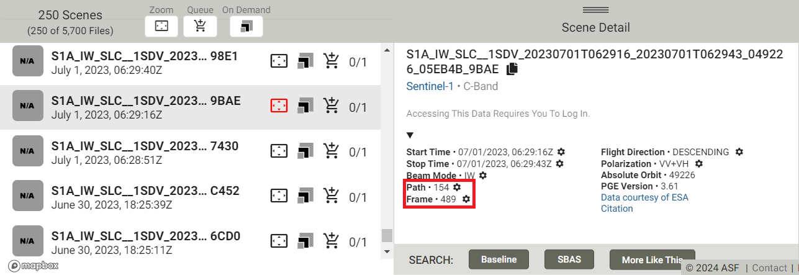

# Radarová interferometrie, tvorba DEM

## Cíl cvičení

- Seznámit se s radarovými daty
- Vyzkoušet si vytvoření DMT pomocí radarových dat

## Základní pojmy

- **Radarová interferometrie (InSAR - Interferometric Synthetic Aperture Radar)** - jedná se o radarovou metodu, která využívá dvou nebo více radarových snímků ke sledování deformací povrchu nebo pro tvorbu digitálního výškového modelu pomocí rozdílů ve fázi vln vracejících se zpět do senzoru.

Výhodou radarových dat je možnost snímání zemského povrchu i za oblačného počasí bez ohledu na denní dobu. Princip aktivního radarového snímání je založen na vysílání mikrovlnného záření k povrchu Země, kde se záření odráží zpět k senzoru, který následně měří fyzikální charakteristiky zpětného odrazu záření. Různé změny na zemském povrchu se projeví v charakteru odraženého záření, proto je možné radarové snímání využít např. při povodních či sesuvech půdy téměř v reálném čase. V oboru zemědělství a lesnictví je vhodný pro monitoring změn lesních porostů a detekce některých zemědělských operací [<a href="https://www.szif.cz/cs/ams-sentinel" target="_blank">https://www.szif.cz/cs/ams-sentinel</a>]. V rámci tohoto cvičení budeme pracovat s daty z družice Sentinel-1. Více o radarových datech se můžete dočíst například v <a href="https://geo.fsv.cvut.cz/vyuka/155dprz/Handbook_Precourse_Sentinel-1.pdf" target="_blank"> **této příručce**</a>.

## Tvorba DEM z radarových dat

Asi největší slabinou pro interferometická data z družice Sentinel-1 představuje vegetace – čím vyšší, tím vzniká větší dekorelace a následný šum v interferogramu. Pokud se zájmová lokalita nachází v oblasti s výraznými změnami v jednotlivých obdobích – tedy léto-zima, je rozumné využít data ze zimního období, tedy z období, kdy alespoň část porostu je zbavena vegetativních částí. InSARu vadí i travnatý porost, nicméně největší problémy dělají tropické deštné pralesy, a touto metodou je nemožné pro tuto oblast vytvořit digitální výškový model. Pro vytvoření výškového modelu je zapotřebí dvou scén.

Během cvičení můžete zpracovávat buď data z oblasti, kterou si sami vyberete (v takovém případě je nutné začít od prvního z následujících kroků, kde se dozvíte, jak vybrat vhodná data), nebo můžete pracovat s již vyhledanými a staženými daty, které jsou k dispozici <a href="https://geo.fsv.cvut.cz/vyuka/155dprz/cv7/data_cv7.zip" target="_blank"> **Zde**</a>. V případě druhé varianty je možné první dva kroky přeskočit.

Pro začátek je dobré znát následující nástroj v prostředí webového prohlížeče od organizace <a href="https://asf.alaska.edu/" target="_blank"> **Alaska Satellite Facility**</a>. Konkrétně se jedná o nástroj <a href="https://search.asf.alaska.edu/#/" target="_blank"> **Vertex**</a>.

{: style="margin-bottom:0px;" align=center }

### 1) Vyhledání dat

Neprve si pomocí nástroje ***Draw a box*** vyznačíme zájmové území. Zároveň se v menu *Dataset* ujistíme, že vyhledáváme data Sentinel-1.

{: .off-glb .process_icon}

{: .process_container}

Dále je dobré si pomocí filtrů vyfiltrovat pouze ta data, která chceme. Ve filtrech je jedna z prvních možností *Seasonal Search*, která je užitečná v případě období vegetační a bezvegetační doby.

{ style="height:85px;"}
{: style="margin-bottom:0px;" align=center }

Radarová data mají více úrovní předzpracování, my potřeboujeme **L1 Single Look Complex (SLC)**. Pro snadnější výběr snímků, které zahrnují celou oblast, můžeme vydefinovat i *Path and Frame*.

{ style="height:523px;"}
{: style="margin-bottom:0px;" align=center }

Hodnoty *Path* a *Frame* zadáváme samozřejmě pouze tehdy, pokud je známe, a pokud hledáme konkrétní data. Následující obrázky znázorňují výsledky vyhledání se zadanými hodnotami *Path* a *Frame* a výsledky bez nich.

{: .process_container}
<figcaption>Vlevo - vyhledaná data bez zadaných hodnot Path a Frame, vpravo - vyhledaná data se zadanými hodnotami Path a Frame</figcaption>

Z vyhledaných výsledků si jeden zvolíme a zkopírujeme název dané scény (někam si to poznamenáme). Po kliknutí na scénu se v detailech můžeme dozvědět i hodnoty Path a Frame.

{ style="height:311px;"}
{: style="margin-bottom:0px;" align=center }

{ style="height:63px;"}
{: style="margin-bottom:0px;" align=center }

### 2) Vyhledání párové scény

Jak již bylo řečeno, pro tvorbu DEM potřebujeme dvě scény. K tomu opět využijeme nástroj <a href="https://search.asf.alaska.edu/#/" target="_blank"> **Vertex**</a>. Doporučuji si ho ale otevřít v nové kartě, abychom nepřišli o naše vyhledaná data. V menu ***Search Type*** se přepneme na ***Baseline Search*** a zadáme dříve zkopírovaný název vyhledané scény.

{: .off-glb .process_icon}

{: .process_container}

Cílem bude snažit se nalézt párovou scénu s co největší kolmou základnou (Perpendicular Baseline) a s co nejmenší časovou základnou (Temporal Baseline) - zjednodušeně co nejvíce vzdálené místo snímkování a nejkratší doba mezi jednotlivými scénami. V pravé části vidíme graf, který vizualizuje jednotlivé snímky na vertikální ose s kolmou základnou a horizontální ose s časovou základnou. Pro tvorbu digitálního výškového modelu z radarových dat je doporučená hodnota pro kolmou základnu alespoň **120 metrů** a časovou základnu maximálně **6 dnů** – aby byla vypozorována co nejmenší změna na daném území. Nicméně jak sami uvidíte, není úplně jednoduché taková data nalézt. Tomu nepomáhá ani fakt, že od 23. 12. 2021 je na oběžné dráze v provozu pouze jedna z původně dvou družic Sentinel-1, a tudíž od tohoto data ani není možné najít párové scény s časovou základnou 6 dnů (doba kdy družice Sentinel-1 snímá podruhé stejné místo na Zemi je 12 dnů - ve dvojici to bylo 6 dnů). Doporučuji tedy pracovat se staršími daty.

Po vyhledání párových scén je dále dobré upravit tzv. ***Baseline Criteria***, aby se nám zobrazovaly pouze scény s vhodnými hodnotami *Perpendicular Baseline* a *Temporal Baseline*. V opačném případě se nám zobrazí všechny dostupné scény a není jednoduché se v tom zorientovat.

{: .off-glb .process_icon}

{: .process_container}

Po upravení parametrů se nám zobrazí pouze potenciálně vhodné scény. Pokud jedna z nich splňuje požadované parametry (nebo se k nim aspoň přibližuje), poznamenáme si znovu její název. V opačném případě je potřeba zvolit jinou scénu z původního vyhledávání a pokusit se najít vhodnou párovnou scénu k ní.

{: style="margin-bottom:0px;" align=center }

V případě nalezení vhodných scén si obě scény pomocí jejich názvu vyhledáme a stáhneme na <a href="https://dataspace.copernicus.eu/browser" target="_blank"> **Copernicus Browser**</a>, kde jsme již dříve stahovali data Sentinel-2. (Stahovat lze i přímo z nástroje *Vertex*, ale je potřeba být zaregistrován.)

### 3) Instalace pluginu ve SNAP

Data budeme zpracovávat v softwaru SNAP. Ještě před samotným zpracováním musíme ale do softwaru nainstalovat zásuvný modul (plugin) **SNAPHU Unwrapping**. To uděláme v menu přes záložku ***Tools*** → ***Plugins***. V nově otevřeném okně se poté překlikneme do záložky ***Available Plugins***, kde najdeme plugin **SNAPHU Unwrapping** a nainstalujeme ho. Během instalace nás SNAP vyzve k restartování, což tedy i učiníme.

{: .off-glb .process_icon}

{: .process_container}

Plugin je dále nutné aktivovat. To se provede v záložce ***Tools*** → ***Manage External Tools*** – tedy pokud je zde vykřičník. Rozklikneme plugin *SNAPHU Unwrapping* a v záložce ***Bundled Binaries*** klikneme na tlačítko *Download and Install Now*. Po těchto krocích je SNAP připraven ke zpracování interferometických dat.

{: .off-glb .process_icon}

{: .off-glb .process_icon}

{: .process_container}

### 4) Koregistrace

Stejně jako v případě dat Sentinel-2, tak ani data Sentinel-1 nebudeme rozzipovávat a nahrajeme je do SNAP tak, jak jsou. Prvním ze základních kroků pro úspěšné vytvoření interferogramu je použít dvojici SLC snímků a spojit je do jedné báze. Tato báze slouží ke koregistraci jednoho bodu na zemi pro oba dva snímky. Dvojici snímků dělíme na hlavní (master) a vedlejší (slave). Pokud pracujeme s daty, které jsme si stáhli ze stránek tohoto cvičení, tak jako *master* použijeme scénu s koncovkou **_8796**, a jako *slave* scénu s koncovkou **_07DD**. Koregistraci provedeme pomocí nástroje ***Radar*** → ***Coregistration*** → ***S1 TOPS Coregistration*** → ***S1 TOPS Coregistration with ESD***.

{ style="height:295px;"}
{: style="margin-bottom:0px;" align=center }

V záložce ***Read*** vložíme náš první snímek (master) s koncovkou **_8796**, v druhé záložce ***Read(2)*** vložíme párový snímek s koncovkou **_07DD** (přepínání mezi záložkami může mít nějakou prodlevu). V záložce ***TOPSAR-Split*** zmenšíme oblast zpracování – pokud Vám SNAP hlásí chybu a nejde vybrat *Subswath*, zkuste znovu otevřít nástroj, případně restartovat software. Pokud SNAP chybu nehlásí, za *Subswath* zvolíme **IW2**, *Polarisations* **VV** a pomocí posuvníků upravíme *Burst* na dílky 3 až 5. Stejné nastavení vybereme i pro druhý snímek v záložce ***TOPSAR-Split(2)***. Záložky ***Apply-Orbit-File*** a ***Apply-Orbit-File(2)*** necháme ve výchozím stavu(Sentinel Precise, Polynomial Degree 3).

{ style="height:543px;"}
{: style="margin-bottom:0px;" align=center }

V záložce ***Back-Geocoding*** zvolíme *Digital Elevation Model* **SRTM 1Sec HGT (Auto Download)**. Další záložku neupravujeme a zvolíme rovnou poslední záložku ***Write***, kde přepíšeme název např. na S1A_S1B_IW_SLC_VV_8796_07DD_Orb_Stack (pro přehlednost) a zvolíme umístění.

{ style="height:543px;"}
{: style="margin-bottom:0px;" align=center }

### 5) Interferogram

Následně vytvoříme interferogram pomocí nástroje v menu ***Radar*** → ***Interferometric*** → ***Products*** → ***Interferogram Formation***. Do vstupních dat vložíme vytvořený *Orb_Stack* z minulého kroku. Název upravovat nemusíme, SNAP dopsal k názvu *_ifg*. Jelikož chceme z dat vytvořit DEM, zkontrolujeme, jestli je v záložce ***Processing Prameters*** označené **Subtract flat-earth phase**. *Subtract topographic phase* se používá pro tvorbu modelu deformací, a musí být tedy v našem případě neoznačené.

{: .off-glb .process_icon}

{: .process_container}

V prostředí softwaru SNAP lze zobrazit histogram interferogramu. Po vytvoření obrazu koherence se v levé části rozhraní softwaru zpřístupní záložka *Colour Manipulation* (pokud ne, tak zkusíme *View* → *Tool Windows* → *Colour Manipulation*). Aby se nám histogram správně zobrazil, musíme mít v mapovém okně otevřenou koherenci histogramu! (Rozbalit pomocí plus vytvořený interferogram, rozkliknout *Bands* a dvakrát kliknout na coh_IW2_VV_........._.........).

{: style="margin-bottom:0px;" align=center }

Koherence nabývá hodnot od 0 do 1, s tím že pokud se hodnota blíží k 1, je snímek více kvalitní a nachází se na něm méně šumu. Naopak, pokud je interferogram blíže k 0, snímky obsahují více šumu a tím pádem jsou méně kvalitní.

### 6) Odstranění černých linií

Na snímku jsou patrné černé linie, které způsobilo snímkování v jednotlivých pruzích. Následujícím krokem je možné tyto linie odebrat a vytvořit tak souvislý snímek. Použijeme funkci ***Radar*** → ***Sentinel-1 TOPS*** → ***S-1 TOPS Deburst***. Zde je nutné vložit vytvořený interferogram s označenou polarizací **VV** v záložce *Processing Parameters*.

{: .off-glb .process_icon}

{: .process_container}

Opět zkusíme otevřít v *Bands* coh_IW2_VV_........._........., ale nyní ve vytvořeném interferogramu s ***_deb*** na konci názvu. Vidíme, že černé linie se již na snímku nenacházejí.

{: style="margin-bottom:0px;" align=center }

### 7) Filtrace šumu

Fáze (pásmo začínající na *Phase_*) obsahuje množství šumu, které je možné odstranit pomocí ***Radar*** → ***Interferometric*** → ***Filtering*** → ***Goldstein Phase Filtering***. Jako vstupní data vložíme soubor z předchozího kroku a zbytek necháme ve výchozím nastavení.

{: .off-glb .process_icon}

{: .process_container}

Efekt filtrace můžeme ověřit porovnáním fáze před filtrací a po filtraci.

{ style="height:520px;"}
{: style="margin-bottom:0px;" align=center }
<figcaption>Vlevo - fáze před filtrací, vpravo - fáze po filtraci</figcaption>

### 8) Definice zájmové lokality

Před rozbalením fáze si ořízneme výpočetní oblast pomocí funkce ***Subset*** (***Raster*** → ***Subset***), kterou aplikujeme na poslední krok, čili na soubor s *_flt* na konci názvu (je potřeba mít otevřenou fázy v mapovém okně). Abychom měli zaměřenou lokalitu hory Jabal Toubkal (pokud tedy pracujeme s poskytnutými daty a ne s nějakými vlastními), zadáme do *Pixel Coordinates* následující hodnoty:

{ style="height:370px;"}
{: .off-glb .process_icon}
{ style="height:473px;"}
{: .process_container}

Subset se sám neuloží, SNAP vytvořil pouze dočasný soubor. Uložíme jej pomocí kliknutí pravého tlačítka myši na vytvořený subset v *Product Explorer* a dále na možnost *Save Product*.

### 9) Rozbalení fáze

Nejnáročnější částí jak časově tak hardwarově je rozbalení fáze, ke které je klíčový dříve nainstalovaný zásuvný modul SNAPHU Unwrapping. Fázový rozdíl vychází pouze v intervalu [-π, π] a jeden cyklus je roven polovině vlnové délky radaru. Tento krok má celkem tři části. První - export vytvořeného produktu pomocí funkce ***Snaphu Export*** (***Radar*** → ***Interferometric*** → ***Unwrapping*** → ***Snaphu Export***). Jako vstupní data poslouží vytvořený Subset.

{ style="height:279px;"}
{: style="margin-bottom:0px;" align=center }

V záložce *SnaphuExport* zvolíme správnou složku uložení a název zvolíme snaphu_export. K odvození výškových hodnot terénu použijeme statistický model (*Statistical-cost mode*) **SMOOTH**, ale používá se i TOPO. Model DEFO se zabývá výpočtem deformací. Dalším polem je *Initial method*, která nabízí dvě statistické metody výpočtu - MCF (minimal cost flow) a MST (minimum spanning tree). My použijeme metodu **MCF**. Dále je možné nastavit počet řádků a sloupců (nicméně navýšení hodnot nevykázalo urychlení procesu, takže můžeme ponechat defaultní hodnoty). Urychlení procesu lze docílit navýšením aktivních jader v procesoru (dle hardwarových možností). Následně nastavíme překryt řádků a sloupců (*Row Overlap*, *Column Overlap*) na hodnotou 500.

{: .process_container}

Druhou částí rozbalení fáze je samotné rozbalení exportované složky (***Radar*** → ***Interferometric*** → ***Unwrapping*** → ***Snaphu-unwrapping***). Vložíme fázová data z exportované složky s koncovkou .img (Phase_ifg_IW2_VV_30Sep2020_24Sep2020.snaphu.img). Výstupní složkou tohoto procesu, v záložce *Processing Parameters*, bude složka vytvořená v předešlém kroku (snaphu_export). Pokud bychom data neuložili do stejné složky, další krok by poté nefungoval. Pro zobrazení výpočtu bylo zaškrtnuto pole *Display execution output*. Krok je poměrně náročný a může zabrat i několik desítek minut (záleží na hardwaru).

{: .off-glb .process_icon}

{: .process_container}

Třetí a poslední částí rozbalování fáze je import rozbalených dat (***Radar*** → ***Interferometric*** → ***Unwrapping*** → ***Snaphu Import***). V záložce *1-Read-Phase* zvolíme vstupní data a to vytvořený Subset ještě **PŘED** samotným rozbalením fází. v druhé záložce *2-Read-Unwrapped-Phase* zvolíme vstupní data - rozbalený soubor v exportované složce s koncovkou .hdr (UnwPhase_ifg_IW2_VV_30Sep2020_24Sep2020.snaphu.hdr). Třetí záložka zůstala nezměněná – čili ponecháme neoznačenou volbu *Do NOT save Wrapped interferogram in the target product* a následně ve čtvrté záložce zvolíme, kam výstup uložíme. Pro přehlednost doporučuji označit soubor, že se jedná o rozbalenou fázi, například vepsáním _unw.

{ style="height:279px;"}
{: style="margin-bottom:0px;" align=center }

{: .process_container}

{: .process_container}

Výsledek můžeme otevřít v Product Explorer.

{: style="margin-bottom:0px;" align=center }

### 10) Převedení fáze na výšku

Takto zpracovaný produkt je nutné převést z jednotek radiánu na absolutní výšku v kartézském souřadnicovém systému. Kromě fázového šumu a možných chyb při rozbalení fáze je přesnost zpracování závislá taktéž na orbitálních vektorech určujících dráhu družice. Převod na výšku provedeme pomocí funkce ***Phase to Elevation*** (***Radar*** → ***Interferometric*** → ***Products***). Vstupním produktem bude produkt z minulého kroku (s koncovkou _unw). Zvolíme, kam se produkt uloží, a v záložce *Processing Parameters* opět zvolíme pro *DEM* **SRTM 1Sec HGT (Auto Download)** a nejjednodušší interpolační metodu pro *DEM Resampling Method*: **Nearest Neighboor**.

{: .off-glb .process_icon}

{: .process_container}

### 11) Korekce terénu

Pomocí funkce ***Range-Doppler Terrain Correction*** (***Radar*** → ***Geometric*** → ***Terrain Correction*** → ***Range-Doppler Terrain Correction***) geokódujeme snímek úpravou SAR geometrického zkreslení pomocí digitálního modelu terénu a vytvoříme snímek projektovaného produktu. Vstupním produktem je produkt z předchozího kroku. V *Processing Parameters* poté opět zvolíme pro *DEM* **SRTM 1Sec HGT (Auto Download)** a v *Source Bands* označíme pásmo *elevation*. Zbytek ponecháme tak, jak je.

{: .off-glb .process_icon}

{: .process_container}

Výsledek by měl vypadat nějak takto:

{ style="height:519px;"}
{: style="margin-bottom:0px;" align=center }

### 12) Export

Posledním krokem je export vytvořeného DEM. Označíme tedy v *Product Explorer* poslední vytvořený produkt a následně přes ***File*** → ***Export*** vybereme vhodný formát (například GeoTIFF), který následně budeme moct otevřít například v ArcGIS Pro. Po exportu v námi zvoleném softwaru vytvoříme výkres, který bude obsahovat všechny náležitosti – **tiráž**, **měřítko**, **legendu**, **směrovku**, **nadpis**.

{ style="height:452px;"}
{: style="margin-bottom:0px;" align=center }