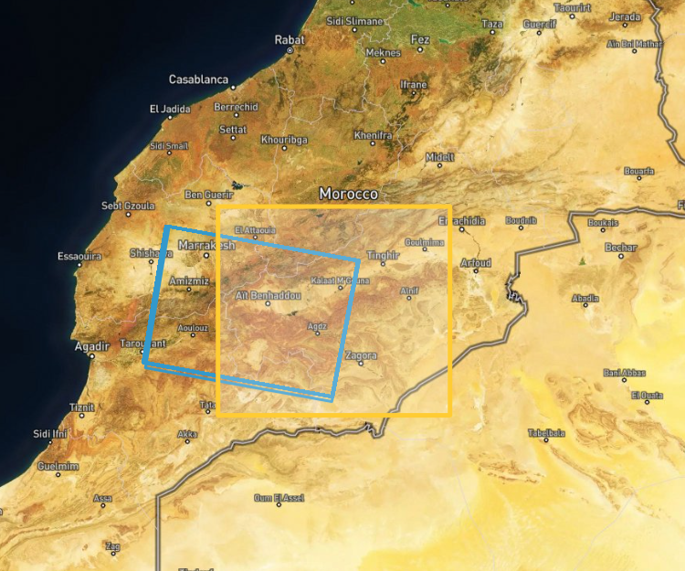

# Radarová interferometrie, tvorba DEM

## Cíl cvičení

- Seznámit se s radarovými daty
- Vyzkoušet si vytvoření DMT pomocí radarových dat

## Základní pojmy

- **Radarová interferometrie (InSAR - Interferometric Synthetic Aperture Radar)** - jedná se o radarovou metodu, která využívá dvou nebo více radarových snímků ke sledování deformací povrchu nebo pro tvorbu digitálního výškového modelu pomocí rozdílů ve fázi vln vracejících se zpět do senzoru.

Výhodou radarových dat je možnost snímání zemského povrchu i za oblačného počasí bez ohledu na denní dobu. Princip aktivního radarového snímání je založen na vysílání mikrovlnného záření k povrchu Země, kde se záření odráží zpět k senzoru, který následně měří fyzikální charakteristiky zpětného odrazu záření. Různé změny na zemském povrchu se projeví v charakteru odraženého záření, proto je možné radarové snímání využít např. při povodních či sesuvech půdy téměř v reálném čase. V oboru zemědělství a lesnictví je vhodný pro monitoring změn lesních porostů a detekce některých zemědělských operací [<a href="https://www.szif.cz/cs/ams-sentinel" target="_blank">https://www.szif.cz/cs/ams-sentinel</a>]. V rámci tohoto cvičení budeme pracovat s daty z družice Sentinel-1. Více o radarových datech se můžete dočíst například v <a href="https://geo.fsv.cvut.cz/vyuka/155dprz/Handbook_Precourse_Sentinel-1.pdf" target="_blank"> **této příručce**</a>.

## Tvorba DEM z radarových dat

Asi největší slabinou pro interferometická data z družice Sentinel-1 představuje vegetace – čím vyšší, tím vzniká větší dekorelace a následný šum v interferogramu. Pokud se zájmová lokalita nachází v oblasti s výraznými změnami v jednotlivých obdobích – tedy léto-zima, je rozumné využít data ze zimního období, tedy z období, kdy alespoň část porostu je zbavena vegetativních částí. InSARu vadí i travnatý porost, nicméně největší problémy dělají tropické deštné pralesy, a touto metodou je nemožné pro tuto oblast vytvořit digitální výškový model. Pro vytvoření výškového modelu je zapotřebí dvou scén.

Během cvičení můžete zpracovávat buď data z oblasti, kterou si sami vyberete (v takovém případě je nutné začít od prvního z následujících kroků, kde se dozvíte, jak vybrat vhodná data), nebo můžete pracovat s již vyhledanými a staženými daty, které jsou k dispozici <a href="https://geo.fsv.cvut.cz/vyuka/155dprz/cv7/data_cv7.zip" target="_blank"> **Zde**</a>. V případě druhé varianty je možné první dva kroky přeskočit.

Pro začátek je dobré znát následující nástroj v prostředí webového prohlížeče od organizace <a href="https://asf.alaska.edu/" target="_blank"> **Alaska Satellite Facility**</a>. Konkrétně se jedná o nástroj <a href="https://search.asf.alaska.edu/#/" target="_blank"> **Vertex**</a>.

{: style="margin-bottom:0px;" align=center }

### 1) Vyhledání dat

Neprve si pomocí nástroje ***Draw a box*** vyznačíme zájmové území. Zároveň se v menu *Dataset* ujistíme, že vyhledáváme data Sentinel-1.

{: .off-glb .process_icon}

{: .process_container}

Dále je dobré si pomocí filtrů vyfiltrovat pouze ta data, která chceme. Ve filtrech je jedna z prvních možností *Seasonal Search*, která je užitečná v případě období vegetační a bezvegetační doby.

{ style="height:85px;"}
{: style="margin-bottom:0px;" align=center }

Radarová data mají více úrovní předzpracování, my potřeboujeme **L1 Single Look Complex (SLC)**. Pro snadnější výběr snímků, které zahrnují celou oblast, můžeme vydefinovat i *Path and Frame*.

{ style="height:523px;"}
{: style="margin-bottom:0px;" align=center }

Hodnoty *Path* a *Frame* zadáváme samozřejmě pouze tehdy, pokud je známe, a pokud hledáme konkrétní data. Následující obrázky znázorňují výsledky vyhledání se zadanými hodnotami *Path* a *Frame* a výsledky bez nich.

{: .process_container}
<figcaption>Vlevo - vyhledaná data bez zadaných hodnot Path a Frame, vpravo - vyhledaná data se zadanými hodnotami Path a Frame</figcaption>

Z vyhledaných výsledků si jeden zvolíme a zkopírujeme název dané scény (někam si to poznamenáme).

{ style="height:311px;"}
{: style="margin-bottom:0px;" align=center }

{ style="height:63px;"}
{: style="margin-bottom:0px;" align=center }

### 2) Vyhledání párové scény

Jak již bylo řečeno, pro tvorbu DEM potřebujeme dvě scény. K tomu opět využijeme nástroj <a href="https://search.asf.alaska.edu/#/" target="_blank"> **Vertex**</a>. Doporučuji si ho ale otevřít v nové kartě, abychom nepřišli o naše vyhledaná data. V menu ***Search Type*** se přepneme na ***Baseline Search*** a zadáme dříve zkopírovaný název vyhledané scény.

{: .off-glb .process_icon}

{: .process_container}

Cílem bude snažit se nalézt párovou scénu s co největší kolmou základnou (Perpendicular Baseline) a s co nejmenší časovou základnou (Temporal Baseline) - zjednodušeně co nejvíce vzdálené místo snímkování a nejkratší doba mezi jednotlivými scénami. V pravé části vidíme graf, který vizualizuje jednotlivé snímky na vertikální ose s kolmou základnou a horizontální ose s časovou základnou. Pro tvorbu digitálního výškového modelu z radarových dat je doporučená hodnota pro kolmou základnu alespoň **120 metrů** a časovou základnu maximálně **6 dnů** – aby byla vypozorována co nejmenší změna na daném území. Nicméně jak sami uvidíte, není úplně jednoduché taková data nalézt. Tomu nepomáhá ani fakt, že od 23. 12. 2021 je na oběžné dráze v provozu pouze jedna z původně dvou družic Sentinel-1, a tudíž od tohoto data ani není možné najít párové scény s časovou základnou 6 dnů (doba kdy družice Sentinel-1 snímá podruhé stejné místo na Zemi je 12 dnů - ve dvojici to bylo 6 dnů). Doporučuji tedy pracovat se staršími daty.

Po vyhledání párových scén je dále dobré upravit tzv. ***Baseline Criteria***, aby se nám zobrazovaly pouze scény s vhodnými hodnotami *Perpendicular Baseline* a *Temporal Baseline*. V opačném případě se nám zobrazí všechny dostupné scény a není jednoduché se v tom zorientovat.

{: .off-glb .process_icon}

{: .process_container}

Po upravení parametrů se nám zobrazí pouze potenciálně vhodné scény. Pokud jedna z nich splňuje požadované parametry (nebo se k nim aspoň přibližuje), poznamenáme si znovu její název. V opačném případě je potřeba zvolit jinou scénu z původního vyhledávání a pokusit se najít vhodnou párovnou scénu k ní.

{: style="margin-bottom:0px;" align=center }

V případě nalezení vhodných scén si obě scény pomocí jejich názvu vyhledáme a stáhneme na <a href="https://dataspace.copernicus.eu/browser" target="_blank"> **Copernicus Browser**</a>, kde jsme již dříve stahovali data Sentinel-2. (Stahovat lze i přímo z nástroje *Vertex*, ale je potřeba být zaregistrován.)

### 3) Instalace pluginu ve SNAP