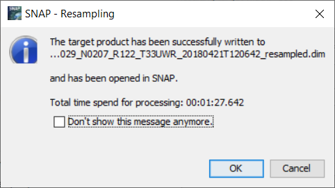

# Seznámení se softwarem SNAP, vytvoření subsetu, barevná syntéza, tvorba spektrálních křivek

## Cíl cvičení

- Nahrání dat do **SNAP** a základní orientace v softwaru
- Vytvoření subsetu ze stažených dat Sentinel-2
- Tvorba RGB obrázku pomocí kombinace jednotlivých pásem
- Analýza spektrálních vlastností různých povrchů pomocí spektrálních křivek

## Základní pojmy

- **Resampling** (převzorkování): Změna prostorového rozlišení rastrovách dat (změna velikosti pixelu).
- **Barevná syntéza**: Kombinace tří různých pásem pro vytvoření RGB snímku. Výsledkem může být snímek v přirozených či falešných barvách.
- **Spektrální křivka**: Závislost mezi odrazivostí a vlnovou délkou pro daný objekt či povrch. Tvar těchto křivek bývá pro daný objekt typický.

## Pásma Sentinel-2

Data Sentinel-2 obasahují celkem 12 (v případě L2A produktů) resp. 13 (v případě L1C produktů) pásem. Při práci s těmito daty je dobré znát, kterým vlnovým délkám jednotlivá pásma odpovídají (tj. v jaké části spektra se nacházejí) a jaké mají jednotlivá pásma prostorové rozlišení. Tyto informace přehledně znázorňuje následující obrázek.

{: style="margin-bottom:0px;" align=center }
<figcaption>Přehled jednotlivých pásem Sentinel-2</figcaption>

## Práce v softwaru SNAP

### Nahrání dat do SNAP

Stažená data Sentinel-2 otevřeme pomocí ***File*** → ***Open Product...***, případně kliknutím na ikonu ***Open Product***. Data lze též otevřít jejich přetažením přímo do SNAP, nikoliv však do mapového okna, ale do ***Product Explorer***, který se nachází v levé horní části prostředí SNAP.

{ style="width:80%;"}
{ style="width:80%;"}
{: .process_container}

Data Sentinel-2 pro práci ve SNAP nemusíme rozbalovat a otevřeme tak přímo stažený **ZIP** soubor.

{ style="width:80%;"}
{: style="margin-bottom:0px;" align=center }

V levé části prostředí SNAP v ***Product Explorer*** se poté objeví náš produkt. Ten si rozbalíme, v části ***Bands*** si vybereme jakékoliv pásmo a dvojklikem ho zobrazíme v mapovém okně.

{: style="margin-bottom:0px;" align=center }

???+ note "&nbsp;Pozn."
      Open source software SNAP má občas tendence nedělat zrovna to, co se po něm chce (hlášení podivných chybových zpráv, nereagování na uživatelské vstupy, atd.). V takovém případě doporučujeme celý SNAP zavřít (případně nejdřív uložit provedené změny) a znovu spustit, což ve většině případů problém vyřeší.

### Základní orientace ve SNAP

V levé dolní části prostředí SNAP se nachází čtyři záložky, z nichž tři jsou pro nás zajímavé. Jedná se o ***Navigation***, ***Colour Manipulation*** a ***World View***. V ***Navigation*** se zobrazuje celá scéna nahraná do aktuálního mapového okna. Při zoomování v mapovém okně se zde rovněž zobrazuje aktuální poloha daného výřezu na zobrazené scéně, se kterým můžeme pomocí levého tlačítky myši i pohybovat. Velmi užitečné jsou zde i ikony pro synchronizaci mapových oken a kurzoru v případě prohlížení více pásem najednou. ***Colour Manipulation*** slouží pro barevnou úpravu zobrazení produktů v mapovém okně. Záložka ***World View*** pak ukazuje, kde přesně se daná scéna nachází na Zemi.

{: .process_container}

V levé horní části vedle záložky ***Product Explorer*** se nachází záložka ***Pixel Info***. Ta se hodí v případě, že chceme znát informaci o konkrétním pixelu, na kterém se zrovna nachází náš kurzor.

{ style="width:45%;"}
{: style="margin-bottom:0px;" align=center }

Do mapového okna lze přidat více než jedno pásmo. Dvojklikem na jednotlivá pásma si je tam postupně můžeme přidávat a následně mezi nimi překlikávat. Pokud si je chceme zobrazit souběžně vedle sebe (například pro porovnání), lze využít jedné z funkcí: ***Tile Horizontally***, ***Tile Vertically*** či ***Tile Evenly***.

{: .off-glb .process_icon}

{: .process_container}
<figcaption>Zobrazení různých pásem s rozdílným prostorovým rozlišením vedle sebe.</figcaption>

### Vytvoření RGB snímku

Pro snadnější orientaci je místo prohlížení jednotlivých scén, které jsou v odstínech šedi (pokud si je neobarvíme jinak), vhodné vytvořit pomocí barevné syntézy RGB snímek. To lze udělat kliknutím pravým tlačítkem myši na product v ***Product Explorer*** a následným kliknutím na ***Open RGB Image Window***. V nově otevřeném okně poté nastavíme kombinaci pásem, pomocí kterých bude definována barevná syntéza.

{: .off-glb .process_icon}

{: .process_container}

V případě dat Sentinel-2 je zde již přednastavena kombinace pásem **B4 - B3 - B2**, což odpovídá právě kombinaci červeného, zeleného a modrého pásma, díky čemuž vznikne obraz v přírodních barvách, ve kterých bychom dané území viděli i my pouhým okem. Je ale možné používat i jiné předdefinované kombinace či vytvářet své vlastní. Musí být ale dodržena podmínka, že kombinovat lze pásma pouze se stejným prostorovým rozlišením. V opačném případě nám SNAP zahlásí chybovou hlášku poukazující právě na tento fakt. Zvolenou barevnou syntézu potvrdíme kliknutím na tlačítko ***OK***, čímž se nám vzniklý RGB snímek přidá do mapového okna.

{ style="width:80%;"}
{: style="margin-bottom:0px;" align=center }

Pokud máte "štěstí", můžete na své scéně najít podobný úkaz jako na obrázku výše. Nejedná se o chybu senzoru, ale o zachycené letadlo prolétávající v době snímání pod družicí. O štěstí lze ale mluvit opravdu jen v uvozovkách, protože nám to zanáší do dat nechtěný šum.

### Tvorba subsetu

V rámci cvičení není praktické především z výpočetních důvodů pracovat s celou scénou Sentinel-2, která má rozměry 110 km × 110 km. Proto si vytvoříme subset o rozměrech zhruba 30 km × 30 km. Subset lze vytvořit kliknutím v menu na ***Raster*** → ***Subset...***.

{ style="width:40%;"}
{: style="margin-bottom:0px;" align=center }

Takto by se ale složitě odhadoval subset o konkrétních rozměrech, které by se musely dopočítávat ze souřadnic, což by bylo poměrně pracné. Doporučujeme proto následující postup.

Nejprve si upravíme mapové okno do zhruba čtvercového tvaru a zazoomujeme do naší oblasti zájmu.

{: style="margin-bottom:0px;" align=center }

Poté pomocí funkce ***Determines the distance between two points*** změříme přibližně velikost mapového okna. Měření se provede kliknutím na jedno místo a následně dvojklikem na místo druhé.

{: .off-glb .process_icon}

{: .process_container}

Pokud vzdálenost odpovídá zhruba 30 km, přepneme kurzor na ***Selection tool***, a poté klikneme pravým tlačítkem myši do mapového okna a zvolíme možnost ***Spatial Subset from View...***. 

{ style="width:70%;"}
{: .off-glb .process_icon}
{ style="width:70%;"}
{: .process_container}

Otevře se nám nové okno, ve kterém můžeme pozměnit parametry subsetu. V záložce ***Spatial Subset*** můžeme vše ponechat tak, jak je. Pokud ale chceme subset o rozměrech přesbě 30 km × 30 km, můžeme upravit hodnoty **Scene start X**, **Scene start Y** a **Scene end X**, **Scene end Y** tak, aby výsledné hodnoty **Subset scene width** a **Subset scene height** byly rovny 500. To ale platí pouze v případě, že je jako referenční pásmo použito pásmo o prostorovém rozlišení 60 m (např. B1). Důvod je ten, že 500 × 60 m = 30 000 m. Pokud by bylo použito jako referenční pásmo pásmo o prostorovém rozlišení 20 m či 10 m, je potřeba hodnoty **Subset scene width** a **Subset scene height** náležitě upravit. V záložce ***Band Subset*** mohu zvolit, jaká všechna pásma budou součástí subsetu. I zde ponecháme všechno tak, jak je (tj. ponecháme zaškrtnuto ***Select all***).

{: .process_container}

Po stisknutí tlačítka ***OK*** se v ***Product Explorer*** objeví nově vzniklý subset.

{ style="width:50%;"}
{: style="margin-bottom:0px;" align=center }

Nově vytvořený produkt můžeme poté uložit na disk. To lze udělat kliknutím pravým tlačítkem myši na daný produkt a zvolit možnost ***Save Product*** či ***Save Product As...***. SNAP nás poté informuje, že produkt bude uložen do formátu **BEAM-DIMAP**, což je nativní formát softwaru SNAP, a zeptá se nás, jestli chceme pokračovat v konverzi produktu. Dotaz potvrdíme tlačítkem ***Yes***, zvolíme místo, kam chceme produkt uložit a dáme ***Save***, čímž se na disku vytvoří **DIM** soubor s naším subsetem.

{: .off-glb .process_icon}

{: .process_container}

### Resampling

Při práci se Sentinel-2 daty můžeme narazit na problém při kombinování pásem s různým prostorovým rozlišením (jako např. při barevné syntéze). Aby se tomuto předešlo, je potřeba data převzorkovat na stejné prostorové rozlišení pro všechna pásma. Toho lze docílit pomocí ***Raster*** → ***Geometric*** → ***Resampling***.

{ style="width:40%;"}
{: style="margin-bottom:0px;" align=center }

V záložce ***I/O Parameters*** zvolíme produkt, který chceme převzorkovat, zadáme název převzorkovaného produktu a případně zaškrtneme, zda chceme produkt uložit na disk. V ***Resampling Parameters*** poté zvolíme referenční pásmo, podle kterého bude převzorkování provedeno. Zvolíme tedy jedno z pásem s prostorovým rozlišením 10 m (tj. B2, B3, B4 nebo B8). Zbytek necháme tak, jak je, a klikneme na ***Run***.

{: .process_container}

???+ note "&nbsp;Pozn."
      Pokud jsme zaškrtli, že chceme produkt rovnou zapsat na disk, může celá operace trvat o trochu déle v závislosti na velikosti dat a výkonu počítače.

{ style="width:40%;"}
{: style="margin-bottom:0px;" align=center }

Když se nyní podíváme znovu do ***Open RGB Image Window***, uvidíme, že máme na výběr mnohem více předdefinovaných kombinací pásem.

{ style="width:40%;"}
{: style="margin-bottom:0px;" align=center }

## Úkol - Tvorba spektrálních křivek

### Zadání

- Vytvořit graf se spektrálními křivkami různých povrchů nacházejících se na vytvořeném subsetu scény ze Sentinel-2.
- Okomentovat, jak se různé povrchy v jednotlivých pásmech chovají (kde dochází k vysoké odrazivosti, kde je naopak záření pohlcováno, atd.)

### Postup

Spektrální křivky ve SNAP zobrazíme pomocí nástroje ***Optical*** → ***Spectrum View***. Poté, pokud najedeme kurzorem na jakoukoliv scénu v mapovém okně, se nám začne zobrazovat spektrální křivka napříč všemi pásmy pro aktuální pozici kurzoru. Můžeme tak pozorovat, jak se křivka mění při pohybu kurzorem mezi různými typy povrchů.

{: .off-glb .process_icon}

{: .process_container}

Cílem je ale zobrazit spektrální křivky pro více povrchů současně. K tomu použijeme nástroje ***View*** → ***Tool Windows*** → ***Pin Manager*** a ***Pin placing tool***. Jak napovídají oba názvy, pomocí ***Pin placing tool*** budeme vkládat piny do mapového okna, a pomocí ***Pin Manager*** je budeme zpravovat.

{ style="width:80%;"}
{ style="width:80%;"}
{: .process_container}

Pomocí ***Pin placing tool*** tedy naklikáme piny pro různé povrchy (nejlépe nad RGB snímkem) a v ***Pin Manager*** je pojmenujeme a přiřadíme barvy.

{: .off-glb .process_icon}

{: .process_container}

Po naklikání všech pinů znovu otevřeme ***Spectrum View*** a pomocí ikony ***Show spectra for all pins*** si zobrazíme spektrální křivky pro všechny naklikané piny.

{ style="width:70%;"}
{: style="margin-bottom:0px;" align=center }

My si ale vytvoříme graf samostatně, a to tím, že si jednotlivá spektra vyexportujeme do **CSV**. To se učíní ve ***Spectrum View*** pomocí ikony ***Export spectra to text file***. Tento soubor pak načteme například do *Excel* (případně *MATLAB* či *Python*) a vytvoříme graf se všemi náležitostmi (popisky os, legenda, atd.). Výsledný graf poté okomentujeme.

{: .off-glb .process_icon}

{: .process_container}
