

# Vegetační (spektrální) indexy, maskování, detekce vodních ploch

## Cíl cvičení

- Naučit se, co jsou spektrální indexy zač (prezentace: <a href="https://geo.fsv.cvut.cz/vyuka/155dprz/cv3/Vegeta%C4%8Dn%C3%AD%20(spektr%C3%A1ln%C3%AD)%20indexy.pdf" target="_blank"> **PDF**</a>)
- Umět spektrální indexy počítat
- Tvořit masky v softwaru SNAP
- Detekovat vodní plochy pomocí spektrálních indexů

## Základní pojmy

- **Spektrální index**: Matematická kombinace dvou nebo více pásem s cílem získat informace o specifických vlastnostech zemského povrchu jako např. stav vegetace, kvalita vody, atd.

Více o spektrálních indexech a jejich konkrétní ukázky nalezneme v následujícím videu:

<iframe width="560" height="315" src="https://www.youtube.com/embed/25OZ1mD8aLc?si=Q-9Ed3AB_btmuCOA" title="YouTube video player" frameborder="0" allow="accelerometer; autoplay; clipboard-write; encrypted-media; gyroscope; picture-in-picture; web-share" allowfullscreen></iframe>

## Počítání spektrálních indexů

Spektrálních indexů existuje celá řada. Příklady indexů můžeme nalézt např. <a href="https://www.indexdatabase.de/db/i.php" target="_blank"> **zde**</a> nebo <a href="https://custom-scripts.sentinel-hub.com/custom-scripts/sentinel/sentinel-2/" target="_blank"> **zde**</a>. V rámci tohoto cvičení se podíváme na následující indexy:

<table>
  <thead>
    <tr>
      <th><strong>Index</strong></th>
      <th><strong>Název</strong></th>
      <th><strong>Vzorec (Sentinel-2)</strong></th>
    </tr>
  </thead>
  <tbody>
    <tr>
      <td><strong>NDMI</strong></td>
      <td>Normalized Difference Moisture Index</td>
      <td>(NIR - SWIR1)/(NIR + SWIR1) = (B8 - B11)/(B8 + B11)</td>
    </tr>
    <tr>
      <td><strong>NDVI</strong></td>
      <td>Normalized Difference Vegetation Index</td>
      <td>(NIR - Red)/(NIR + Red) = (B8 - B4)/(B8 + B4)</td>
    </tr>
    <tr>
      <td><strong>NDWI</strong></td>
      <td>Normalized Difference Water Index</td>
      <td>(Green - NIR)/(Green + NIR) = (B3 - B8)/(B3 + B8)</td>
    </tr>
    <tr>
      <td><strong>AWEIsh</strong></td>
      <td>Automated Water Extraction Index</td>
      <td>Blue + 2.5·Green - 1.5·(NIR + SWIR1) - 0.25·SWIR2) = B2 + 2.5·B3 - 1.5·(B8 + B11) - 0.25·B12</td>
    </tr>
  </tbody>
</table>

Pokud chceme spektrální indexy počítat ve SNAP, využijeme nástroj ***Band Maths...***, který nalezneme buď kliknutím pravým tlačítkem na vybraný produkt v ***Product Explorer***, nebo přes menu ***Raster*** → ***Band Maths...***

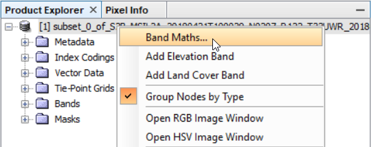{ style="height:171px;"}
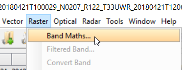{ style="height:115px;"}
{: .process_container}

???+ note "&nbsp;Pozn."
      Stejně jako u barevné syntézy, tak i zde platí, že pro výpočet spektrálních indexů je potřeba, aby všechna vstupující pásma do výpočtu měla stejné prostorové rozlišení. Proto budeme pracovat s převzorkovaným produktem.

V nově otevřeném okně poté zadáme název nově vytvořeného pásma (v našem případě indexu), zvolíme, zda chceme mít pásmo pouze virtuálně a nebo zapsané na disk, a klikneme na ***Edit Expression...*** Zde následně zadáme vzorec pro náš vybraný index. Vzorec můžeme napsat ručně pomocí klávesnice nebo si ho naklikat myší. Vyzkoušíme např. *NDMI = (B8 - B11)/(B8 + B11)*. Poté dáme *OK* a znovu *OK*.

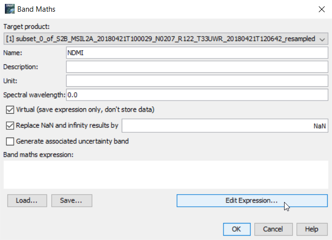
{: .off-glb .process_icon}
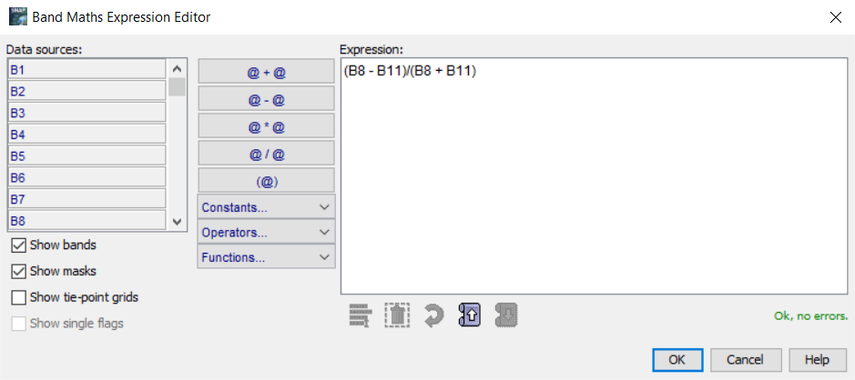
{: .process_container}

Vypočtené pásmo se nám přidá do mapového okna a také do *Bands*. Pokud jsme v předchozím kroku nechali zaškrtnuto *Virtual (save expression only, don't store data)*, zobrazuje se u ikony pásma písmeno *V* značící, že pásmo je pouze virtuální. Pokud bychom ho chtěli zapsat na disk, klikneme na pásmo pravým talčítkem myši a dáme ***Convert Band***.

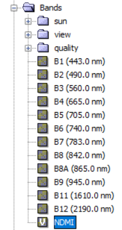{ style="height:309px;"}
{: .off-glb .process_icon}
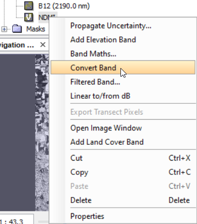{ style="height:350px;"}
{: .process_container}

[:material-open-in-new: NDMI](https://eos.com/make-an-analysis/ndmi/){ .md-button .md-button--primary .button_smaller .external_link_icon target="_blank"} neboli *Normalized Difference Moisture Index* popisuje úroveň vlhkosti ve vegetaci a slouží tedy jako indikátor vodního stresu vegetace. Nabývá hodnot od -1 do 1. Čím vyšší hodnota, tím vyšší úroveň vlhkosti ve vegetaci. Pro lepší názornost přiřadíme pásmu s indexem NDMI některou z nabízených barevných palet ve SNAP. Palety najdeme v záložce ***Colour Manipulation*** → ***Palette***, kde si nějakou vybereme (např. *gradient_red_white_blue*).

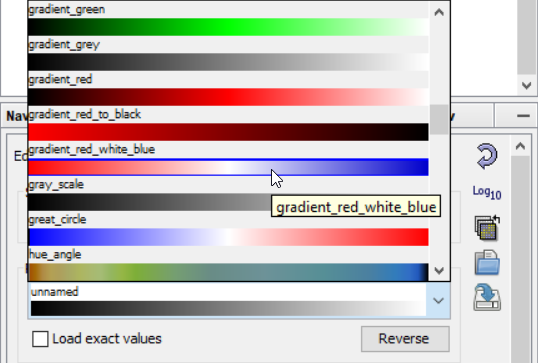
{: .off-glb .process_icon}
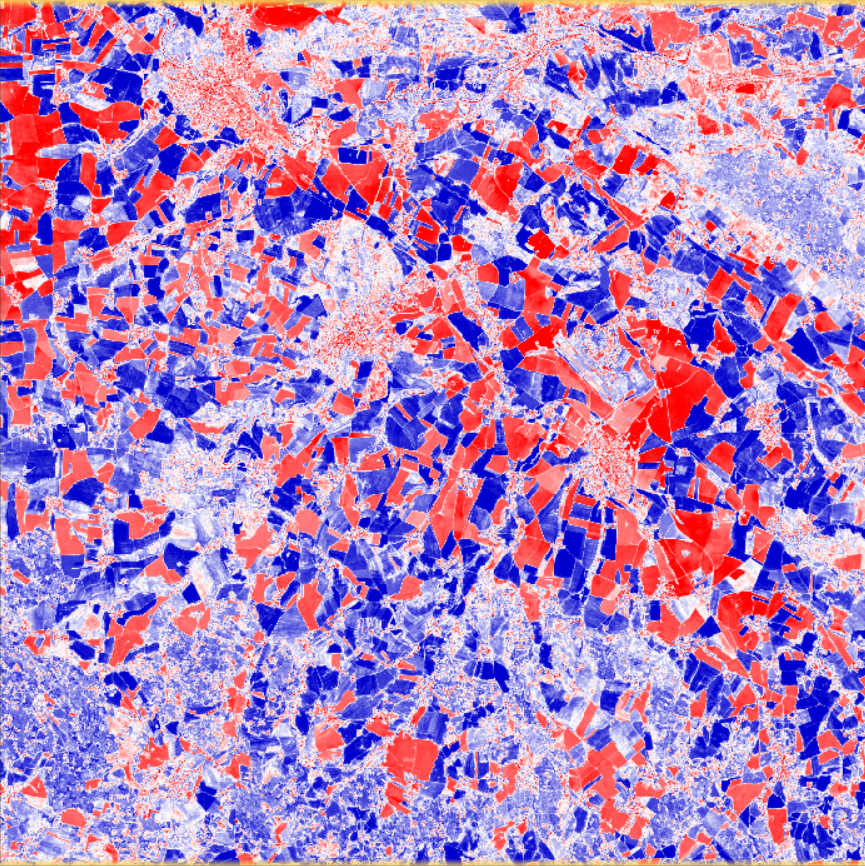
{: .process_container}

V tomto případě červená barva znázorňuje místa s nízkou hodnotou NDMI, a tudíž místa s žádnou či velmi nízkou úrovní vlhkosti ve vegetaci, a naopak modrá místa znázorňují místa s větším obsahem vlkosti. Při porovnání s RGB snímkem tak můžeme vidět, že červeně znázorněná místa odpovídají holé půde a zástavbě a modrá místa především zemědělským plodinám.

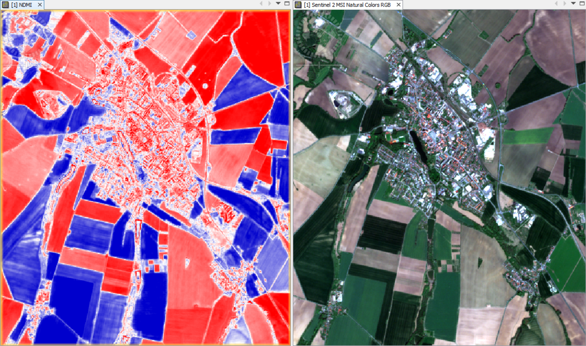
{: style="margin-bottom:0px;" align=center }
<figcaption>Porovnání NDMI s RGB syntézou v přírodních barvách</figcaption>

## Maskování

Příklad maskování si ukážeme na dalším indexu, který si spočítáme. Cílem bude zamaskovat místa porostlá vegetací. K tomu je ideální použít index [:material-open-in-new: NDVI](https://eos.com/make-an-analysis/ndvi/){ .md-button .md-button--primary .button_smaller .external_link_icon target="_blank"} neboli *Normalized Difference Vegetation Index*, který slouží právě k detekci vegetace a ke zkoumání jejího stavu. Vzoreček pro výpočet je následující: *NDVI = (B8 - B4)/(B8 + B4)*, a postup výpočtu je stejný, jako tomu bylo u *NDMI*. K vytvoření masky použijeme nástroj ***Mask Manager*** nacházející se v právě části prostředí SNAP. Pokud tam tento nástroj nevidíme, lze jej spustit z menu ***View*** → ***Tool Windows*** → ***Mask Manager***. V našem případě se zde již nachází některé předpočítané masky, které byly součástí produktu Sentinel-2.

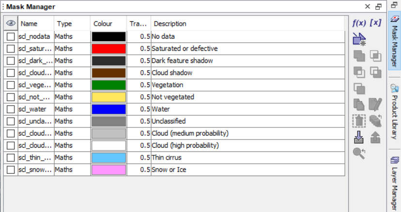
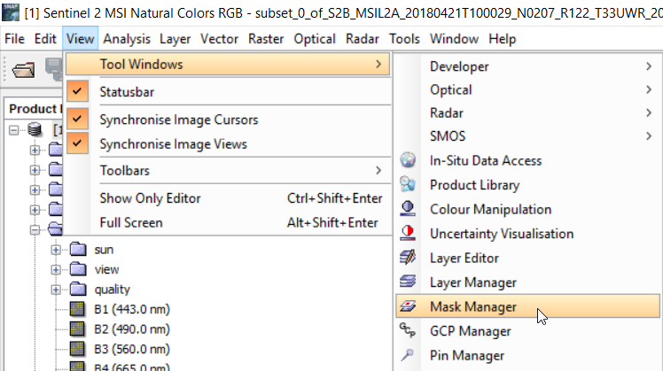
{: .process_container}

V ***Mask Manager*** jsou tři možnosti, jak masky tvořit. Jsou jimi: ***Creates a new mask based on a logical band maths expression***, ***Creates a new mask based on a value range*** a ***Creates a new mask based on a new geometry container (lines and polygons)***. Vytvořené mask je pak možné dále kombinovat pomocí logických operátorů. My nyní použijeme druhou možnost a vytvoříme masku pomocí rozsahu hodnot. Nejprve je ale potřeba znát, co hodnoty NDVI představují. To zhruba znázorňuje následující tabulka.

<table>
  <thead>
    <tr>
      <th><strong>Povrch</strong></th>
      <th><strong>Rozsah hodnot</strong></th>
    </tr>
  </thead>
  <tbody>
    <tr>
      <td><strong>Vodní plocha</strong></td>
      <td>(-1; 0)</td>
    </tr>
    <tr>
      <td><strong>Zástavba a holá půda</strong></td>
      <td>(0; 0.2)</td>
    </tr>
    <tr>
      <td><strong>Řídká vegetace</strong></td>
      <td>(0.2; 0.3)</td>
    </tr>
    <tr>
      <td><strong>Středně hustá vegetace</strong></td>
      <td>(0.3; 0.5)</td>
    </tr>
    <tr>
      <td><strong>Hustá vegetace</strong></td>
      <td>(0.5; 1)</td>
    </tr>
  </tbody>
</table>

Hovořit se ale rovněž dá i o zdravé a nezdravé vegataci. Chlorofyl totiž pohlcuje červené záření a buněčná struktura rostlin naopak odráží záření infračervené, což ve výsledku způsobuje vysoké honoty NDVI. Když ale není vegetace v dobrém stavu a chlorofylu ubývá, dochází k vyššímu odrazu červeného záření, což se projevuje nižšími hodnotami NDVI.

Řekněme tedy, že chceme vytvořit masku s hustou a středně hustou vegetací. V ***Mask Manager*** zvolíme možnost ***Creates a new mask based on a value range*** a zadáme požadovaný rozsah hodnot NDVI.

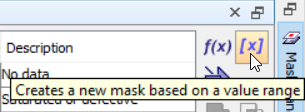{ style="height:90px;"}
{: .off-glb .process_icon}
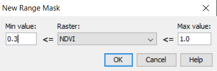{ style="height:113px;"}
{: .process_container}

V ***Mask Manager*** se nám poté objeví nová maska, kterou si můžeme pojmenovat či jí změnit barvu.

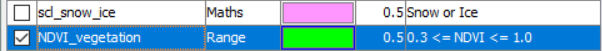{ style="height:41px;"}
{: style="margin-bottom:0px;" align=center }

Následně si masku zobrazíme přes nějaké pásmo (ideálně přes RGB kompozit) a přesvědčíme se, zda opravdu maskuje to, co jsme chtěli.

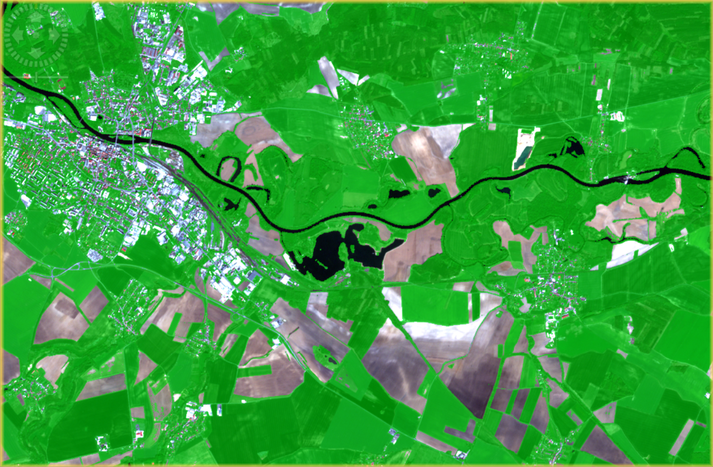
{: style="margin-bottom:0px;" align=center }

## Úkol - Tvorba NDVI mapy a detekce vodní ploch

### Zadání

- Vytvořit NDVI mapu s diskrétními barvami pro různé druhy povrchů detekovatelných pomocí NDVI, popsat co jaká barva znázorňuje
- Detekovat vodní plochy pomocí vybraných indexů
- Zhodnotit který z indexů detekoval vodní plochy nejlépe, aniž by docházelo i k zásadnímu detekování zástavby
- Zjistit celkovou detekovanou plochu vody pro jednotlivé indexy

### Postup

První část úkolu je snadná. NDVI již máme spočítané, takže jen stačí přidělit jednotlivým hodnotám NDVI barvy dle tabulky výše. Zobrazíme si tedy pásmo NDVI a přejdeme do ***Colour Manipulation***. Zvolíme možnost ***Sliders*** a klikneme na ***More Options***, kde zaškrtneme checkbox ***Discrete colours***.

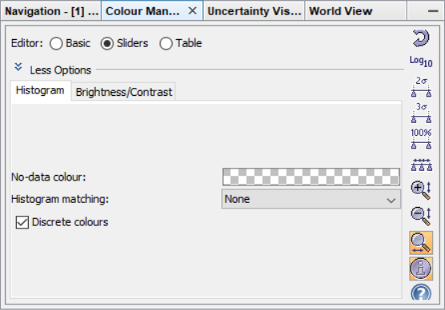{ style="height:310px;"}
{: style="margin-bottom:0px;" align=center }

Slidery poté upravíme dle našich potřeb. Kliknutím na hodnotu slider můžeme tuto hodnotu měnit. Kliknutím na samotný slider můžeme měnit barvu daného slideru (při zaškrtnutém *Discrete colours* bude vybraná barva platit pro hodnoty od daného slideru až po slider následující). Kliknutím pravým talčítkem myši můžeme slidery buď přidávan nebo odstraňovat. Není potřeba zadávat slider pro nejvyšší možnou hodnotu. Stačí mít slider pro počáteční hodnotu posledního intervalu.

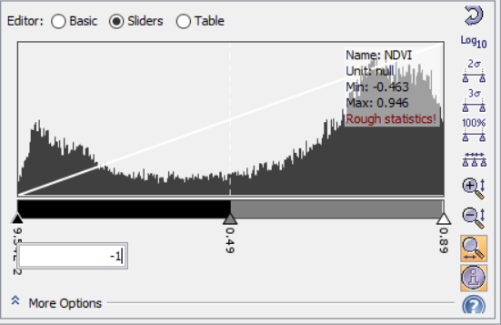
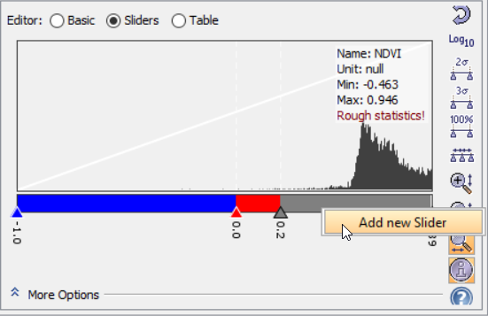
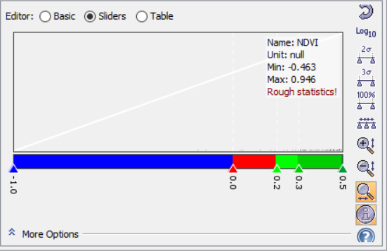
{: .process_container}

Výsledná mapa pak může vypadat nějak takto:

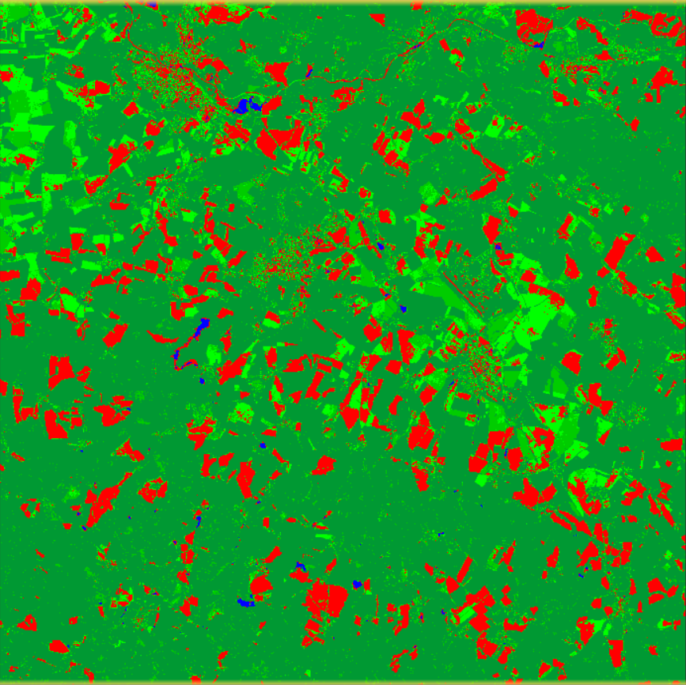{ style="height:693px;"}
{: style="margin-bottom:0px;" align=center }

Druhá část není o nic složitější. Pro detekci vody použijeme následující indexy: NDVI, NDWI a AWEIsh. Jen je potřeba znát, které hodnoty zhruba odpovídají vodní hladině. Tuto informaci shrnuje následující tabulka.

<table>
  <thead>
    <tr>
      <th><strong>Index</strong></th>
      <th><strong>Hodnoty pro vodní plochu</strong></th>
    </tr>
  </thead>
  <tbody>
    <tr>
      <td><strong>NDVI</strong></td>
      <td>(-1; 0)</td>
    </tr>
    <tr>
      <td><strong>NDWI</strong></td>
      <td>(0; 1)</td>
    </tr>
    <tr>
      <td><strong>AWEIsh</strong></td>
      <td>> 0</td>
    </tr>
  </tbody>
</table>

Postup pro NDVI a NDWI je stejný jako při maskování vegetace. U AWEIsh je postup také identický. Jen při tvorbě samotné masky použijeme místo ***Creates a new mask based on a value range*** funkci ***Creates a new mask based on a logical band maths expression***.

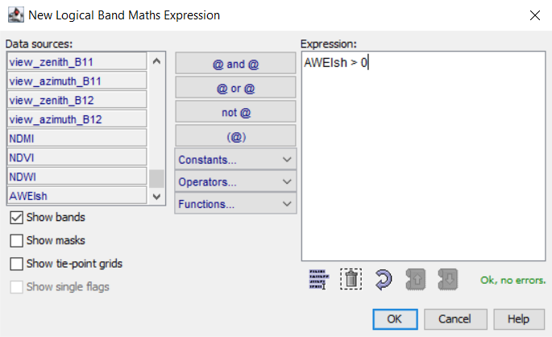{ style="height:334px;"}
{: style="margin-bottom:0px;" align=center }

Výsledky detekce vodních ploch poté porovnáme. Hodnoty indexů definující vodní plochy můžeme rovněž trochu upravovat, dokud není dosaženo optimálních výsledků. Nejhůře pro detekci vody by měl vyjít index NDVI (na obrázku níže vlevo), který pro tento účel není primárně určen.

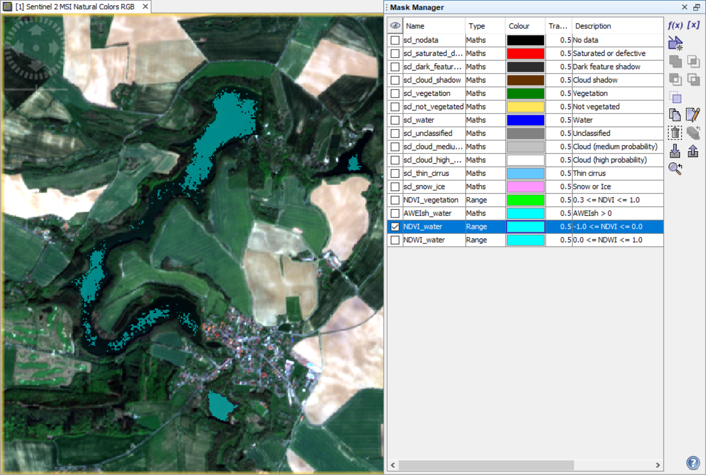
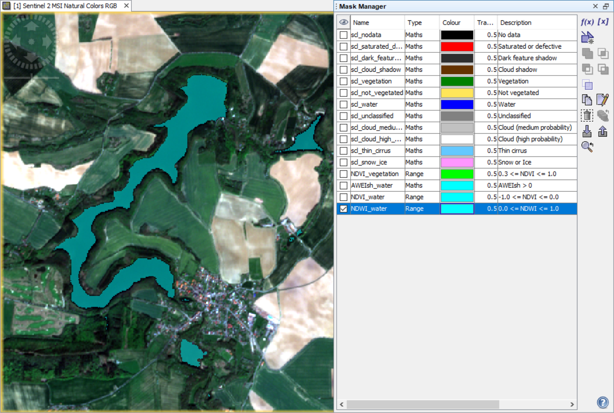
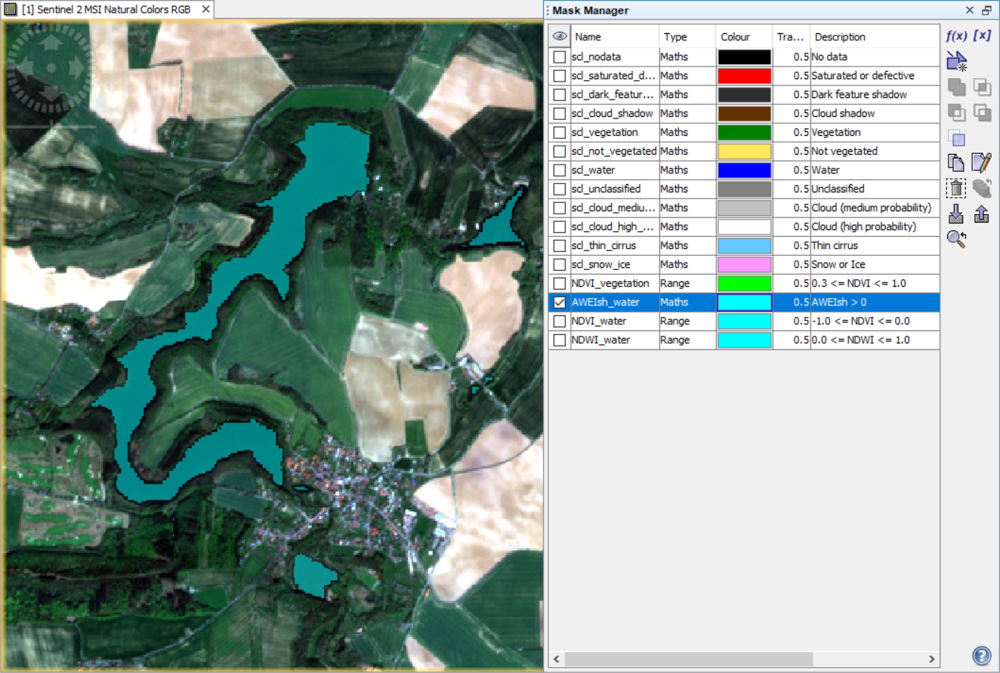
{: .process_container}

Celkovou plochu, které naše masky pokrývají, zjistíme pomocí ***Analysis*** → ***Statistics***.

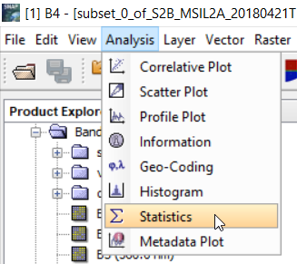{ style="height:233px;"}
{: style="margin-bottom:0px;" align=center }

Po otevření nového okna je nejprve nutno znovu kliknout do mapového okna, aby nástroj věděl, odkud se bude statistika počítat. V právě části poté zaškrtneme možnost ***Use ROI mask(s):*** a zvolíme konkrétní masku. Následně klikneme na dvě modré šipky v pravé horní části, čímž se statistika spočítá. V lévé části pak najdeme hodnotu ***#Pixels total***, která v tomto případě udává počet pixelů pokrytých maskou.

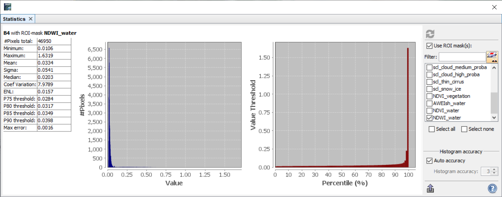
{: style="margin-bottom:0px;" align=center }