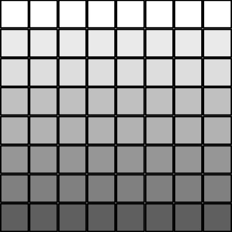
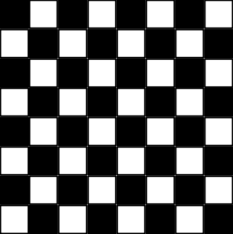
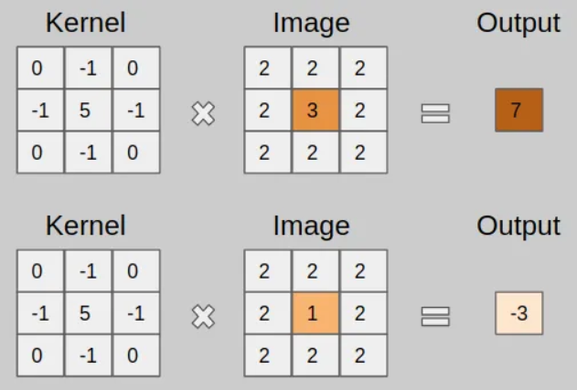
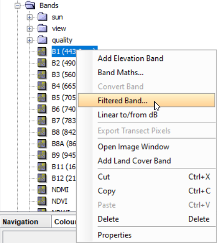
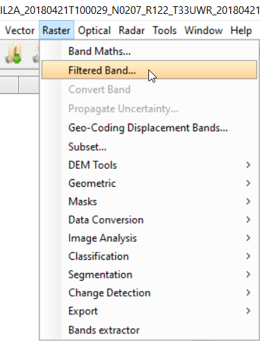
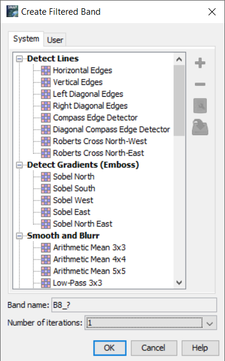
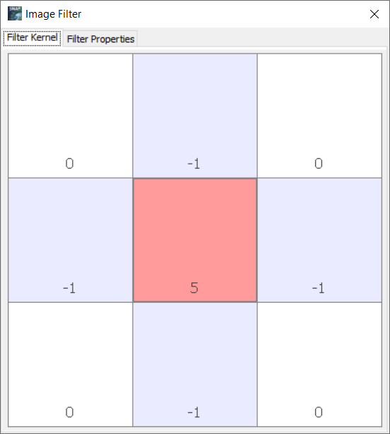
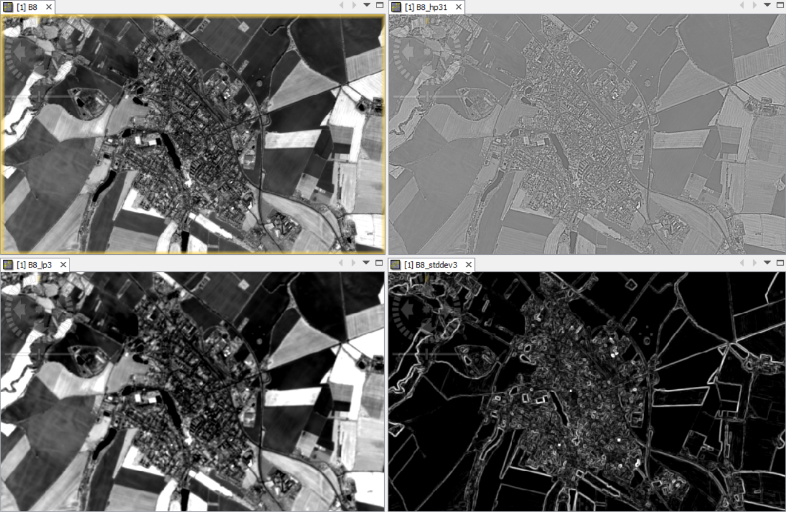

# Filtrace obrazu

## Cíl cvičení

- Porozumět principu prostorových filtrů
- Umět prostorové filtry aplikovat

## Základní pojmy

Aplikace prostorových filtrů na obrazová data se řadí mezi metody zvýraznění obrazu. S jinými metodami zvýraznění obrazu jsme se setkali již v minulých cvičeních. Příkladem byla úprava (roztažení) histogramu v *Colour Manipulation*, či vytváření barevných syntéz a počítání spektrálních indexů. Metody zvýraznění obrazu můžeme tedy rozdělit do následujících skupin:

- **Bodové** (radiometrické) zvýraznění - manipulace s odstíny šedi, prahování, hustotní řezy
- **Prostorové** zvýraznění - prostorové **filtrace**, Fourierovy transformace
- **Spektrální** zvýraznění - sestavování barevných syntéz, barevná zvýraznění více pásem (analýza hlavních komponent, aritmetické kombinace, IHS
transformace)

### Prostorová frekvence

Popisuje množství změn v hodnotách pixelů pro dané území v závislosti na vzdálenosti. Nízká prostorová frekvence znamená, že jsou si hodnoty v rastru podobné. Naopak pokud se hodnoty v rastru výrazně liší, mluvíme o vysoké prostorové frekvenci.

{: .process_container}
<figcaption>Nízká prostorová frekvence (vlevo) a vysoká prostorová frekvence (vpravo)</figcaption>

### Konvoluce

- Jedná se o proces, kde je pro výpočet nových hodnot pixelů využito pohyblivé okno (kernel) s předem definovanými hodnotami váh. Toto pohyblivé okno se postupně pohybuje po celém rastru.
- Pohyblivé okno je zpravidla čtvercového tvaru a má většinou rozměry 3×3, 5×5 nebo 7×7 pixelů (je potřeba mít lichý počet sloupců a řádků, protože se počítá hodnota prostředního pixelu, nicméně nemusí to být pravidlem).
- Nové hodnoty rastru se počítají nejčastěji pomocí tzv. konvolučního vzorce, což ale není nic jiného, než vážený průměr hodnot pixelů v pohyblivém okně.

{ style="height:342px;"}
{: style="margin-bottom:0px;" align=center }

### Dělení filtrů

Prostorové filtry můžeme dělit dvěma způsoby. První způsob dělení je podle druhu informace, kterou dané filtry propouští, a druhou metodou je pak způsob, jakým jsou nové hodnoty rastru určovány.

**Dělení podle propustnosti informací**

- **Vysokofrekvenční** (high-pass) filtry - propouštějí vysokofrekvenční informaci a zesilují tedy rozdíly mezi hodnotami v obraze. Dochází tak ke zvýraznění obrazu. Využívají se například pro detekci hran.
- **Nízkofrekvenční** (low-pass) filtry - propouštějí pouze nízkofrekvenční informaci a potlačují tak rozdíly mezi hodnotami v obraze. Dochází k vyhlazení obrazu. Slouží například k redukci šumu.

**Dělení podle způsobu výpočtu nových hodnot**

- **Lineární** filtry - nová hodnota daného pixelu je vypočtena jako lineární kombinace hodnot v jeho okolí (v pohyblivém okně). Je použito konvolučního vzorce.
- **Nelineární** filtry - nová hodnota daného pixelu není lineární kombinací okolních hodnot a k výpočtu tedy není použita konvoluce. Příkladem může být např. mediánový filtr, či filtry přiřazující danému pixelu maximální případně minimální hodnotu z okolí.

### Využití filtrů a shrnutí

Filtry mají v DPZ řadu využití. Příklady mohou být následující:

- Vylepšení, zvýraznění obrazu
- Analýza či automatické zpracování
- Odstranění šumu
- Vyhlazení klasifikačních výsledků

Princip prostorových filtrů názorně shrnují následující videa:

<iframe width="560" height="315" src="https://www.youtube.com/embed/5_V_iJmtwwg?si=VStQYNNZ062CIMoQ" title="YouTube video player" frameborder="0" allow="accelerometer; autoplay; clipboard-write; encrypted-media; gyroscope; picture-in-picture; web-share" allowfullscreen></iframe>
<iframe width="560" height="315" src="https://www.youtube.com/embed/PDLSvWuhDwI?si=SDYJPBYJWyWw5TCW" title="YouTube video player" frameborder="0" allow="accelerometer; autoplay; clipboard-write; encrypted-media; gyroscope; picture-in-picture; web-share" allowfullscreen></iframe>

## Ukázka použití filtrů ve SNAP

Ve SNAP máme dvě možnosti, jak se dostat k prostorovým filtrům. Buď můžeme kliknout pravým tlačítkem myši na některé pásmo v *Product Explorer* a následně zvolit možnost ***Filtered Band...*** nebo můžeme přes menu ***Raster*** → ***Filtered Band...*** Pokud k prostorovým filtrům přistupujeme druhým způsobem, je potřeba mít označeno pásmo buď v *Product Explorer* nebo v mapovém okně.

{ style="height:380px;"}
{ style="height:393px;"}
{: .process_container}

V nově otevřeném okně si pak můžeme vybrat jeden z nabízených filtrů nebo si vytvořit svůj vlastní. Dále můžeme volit počet iterací nebo se podívat na kernel jednotlivých filtrů.

{ style="height:490px;"}
{ style="height:492px;"}
{: .process_container}
<figcaption>Vpravo ukázka kernelu vysokofrekvenčního filtru</figcaption>

Po aplikování filtru se nám filtrovaný obraz přidá do mapového okna.

{: style="margin-bottom:0px;" align=center }
<figcaption>Ukázky filtrů. Vlevo nahoře - původní pásmo B8, vpravo nahoře - High-Pass filtr, vlevo dole - Low-Pass filtr, vpravo dole - Standard Deviation filtr</figcaption>

## Úkol - Aplikace vybraných filtrů

- Použít na jedno z původních desetimetrových pásem (tj. B2, B3, B4 nebo B8) čtyři různé filtry (alespoň jeden nízkofrekvenční a jeden vysokofrekvenční). Popsat co se děje s obrazem pro následující oblasti:
    - Vodní plocha a břehové oblasti
    - Město / zástavba
    - Lesní plocha
- Ke každému popisu přidat obrázek jako důkaz
- V závěru zhodnoťte, které filtry jsou výhodné pro zvýraznění změn mezi jednotlivými plochami a které potlačují různorodosti v rámci ploch stejného typu.

### Nízkofrekvenční filtry

- Průměrový (Mean)
- Mediánový
- Low-Pass
- Min/Max
- Morphological

### Vysokofrekvenční filtry

- Line (edge) detection
- Laplace
- High-Pass
- Emboss
- Standard Deviation

Vysokofrekvenční filtr lze získat i tak, když od původního pásma odečteme pásmo s aplikovaným nízkofrekvenčním filtrem.