

# Neřízená klasifikace

## Cíl cvičení

- Naučit se klasifikovat optická družicová data pomocí neřízené klasifikace s cílem vytvořit vrstvu pokrytí území (land cover)
- Porozumět rozdílu mezi neřízenou a řízenou klasifikací
- Pochopit princip neřízené klasifikace

## Základní pojmy

### Klasifikace obecně

- Klasifikaci lze obecně definovat jako seskupování vzájemně si podobných prvků do určitých skupin (tříd, kategorií).
- V dálkovém průzkumu Země klasifikace představuje proces, při kterém se jednotlivé pixely originálního numerického záznamu zařazují do tříd, a vzniká tak klasifikovaný snímek. Originální obrazový záznam se tak stává tematickou mapou (nejčastěji mapa land cover).
- Přiřazování pixelů do tříd probíhá na základě tzv. **příznaků** (u optických dat mluvíme o spektrálních příznacích, tj. hodnoty spektrální odrazivosti různých povrchů).
- Příznaky tvoří tzv. **příznakový prostor**, který je definován všemi pásmy, v nichž lze naměřit nebo vypočíst určitou charakteristiku.

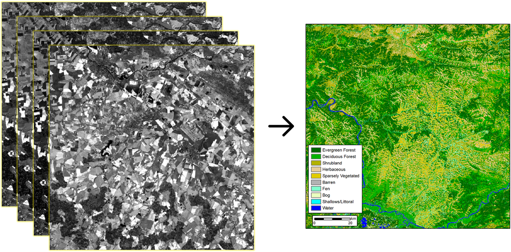
{: style="margin-bottom:0px;" align=center }
<figcaption>Zjednodušené schéma klasifikace, kdy se z multispektrálních dat tvoří tematická mapa</figcaption>

### Dělení klasifikace

Klasifikaci obrazových dat můžeme dělit dvěma způsoby. První způsob klasifikaci dělí podle toho, kdy do ní my jakožto operátor vstupujeme. Mluvíme poté o následujících typech klasifikací:

- **Neřízená** klasifikace - Na začátku zadáváme pouze počet tříd, které chceme klasifikovat. Co ale dané třídy ve skutečnosti představují, musíme určit až dodatečně po samotné klasifikaci.
- **Řízená** klasifikace - Na začátku určujeme konkrétní třídy, které chceme klasifikovat. Klasifikátoru zároveň poskytujeme trénovací množiny, na kterých se klasifikátor jednotlivé třídy "učí".
- **Hybridní** klasifikace - Kombinuje dohromady neřízenou a řízenou klasifikaci.

Druhým způsobem je dělení klasifikace podle toho, zda do tříd přiřazujeme jednotlivé pixely nebo skupiny pixelů. Mluvíme pak o následujících typech klasifikací:

- **Pixelová** (per-pixel) klasifikace - Ke konkrétní třídě jsou postupně přiřazovány jednotlivé pixely.
- **Objektová** klasifikace - Do konkrétních tříd nejsou přiřazovány jednotlivé pixely, ale skupiny pixelů.

### Princip neřízené klasifikace

Většina algoritmů neřízené klasifikace je založena na **shlukové analýze**. Ta iterativním způsobem slučuje pixely do shluků se stejnými či podobnými spektrálními vlastnostmi. Základním předpokladem tedy je, že pixely, které patří do jedné třídy, jsou ve vícerozměrném prostoru přirozeně blízko sebe a naopak pixely odlišných skupin, které představují povrchy lišící se svým spektrálním chováním, jsou dobře separované. Vytvořené shluky se nazívají **spektrální třídy**. Tyto spektrální třídy ale nemají požadovanou informační hodnotu a teprve jejich interpretací a postupným spojováním vzikají **třídy informační**.

### Algoritmy neřízené klasifikace

Algoritmů neřízené klasifikace je celá řada. SNAP nabízí dva algoritmy: **K-Means Cluster Analysis** a **EM Cluster Analysis**. V ArcGIS Pro pak nalezneme algoritmus **ISO Cluster**.

#### K-Means Cluster Analysis

Metoda **K-Means Cluster Analysis** ve SNAP po uživateli před spuštěním požaduje pouze zadání konkrétního počtu shluků a počet iterací. Postup výpočtu lze pak shrnout do následujících kroků:

1. Definování počtu výsledných shluků a určení počtu iterací
2. Určení počáteční polohy centroidu pro každý shluk (pokud není poloha explicitně zadána, jsou centroidy rozmístěny rovnoměrně po diagonále příznakového prostoru)
3. Postupné přiřazení všech pixelů k tomu shluku, k němuž mají v příznakovém prostoru nejblíže (podle Euklidovské vzdálenosti)
4. Výpočet nové polohy centroidu pro každý shluk na základě nově přiřazených pixelů
5. Opakování kroků 3. a 4. dokud nenastane jedna z následujících momžností:
    1. Bylo dosaženo jednoho z **kritérií konvergence**, tj. poloha centroidů či počet pixelů zařazených do jednotlivých shluků se již výrazně nemění
    2. Bylo dosaženo maximálního počtu iterací zadaného uživatelem

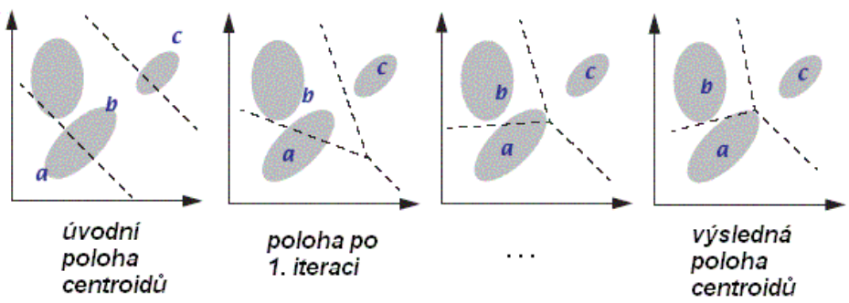{ style="height:266px;"}
{: style="margin-bottom:0px;" align=center }
<figcaption>Princip iteračního postupu shlukování</figcaption>

Následně pak uživatel již samostatně provádí následující dva kroky, které jsou stejné pro všechny metody neřízené klasifikace.

1. Přiřazení konkrétního významu každému tzv. stabilnímu shluku (spektrální třídě)
2. Vytvoření informačních tříd spojováním tříd spektrálních

#### EM Cluster Analysis

Metoda **EM (Expectation Maximization) Cluster Analysis** funguje podobně jako K-Means Cluster Analysis. Nastavuje se znovu pouze jen počet shluků a počet iterací. Přiřazování pixelů do shluků ale neprobíhá na základě Euklidovské vzdálenosti (tj. ke kterému centroidu má daný pixel nejblíže), ale podle pravděpodobnosti, že daný pixel patří do daného shluku. Tyto pravděpodobnosti jsou určeny pomocí normálního rozdělení.

1. Definování počtu výsledných shluků a určení počtu iterací
2. Určení počáteční střední hodnoty a rozptylu pro každý shluk (náhodně nebo pomocí K-Means)
3. Výpočet pravděpodobností každého pixelu že patří do daného shluku (normální rozdělení)
4. Aktualizace parametrů každého shluku na základě vypočtených pravděpodobností
5. Opakování kroků 3. a 4. dokud nenastane jedna z následujících momžností:
    1. Bylo dosaženo **kritéria konvergence**, tj. pravděpodobnosti jednotlivých pixelů, že patří do daných shluků, se již výrazně nemění
    2. Bylo dosaženo maximálního počtu iterací zadaného uživatelem

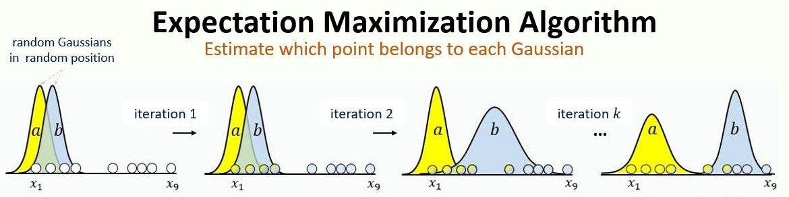{ style="height:234px;"}
{: style="margin-bottom:0px;" align=center }
<figcaption>Princip EM Cluster Analysis</figcaption>

#### ISO Cluster Analysis

ArcGIS Pro ve své dokumentaci **ISO Cluster** moc detailně nepopisuje. Nicméně dle jejich popisu se jedná o metodu velmi podobnou metodě K-means, která navíc může automatiky odstranit či spojit některé shluky, pokud obsahují malé množství vzorků či se nacházejí blízko sebe. Konkrétní parametry, které se zde nastavují si ukážeme v praktické ukázce.

## Neřízená klasifikace ve SNAP

Neřízenou klasifikaci ve SNAP najdeme v menu **Raster** → **Classification** → **Unsupervised Classification**, kde poté zvolíme jednu ze dvou nabízených možností. V našem případě zvolíme **K-Means Cluster Analysis**.

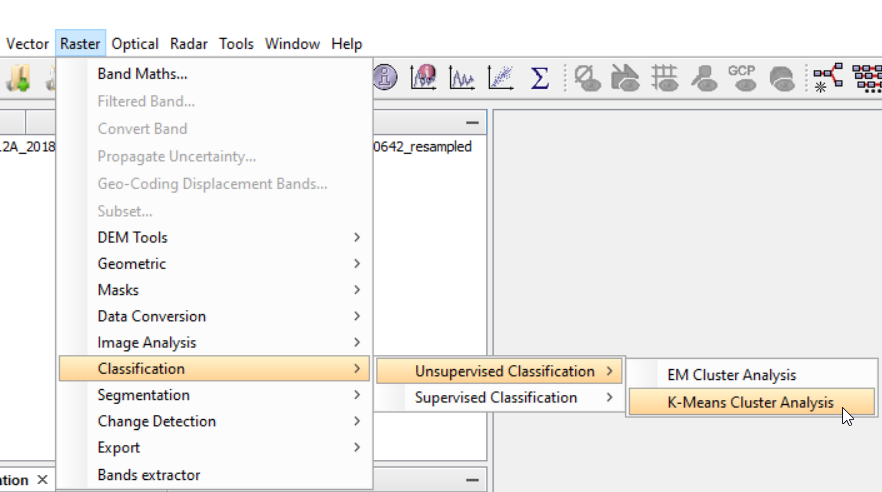{ style="height:394px;"}
{: style="margin-bottom:0px;" align=center }

Otevře se nám nové okno, kde nejprve v záložce **I/O Parameters** zvolíme ***Source Product***, což bude náš převzorkovaný subset (do výpočtu musí vstupovat pásma se stejným prostorovým rozlišením), a dále pak název nového produktu, zda ho chceme uložit atd. V záložce **Processing Parameters** poté nastavíme parametry algoritmu, jimiž jsou počet spektrálních tříd (***Number of clusters***) a počet iterací (***Number of iterations***). Parametr ***Random seed*** můžeme nechat tak, jak je. Ten pouze náhodně generuje počáteční shluky. V ***Source band names*** nakonec vybereme jednotlivá pásma, která budou do klasifikace vstupovat (můžeme použít např. i jednotlivé spektrální indexy, pokud je máme v produktu uloženy). Pokud bychom chtěli klasifikaci provést jen na určité části území, můžeme použit ***ROI-mask*** k vybrání konkrétní masky.

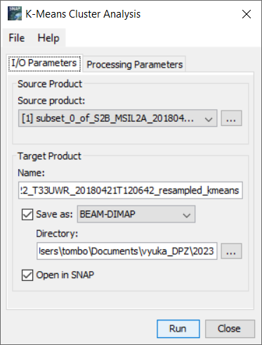{ style="height:392px;"}
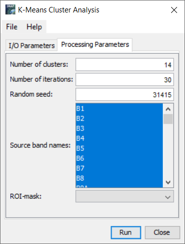{ style="height:392px;"}
{: .process_container}

???+ note "&nbsp;Pozn."
      Výpočet může být v závislosti na vstupních parametrech a velikosti území časově trochu náročnější.

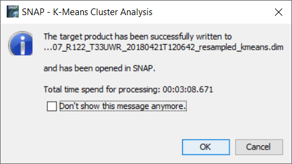{ style="height:217px;"}
{: style="margin-bottom:0px;" align=center }

Po dokončení výpočtu se do *Product Explorer* přidá nový produkt, kde v *Bands* najdeme naší klasifikovanou vrstvu pod názvem *class_indices*.

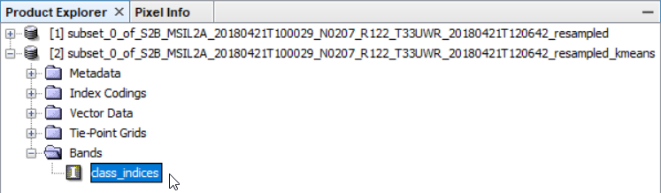
{: .off-glb .process_icon}
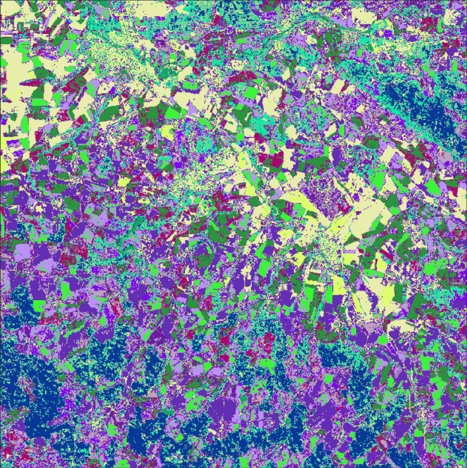
{: .process_container}

### Vliv počátečních parametrů na výsledek

Vcelku rozumná úvaha by byla nastavit *Number of clusters* na počet tříd, které na scéně doopravdy vidíme. Těmi mohou být například *Zástavba*, *Holá půda*, *Zemědělské oblasti*, *Les* a *Vodní plocha* (tříd je reálně samozřejmě víc, nicméně např. třídu *Traviny* jen těžko rozeznáme na datech Sentinel-2 od třídy *Zemědělské oblasti*). Zkusme tedy začít s těmito parametry:

**První pokus**

- **Number of clusters** = 5
- **Number of iterations** = 1

**Druhý pokus**

- **Number of clusters** = 5
- **Number of iterations** = 30

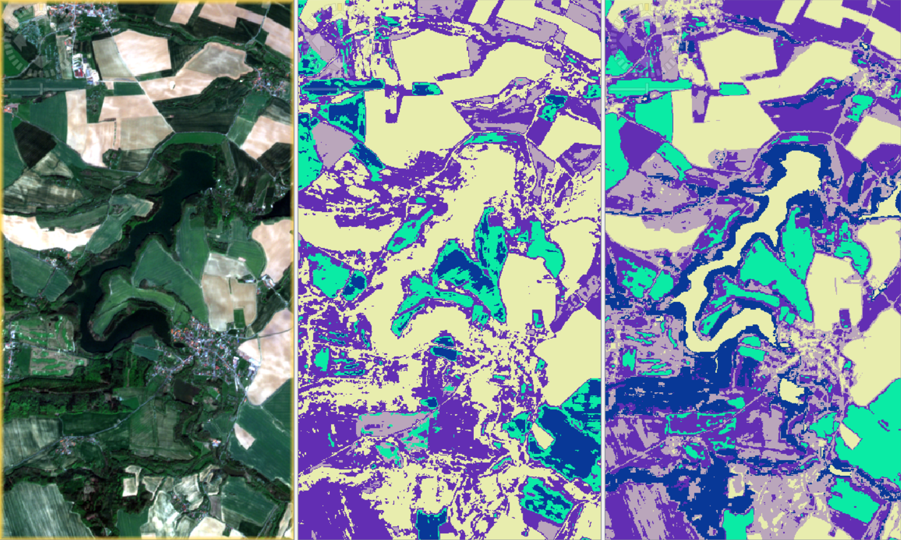
{: style="margin-bottom:0px;" align=center }
<figcaption>Vlevo - RGB scéna, uprostřed - 5 tříd a 1 iterace, vpravo - 5 tříd a 30 iterací</figcaption>

Z výsledků je patrné, že při pěti třídách a jedné iteraci nedochází k dobré separabilitě tříd. V tomto případě jedna třída pokrývá jak vodní plochu, tak i holou půdu a les. Při třiceti iteracích je pak už vidět, že se jednotlivé třídy od sebe oddělily již mnohem lépe, a názorně to tak ilustruje princip fungování algoritmu *K-Means*. Nicméně výsledek není ani tak optimální. Došlo sice k separování jednotlivých tříd, ale ne těch, u kterých bychom to chtěli. Vodní plocha, holá půda a z části i zástavba v tomto případě stále spadají pod jednu spektrální třídu a je tedy potřeba zvýšit počet klastrů. Můžeme takto vyzkoušet například 10, 15 či 20 tříd, případně i navyšovat počet iterací.

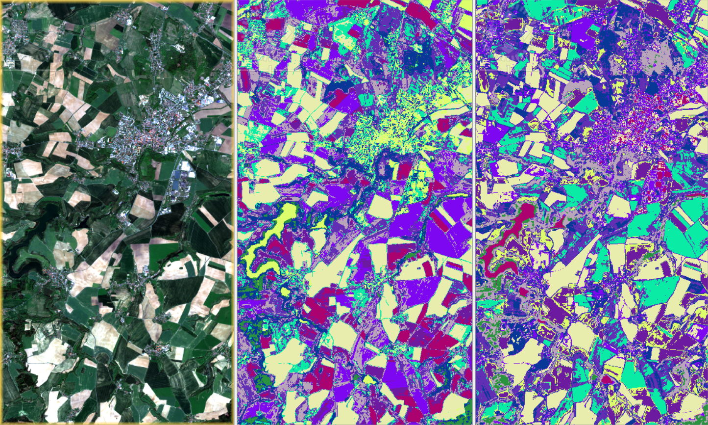
{: style="margin-bottom:0px;" align=center }
<figcaption>Vlevo - RGB scéna, uprostřed - 10 tříd a 30 iterací, vpravo - 10 tříd a 50 iterací</figcaption>

Zvýšením počtu tříd na 10 již výsledky vypadají nadějněji. Tentokrát se již holá půda z větší části odseparovala od vody, a se zvýšením počtu iterací na 50 došlo i k poměrně dobrému separování vody od zástavby (byť ne kompletně).

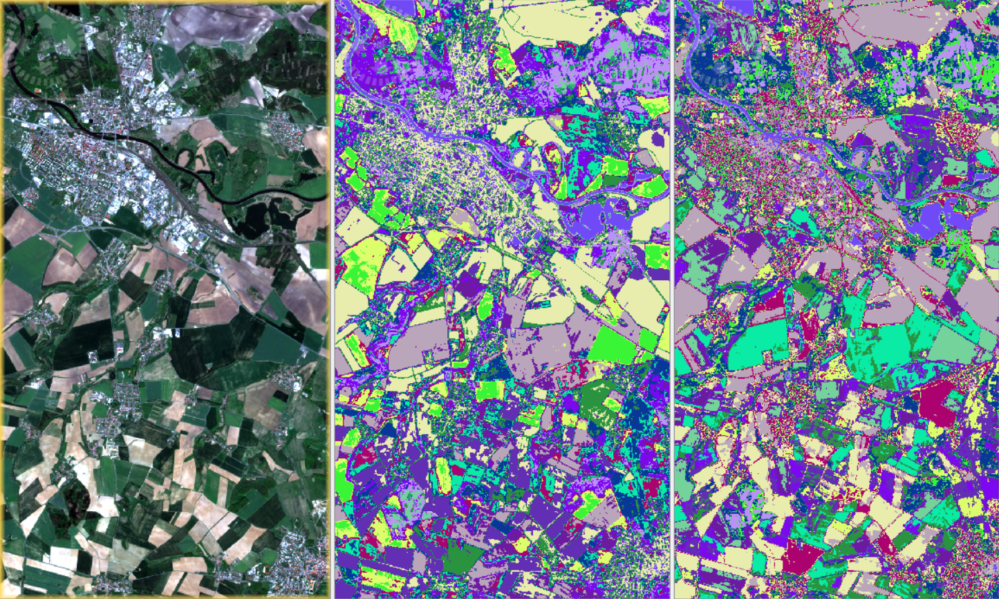
{: style="margin-bottom:0px;" align=center }
<figcaption>Vlevo - RGB scéna, uprostřed - 15 tříd a 30 iterací, vpravo - 15 tříd a 50 iterací</figcaption>

U patnácti tříd vypadají výsledky zas o něco lépe, byť alespoň na této části scény dochází stále k míchání zástavby a holé půdy jak při 30 iterací, tak při 50 iterací. Zároveň ale s přibývajícím počtem tříd začíná být klasifikovaný snímek čím dál méně přehledný a je potřeba při posuzování výsledku být více pečlivější.

## Neřízená klasifikace v ArcGIS Pro

???+ note "&nbsp;Pozn."
      Jak exportovat data ze SNAP a následně je správně zobrazit v ArcGIS Pro naleznete ve **Cvičení 7**

Klasifikační nástroje v ArcGIS Pro nalezneme pod záložkou **Imagery** → **Classification Tools**. Zde pak z nabídky zvolíme nástroj [:material-open-in-new: Classify](https://pro.arcgis.com/en/pro-app/latest/help/analysis/image-analyst/classify.htm){ .md-button .md-button--primary .button_smaller target="_blank"}.

{ style="height:360px;"}
{: style="margin-bottom:0px;" align=center }

Zde již ale musíme vědět, který z nabízených klasifikátorů patří mezi klasifikátory neřízené klasifikace. Tím je v ArcGIS Pro pouze klasifikátor **ISO Cluster**. Dalé je zde potřeba vyplnit několik parametrů. Jsou jimi následující:

1. *Maximum Number of Classes* udávající maximální počet výsledných tříd (nemusí se tedy jednat o přesný počet, který ve výsledku dostaneme).
2. *Maximum Number of Iterations*, tj. maximální počet iterací.
3. *Maximum Number of Cluster Merges per Iteration*, tj. maximální počet kolikrát může být shluk spojen s jiným shlukem během jedné iterace.
4. *Maximum Merge Distance* - v tomto případě vzdálenost pixelů na základě RGB hodnot. Čím vyšší hodnota, tím může docházet více ke spojování shluků.
5. *Minimum Samples Per Cluster*, tj. minimální počet vzorků ve shluku.
6. *Skip Factor* - Z dokumentace to není příliš jasné. Pravděpodobně počet pixelů které jsou vynechány v určitém intervalu při tvorbě shluků.

Doporučuji měnit jen první dva až tři parametry a zbytek nechat v defaultních hodnotách. Zároveň je lepší nastavit si větší počet tříd, které následně budete spojovat do menšího počtu tříd informačních. 

{ style="height:637px;"}
{: style="margin-bottom:0px;" align=center }

V dalším kroku by se nad klasifikovaným rastrem použila funkce [:material-open-in-new: Assign Classes](https://pro.arcgis.com/en/pro-app/latest/help/analysis/image-analyst/unsupervised-assign-classes.htm){ .md-button .md-button--primary .button_smaller target="_blank"}, která by se objevila v nabídce **Classification Tools**. Bohužel mi ArcGIS Pro na mém osobním notebooku nechtěl klasifikaci z nějakého důvodu provést, tudíž další postup zde není k dispozici. Uvidíme, jestli to bude fungovat v učebně.

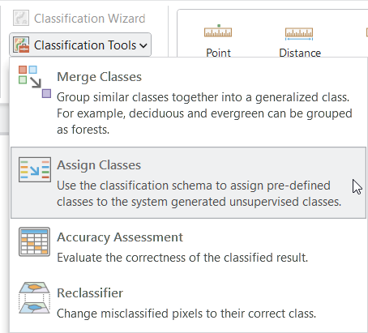
{: style="margin-bottom:0px;" align=center }

## Úkol - Neřízená klasifikace

- Provést neřízenou klasifikaci na svém území
- Seskupit spektrální třídy do informačních tříd (mít pokud možno správně klasifikovanou vodu, zemědělské oblasti, les, holou půdu a zástavbu)
- Zhodnotit výsledek (jakou jste použili klasifikaci, jaké jste nastavili parametry, kolik je ve výsledku tříd, s čím a proč byly problémy atd.)

### Seskupování spektrálních tříd ve SNAP

Neřízenou klasifikaci ve SNAP jsme si ukazovali již výše. SNAP bohužel neumožňuje nějaké jednoduché seskupování tříd v rastru, nicméně pro náš účel postačí, když si třídy pojmenujeme, a těm třídám, které představují stejný povrch, přidělíme stejnou barvu. Upravíme tedy tabulku v *Colour Manipulation*, kde se mimochodem dozvíme i četnost jednotlivých spektrálních tříd.

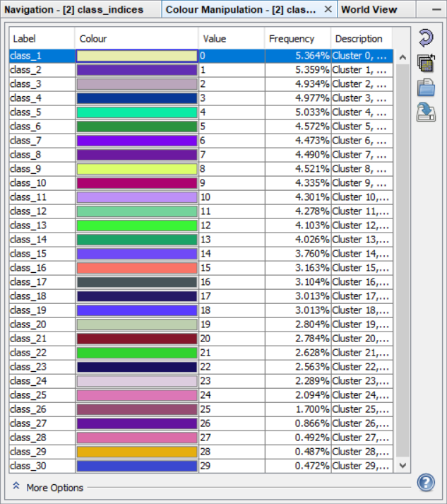{ style="height:570px;"}
{: style="margin-bottom:0px;" align=center }

Při vyšším počtu tříd může ale nastat situace, že mezi sebou začnou jednotlivé barvy splývat, což zhoršuje orientaci, co jaká třída vlastně znamená. Samozřejmě lze využít nástroj *Pixel Info*, který nám řekne, o jakou hodnotu se na konkrétním místě jedná. Mnohem přehlednější je ale využítí maskování s tím, že si jednotlivé spektrální třídy zobrazíme přímo na RGB scéně. K tomu ale potřebujeme propsat klasifikovanou vrstvu do našeho produktu s pásmy Sentinel-2. To uděláme pomocí funkce *Band Maths...*, kde jako *Target product* zvolíme produkt s pásmy Sentinel-2 a klikneme na *Edit Expression...* Zde poté přepneme produkt na produkt s klasifikovanou vrstvou, kterou následně dvojklikem vložíme do *Expression*. Nakonec dáme *OK* a znovu *OK*, čímž dostaneme klasifikovanou vrstvu do našeho produktu.

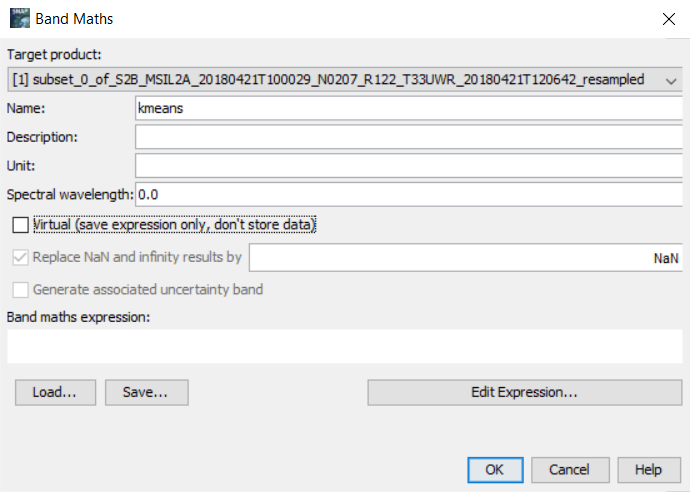
{: .off-glb .process_icon}
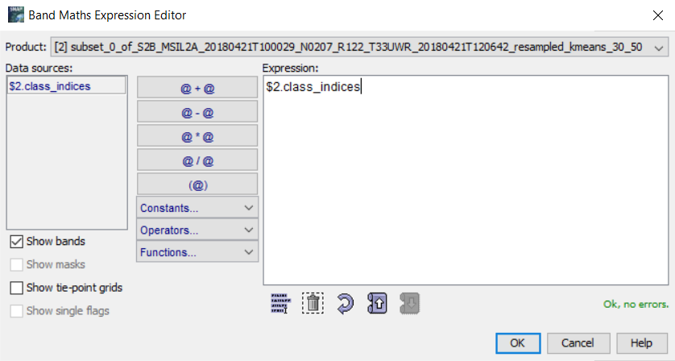
{: .off-glb .process_icon}
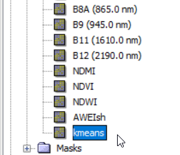
{: .process_container}

Když si tuto vrstvu poté zobrazíme v mapovém okně, zobrazuje se pouze v odstínech šedi. Z klasifikovaného produktu si ale můžeme uložit barevnou paletu a nahrát jí do klasifikované vrstvy, kterou jsme si vytvořili v původním produktu. Nicméně i tak bychom doporučovali využít tuto vrstvu pouze pro maskování a barevné úpravy provádět v klasifikovaném produktu, u kterého se tabulka s hodnotami a barvami jednotlivých spektrálních tříd zobrazuje lépe a přehledněji. Masku pro konkrétní spektrální třídu vytvoříme v *Mask Manager* pomocí funkce *Creates a new mask based on a logical band maths expression*.

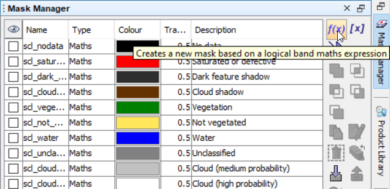
{: .off-glb .process_icon}
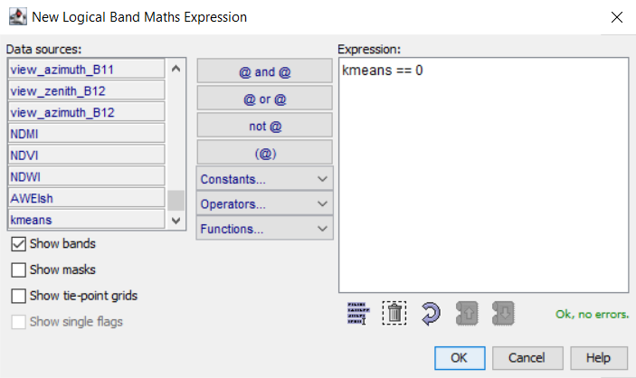
{: .process_container}

Poté se můžeme podívat, s jakým krajinným prvkem se vypočtená maska překrývá. V tomto případě lze vidět, že spektrální třída s hodnotou 0 odpovídá holé půdě.

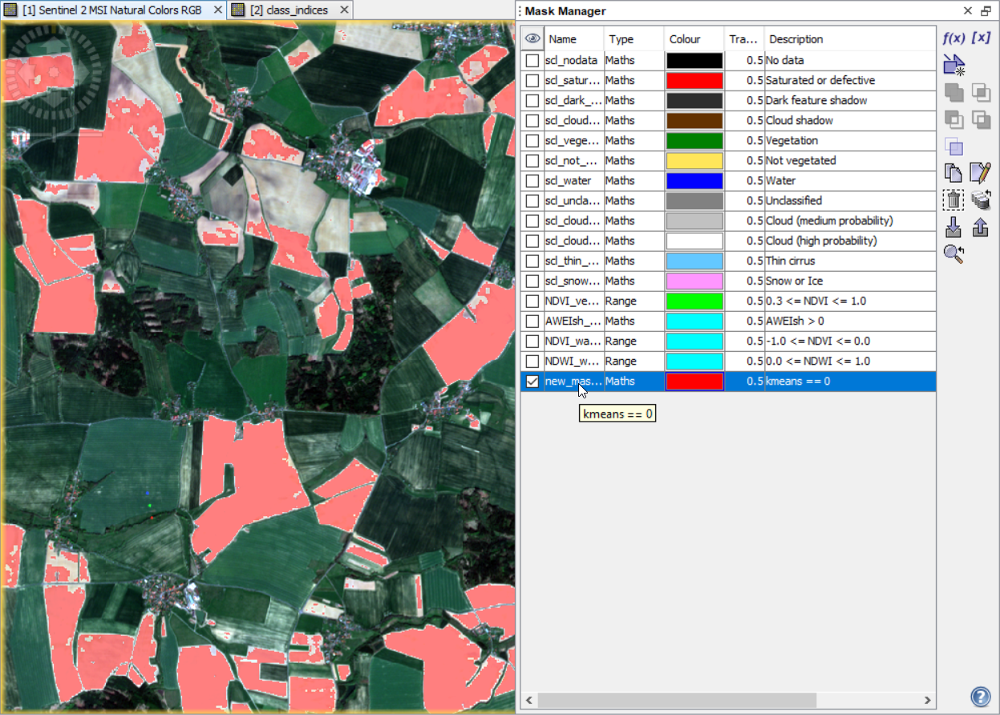{ style="height:535px;"}
{: style="margin-bottom:0px;" align=center }

Tuto informaci následně zaneseme do tabulky v *Colour Manipulation* u klasifikovaného produktu. Do tabulky napíšeme název třídy a přiřadíme nějakou barvu.

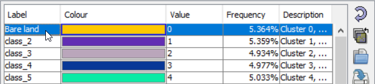{ style="height:111px;"}
{: style="margin-bottom:0px;" align=center }

Stejný postup provedeme pro všechny spekrální třídy. Není ale potřeba vytvářet pokaždé novou masku. Stačí upravit tu stávající pomocí funkce ***Edit the selected mask***.

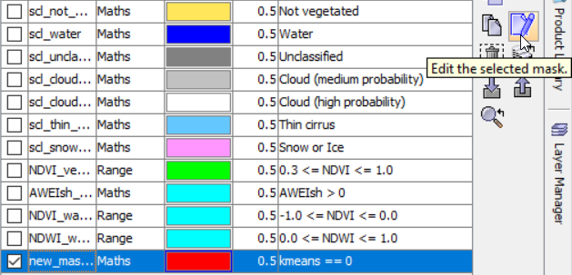{ style="height:242px;"}
{: style="margin-bottom:0px;" align=center }

Konečný výsledek může vypadat nějak takto:

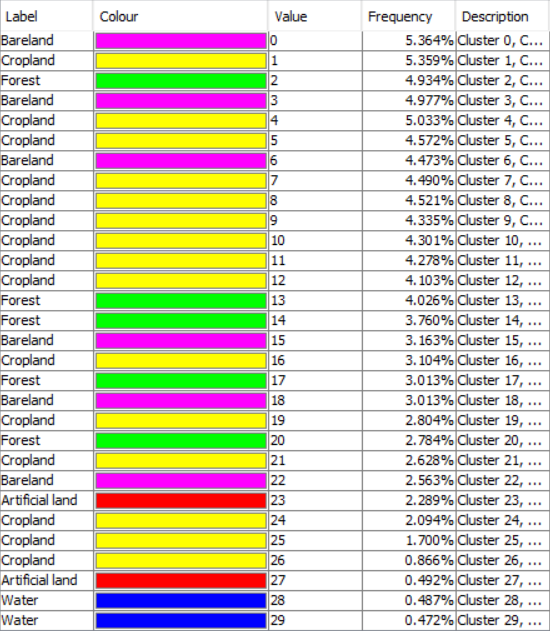
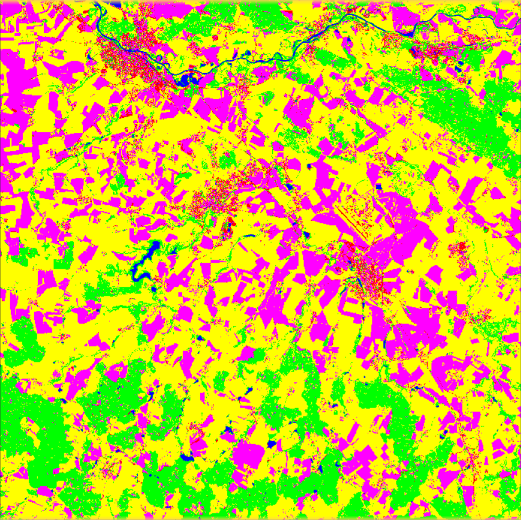
{: .process_container}