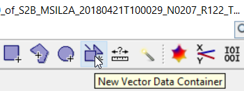
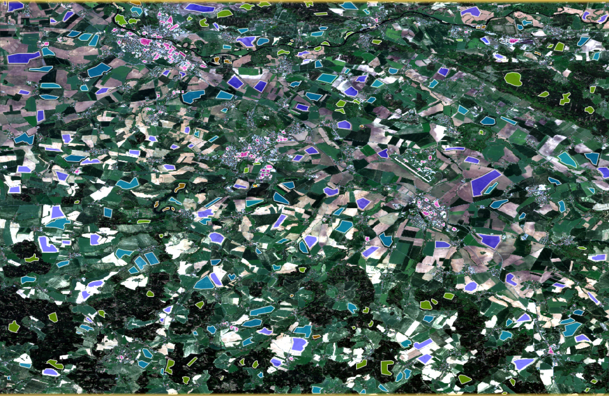

# Řízená klasifikace, validace výsledku klasifikace

## Cíl cvičení

- Naučit se provádět řízenou klasifikaci na družicových datech
- Porozumnět principu validování land cover produktů

## Základní pojmy

- **Řízená klasifikace** - Jedná se o proces, při kterém se klasifikátor nejprve učí vlastnosti předem zadaných tříd na poskytnutých trénovacích vzorcích a následně tyto "znalosti" aplikuje na celý dataset. V DPZ lze celý proces rozdělit do následujících kroků:

    1. Určení jednotlivých tříd a definování trénovacích vzorků (v DPZ často mluvíme o trénovacích plochách)
    2. Výpočet statistických charakteristik (tzv. **spektrálních příznaků**) pro trénovací plochy popisující jednotlivé třídy, editace trénovacích ploch a výběr vhodných pásem pro vlastní klasifikaci
    3. Volba vhodného rozhodovacího pravidla (tzv. klasifikátoru) pro zařazení všech prvků obrazu (pixelů) do jednotlivých tříd
    4. Zatřídění všech obrazových prvků do stanovených tříd
    5. Úprava, hodnocení a prezentace výsledků klasifikace

{ style="height:138px;"}
{: style="margin-bottom:0px;" align=center }
<figcaption>Schéma řízené klasifikace</figcaption>

- **Trénovací plochy** - Jedná se o reprezentativní pixely nebo prvky ze souboru obrazových dat pro každou definovanou třídu. Pro úspěšnost klasifikace je volba trénovacích množin stěžejní. Je tedy potřeba mít definovám dostatečný počet těchto trénovacích ploch a v ideálním případě je mít i rovnoměrně rozmístěné na obrazových datech (pokud to jednotlivé třídy dovolují). Důležité také je, aby byly trénovací plochy jednotlivých tříd spektrálně co nejvíce homogenní.
- **Klasifikátor** - Algoritmus nebo metoda použitá k provedení klasifikace. V současné době jsou nejpopulárnější metody patřící do strojového či hlubokého učení, případně metody využívající umělých neuronových sítí.
- **Validace** - Kontrola přesnoti výsledku klasifikace s využitím tzv. testovacího datasetu. K určení přesnosti se užívá řada metrik. Patří mezi ně například *Celková přesnost*, *Uživatelská přesnost* či *Zpracovatelská přesnost*.
- **Chybová matice** (Kontingenční tabulka) - Čtvercová matice, kde počet sloupců i řádků odpovídá počtu definovaných tříd. Slouží k přehlednému zobrazení záměny mezi jednotlivými třídami (tj. které třídy se špatně klasifikovaly do jiných tříd). Správně klasifikovaná data se v této matici nachází na hlavní diagonále. V ideálním případě by měla být hlavní diagonála tvořena nejvyššími hodnotami v matici a hodnoty mimo diagonálu by se měly blížit nule.
- **Přetrénování** (Overfitting) - Přetrénování klasifikátoru je jev, kdy se klasifikátor až příliš přizpůsobí trénovacím datům. Důsledkem pak může být špatná generalizace při použití na jiných datech, než na kterých byl klasifikátor natrénován.
- **Land use / land cover** - Jedná se o výsledek klasifikace družicových obrazových dat. Konkrétně se jedná o tematické mapy popisující zemský povrch. *Land use* povrch popisuje z hlediska jeho využití lidmi. *Land cover* pak znázorňuje jednotlivé druhy povrchů (voda, holá půda, les atd.).

## Řízená klasifikace ve SNAP

### Transformace obrazových dat do WGS84

Tento krok budeme považovat za tzv. nultý krok, protože není běžnou součástí řízené klasifikace. Ve SNAP bohužel z nějakého důvodu řízená klasifikace funguje pouze na *Lat/Long* datech v systému WGS84. Je tedy potřeba si naše data přetransformovat. K tomu slouží funkce nacházející se v **Raster** → **Geometric** → **Reprojection**.

{ style="height:393px;"}
{: style="margin-bottom:0px;" align=center }

V záložce ***I/O Parameters*** nastavíme produkt, který chceme transformovat, název transformovaného produktu a zda chceme výsledný produkt uložit. V záložce ***Reprojection Parameters*** poté nastavíme, do jakého systému bude produkt transformován. V tomto případě můžeme nechat vše tak, jak je.

{ style="height:548px;"}
{ style="height:548px;"}
{: .process_container}

Výsledkem je pak v závislosti na poloze více či méně "zdeformovaná" scéna.

{ style="height:472px;"}
{: style="margin-bottom:0px;" align=center }

### Tvorba trénovacích ploch

Prvním krokem řízené klasifikace je definování jednotlivých tříd a k nim odpovídajících trénovacích ploch. Pokud trénovací plochy nemáme odněkud přebrané, musíme si je vytvořit sami. Trénovací plochy budeme vkládat do tzv. vektorových kontejnerů. Vektorový kontejner vytvoříme pomocí **Vector** → **New Vector Data Container**, případně pomocí ikony této funkce. Vektorové kontejnery vytvoříme pro všechny klasifikační třídy (buď všechny najednou nebo postupně po vytvoření trénovacích ploch pro danou třídu).

{: .off-glb .process_icon}

{: .process_container}

Jednotlivé vektorové kontejnery se nám pak zobrazí v **Layer Manager** (spolu s dalšími již existujícími kontejnery) a zároveň i v *Product Explorer* ve složce **Vector Data**.

{ style="height:113px;"}
{ style="height:128px;"}
{: .process_container}

Máme-li vytvořený vektorový kontejner, můžeme začít s tvorbou trénovacích ploch. Ty budeme tvořit pomocí funkce **Polygon drawing tool**. Poté, když chceme začít kreslit polygon, se nás SNAP zeptám, do kterého kontejneru chceme polygon vložit. Z nabídky tedy vybereme příslušný název kontejneru a nakreslíme trénovací plochu. Kreslení polygonu ukončíme dvojklikem.

{: .off-glb .process_icon}

{: .off-glb .process_icon}

{: .process_container}

Na to, do jakého vektorového kontejneru chceme polygon vkládat, se nás SNAP zeptá dvakrát. Následně už se automaticky volí dříve zvolený kontejner. Pokud bychom ale chtěli poté vkládat polygon do jiného kontejneru, je potřeba příslušný kontejner označit v **Layer Manager**.

{ style="height:80px;"}
{: .off-glb .process_icon}
{ style="height:534px;"}
{: .process_container}

Tímto způsobem vytvoříme trénovací plochy pro všechny třídy. Trénovacích ploch by mělo být dostatečné množství a je ideální, aby se nacházely rovnoměrně po celé ploše obrazových dat.

{ style="height:520px;"}
{: style="margin-bottom:0px;" align=center }

???+ note "&nbsp;Pozn."
      Někdy se může stát, že funkce **Polygon drawing tool** nebude z nějakého důvodu reagovat. V takovém případě je potřeba buď zkusit uložit práci a vypnout a zapnout SNAP, případně tvořit trénovací plochy pomocí jedné z funkcí **Rectangle drawing tool** či **Ellipse drawing tool**.

Kromě nefunkčnosti **Polygon drawing tool** může nastat i poněkud horší problém. Po naklikání všech trénovacích ploch a uložení produktu se můžeme rozhodnout, že v práci budeme pokračovat později a SNAP zavřeme. Při znovuotevření produktu a snaze vytvořit RGB kompozit či si zobrazit jakékoliv pásmo se zobrazí následující chybové hlášky:

{ style="height:171px;"}
{ style="height:171px;"}
{: .process_container}

Nejspíš se jedná o nějaký *bug* a celý transformovaný produkt je nefunkční. Neznamená to ale, že jsme vytvořené trénovací plochy nadobro ztratily. Každý **DIM** soubor má k sobě přidruženou složku s koncovkou **.data** a právě v této složce lze naše trénovací plochy dohledat. Ve složce se nacházejí soubory jednotlivých pásem a také podsložka ***vector_data***, ve které se nacházejí **CSV** soubory jednotlivých vektorových dat, mezi nimiž jsou i vytvořené trénovací plochy. Soubory trénovacích ploch poté můžeme jednoduše překopírovat do příslušné složky nově vytvořeného transformovaného produktu.

{: style="margin-bottom:0px;" align=center }

### Kontrola homogenity trénovacích ploch

Pro co nejlepší natrénování klasifikátoru je vhodné, aby trénovací plochy byly pokud možno co nejhomogennější a mezi sebou spektrálně odlišné. Homogenitu tříd ve SNAP můžeme zkontrolovat dvěma způsoby.

#### Histogram

Funkci pro vykreslování histogramů najdeme v menu **Analysis** → **Histogram**, případně v **Analysis** → **Statistics**, kde se kromě histogramu zobrazují i další informace. Dále je potřeba mít zaškrtnuté ***Use ROI mask:*** a zvolit příslušnou vektorovou vrstvu obsahující konkrétní třídu. Zároveň je nutné znovu kliknout do mapového okna, aby nástroj věděl, nad jakými daty histogram počítat.

{: .off-glb .process_icon}

{: .process_container}

Z histogramu lze poté vyčíst, zda je třída homogenní a nebo je tvořena více třídami. V ideálním případě by měl být histogram tvořen jedním vrcholem. Pokud je vrcholů více, indikuje to, že je více i tříd (tj. počet vrcholů = počet tříd). Na příkladu níže jsou zobrazeny histogramy pro vodu (vlevo), pole (uprostřed) a holou půdu (vpravo). Z histogramů vyplývá, že trénovací plochy pro vodu jsou homogenní, zatímco trénovací plochy pro pole a holou půdu jsou ve skutečnosti tvořemi dvěmi, resp. až třemi spektrálními třídami.

{: .process_container}
<figcaption>Histogramy vybraných tříd (vlevo - voda, uprostřed - pole, vpravo - holá půda)</figcaption>

???+ note "&nbsp;Pozn."
      Histogram se vždy zobrazuje pro jedno konkrétní pásmo (v tomto případě B4). Pokud by bylo použito pásmo jiné, histogramy by se zamozřejmě trochu lišily.

#### Rozptylogram (scatter plot)

Druhou možností sledovat homogenitu tříd je tzv. rozptylogram, který najdeme v menu **Analysis** → **Scatter Plot**. Znovu je potřeba zaškrtnou ***Use ROI mask:*** a zvolit příslušnou vektorovou vrstvu obsahující konkrétní třídu. Dále je potřeba vybrat pásma, jejichž hodnoty budou vyneseny na osu X a osu Y (můžeme zvolit např. pásma B4 a B8).

{: .off-glb .process_icon}

{: .process_container}

Rozptylogram v tomto případě znázorňuje již zmíněný **příznakový prostor** (v našem případě dvourozměrný). Třídy by pak měly v rozptylogramu tvořit tzv. shluky. V ideálním případě by tak jedna třída měla tvořit jeden shluk. Pokud je shluků víc, indikuje to znovu i více tříd. Příklady níže ukazují rozptylogramy pro vodu (vlevo), pole (uprostřed) a holou půdu (vpravo). Je tedy vidět, že by bylo vhodné některé třídy rozdělit do více podtříd.

{: .process_container}
<figcaption>Rozptylogramy vybraných tříd (vlevo - voda, uprostřed - pole, vpravo - holá půda)</figcaption>

### Spuštění řízené klasifikace

Řízenou klasifikaci ve SNAP najdeme v menu **Raster** → **Classification** → **Supervised Classification**, kde si vybereme jeden z nabízených algoritmů. V našem případě **Random Forest Classifier**.

{ style="height:449px;"}
{: style="margin-bottom:0px;" align=center }

**Random Forest** je v současné době jedním z nejpopulárnějších klasifikátorů na bázi strojového učení. Vychází z tzv. *Decision Trees (rozhodovacích stromů)*, kde každý strom vezme jen určitý a náhodný počet příznaků a z nich určí, o jakou třídu se podle něj jedná. Výsledná třída je pak určena na základě přavažujícího výsledku ze všech stromů.

{ style="height:389px;"}
{: style="margin-bottom:0px;" align=center }

Nástroj **Random Forest Classifier** se ve SNAP zkládá ze tří záložek. V ***ProductSet-Reader*** je potřeba zvolit produkt, který se bude klasifikovat. Záložka ***Random-Forest-Classifier*** slouží k nastavení samotného klasifikátoru. Volíme zde, jestli chceme trénovat klasifikátor na rastru nebo na vektorech (v našem případě chceme na vektorech). Dále jestli chceme klasifikátor evaluovat, ale především určujeme hodnoty ***Number of training samples*** a ***Number of trees***. V neposlední řadě je potřeba označit i všechny třídy, které chceme klasifikovat a označit i všechna pásma, která chceme v klasifikaci použít (kromě původních pásem Sentinel-2 můžeme použít i vypočtené spektrální indexy atd.). V poslední záložce ***Write*** zvolíme, kam chceme klasifikovaný produkt uložit.

{: .process_container}

Pro první pokus klasifikace můžeme nechat parametry klasifikátoru tak, jak jsou. Byť tedy počet stromů nastavený na 10 se zdá být relativně nízký (v praxi se využívá až stovky stromů). Důležíté je také pochopit, jak zde funguje hodnota počtu trénovacích vzorků. Kromě trénování dochází totiž i k testování klasifikátoru, tudíž pokud je defaultně nastavena hodnota trénovacích vzorků na 5000, znamená to, že dalších 5000 vzorků bude použito na testování. Tyto počty se poté rovnoměrně rozdělí mezi jednotlivé třídy. Pokud jsme si definovali 5 tříd, na jednu třídu tak přijde 1000 trénovacích vzorků, které jsou náhodně vybrány z trénovacích ploch. Toto je tedy potřeba brát do úvahy, a pokud chceme využít co nejvíce pixelů z trénovacích ploch, které jsme vytvářeli, je potřeba hodnotu ***Number of training samples*** náležitě upravit. Počet pixelů, které pokrývají jednotlivé třídy, zjistíme v **Analysis** → **Statistics**. Samozřejmě je potřeba i počítat s tím, že čím více trénovacích vzorků a čím více stromů, tím déle pak samotný výpočet trvá. Následující tabulka znázorňuje časovou náročnost výpočtu pro různá nestavení vstupních parametrů (v tomto případě do klasifikace vstupovalo 12 pásem Sentinel-2 a 4 vypočtené spektrální indexy):

<table>
  <thead>
    <tr>
      <th><strong>Number of training samples</strong></th>
      <th><strong>Number of trees</strong></th>
      <th><strong>Čas výpočtu</strong></th>
    </tr>
  </thead>
  <tbody>
    <tr>
      <td>5000</td>
      <td>10</td>
      <td>46 s</td>
    </tr>
    <tr>
      <td>10000</td>
      <td>10</td>
      <td>52 s</td>
    </tr>
    <tr>
      <td>40000</td>
      <td>10</td>
      <td>4 min</td>
    </tr>
    <tr>
      <td>40000</td>
      <td>30</td>
      <td>11,5 min</td>
    </tr>
    <tr>
      <td>100000</td>
      <td>10</td>
      <td>17 min</td>
    </tr>
    <tr>
      <td>100000</td>
      <td>30</td>
      <td>50 min</td>
    </tr>
    <tr>
      <td>200000</td>
      <td>10</td>
      <td>51 min</td>
    </tr>
  </tbody>
</table>

Z tabulky vyplývá, že vyšší časovou náročnost způsobuje parametr ***Number of trees***.

Výsledkem klasifikace je nový produkt obsahující klasifikovanou vrstvu, kterou najdeme pod názvem *LabeledClasses*.

{: .off-glb .process_icon}

{: .process_container}

Při podrobnějším zkoumání výsledku klasifikace si můžeme všimnout tmavě šedých pixelů nekorespondujících s žádnou barvou v legendě.

{: .process_container}

Jedná se o zamaskované pixely, jejichž *"Confidence"* (viz vrstva ***Confidence*** v klasifikovaném produktu) je menší než určitá mez. Tuto mez lze změnit kliknutím pravým tlačítkem na vrstvu *LabeledClasses* v klasifikovaném produktu a vybráním možnosti *Properties*. Zde následně změníme hodnotu ***Valid-Pixel Expression*** z ***Confidence >= 0.5*** např. na ***Confidence >= 0***, čímž se pixely odmaskují.

{: .off-glb .process_icon}

{: .process_container}

Z mnou dosažených výsledků je ale vidět, že poměrně dost oblastí s holou půdou se klasifikovalo jako zástavba a bylo by tedy potřeba na klasifikaci dále pracovat.

{ style="height:520px;"}
{: style="margin-bottom:0px;" align=center }

## Validace výsledku klasifikace

Nedílnou součástí klasifikace obrazových dat je i posouzení její přesnosti. Ta se posuzuje pomocí tzv. validačních (testovacích) dat reprezentujících skutečnost, kterými mohou být body zaměřené v terénu či nad ortofotem, případně data typu ZABAGED atd. Důležité také je, aby se jednalo o data nezávislá na datech trénovacích. V opačném případě by taková validace nebyla směrodatná. Přesnost klasifikace se nejčastěji posuzuje pomocí **chybové matice** (kontingenční tabulky), a z ní plynoucích statistických ukazatelů, jakými jsou např. **uživatelská přesnost**, **zpracovatelská přesnost** či **celková přesnost**.

### Chybová matice

Jedná se o čtvercovou matici, kde počet sloupců i řádků odpovídá počtu definovaných tříd. Řádky chybové matice jsou zpravidla tvořeny klasifikovanými daty a sloupce daty, které odpovídají skutečnosti. Správně klasifikovaná data se v této matici nachází na hlavní diagonále. V ideálním případě by měla být hlavní diagonála tvořena nejvyššími hodnotami v matici a hodnoty mimo diagonálu by se měly blížit nule.

{ style="height:422px;"}
{: style="margin-bottom:0px;" align=center }

### Celková přesnost

Celková přesnost (overall accuracy) se vztahuje k celé klasifikaci a udává poměr spávně klasifikovaných pixelů ku všem pixelům vstupujících do validování. Je to tedy suma hodnot na hlavní diagonále chybové matice ku celkovému počtu testovacích vzorků. Dle chybové matice výše by se celková přesnosti rovnala: **(21 + 31 + 22)/95 = 0,78**. Celková přesnost klasifikace nicméně není nejlepším ukazatelem správnosti klasifikace, protože nám neříká nic o tom, jak se klasifikovaly jednotlivé třídy.

### Uživatelská přesnost

Uživatelská přesnost (user's accuracy), ve strojovém učení označována také jako **Precision**, udává, s jakou pravděpodobností pixel zařazený do určité třídy tuto třídu opravdu představuje. Počítá se pro každou třídu zvlášť, a to jako podíl správně klasifikovaných pixelů ku celkovému počtu pixelů, které do dané třídy byly zařazeny. Hodnoty uživatelské přesnosti pro jednotlivé třídy uvedené v matici chyb výše by byly následující:

<table>
  <thead>
    <tr>
      <th><strong>Třída</strong></th>
      <th><strong>Uživatelská přesnost</strong></th>
    </tr>
  </thead>
  <tbody>
    <tr>
      <td>Water</td>
      <td>21/27 = 0,78</td>
    </tr>
    <tr>
      <td>Forest</td>
      <td>31/37 = 0,84</td>
    </tr>
    <tr>
      <td>Urban</td>
      <td>22/31 = 0,71</td>
    </tr>
  </tbody>
</table>

### Zpracovatelská přesnost

Zpracovatelská přesnost (producer's accuracy), ve strojovém učení označována také jako **Recall**, je poměr správně klasifikovaných pixelů ku celkovému počtu pixelů použitých pro testování dané třídy. Stejně tedy jako u uživatelské přesnoti se počítá pro každou třídu zvlášt, a pro data z matice chyb uvedené výše by nabývala následujících hodnot:

<table>
  <thead>
    <tr>
      <th><strong>Třída</strong></th>
      <th><strong>Zpracovatelská přesnost</strong></th>
    </tr>
  </thead>
  <tbody>
    <tr>
      <td>Water</td>
      <td>21/33 = 0,64</td>
    </tr>
    <tr>
      <td>Forest</td>
      <td>31/39 = 0,79</td>
    </tr>
    <tr>
      <td>Urban</td>
      <td>22/23 = 0,96</td>
    </tr>
  </tbody>
</table>

Uživatelskou (precision) a zpracovatelskou (recall) přesnost názorně znázorňuje následující obrázek:

{ style="height:381px;"}
{: style="margin-bottom:0px;" align=center }

### F1 score

Metrika kombinující precision a recall pomocí harmonického průměru. Narozdíl od klasického průměru má harmonický průměr tendenci přiklánět se k nižšímu z obou hodnot. Proto pro dosažení vysokého F1 score je potřeba mít vysokou hodnotu jak u precision, tak u recall, což zajišťuje dobrou rovnováhu obou hodnot. Vzoreček je tedy následující: **F1 = 2 · Precision · Recall / (Precision + Recall)**.

## Validace ve SNAP

SNAP narozdíl od jiných softwarů bohužel neumožňuje nějakou automatickou validaci provádět. Nicméně pro pochopení principu validace ho v rámci cvičení využít můžeme. Konkrétně použijeme nástroje ***Pin placing tool*** a ***Pin Manager*** a následně si chybovou matici ručně vytvoříme v Excelu. Pro účely cvičení budeme pro každou třídu vkládat 10 pinů a pro zachování nezávislosti na trénovacích datech je budeme vkládat mimo dříve vytvořené trénovací plochy. Řekněme tedy, že nejprve budeme chtít vytvořit piny pro třídu *Holá půda*. Pomocí nástroje ***Pin placing tool*** vytvoříme 10 pinů na místech s holou půdou a ideálně je umístíme rovnoměrně napříč celou scénou (pracujeme nad transformovaným produktem nad RGB kompozitem). 

{: .off-glb .process_icon}

{: .process_container}

Po naklikání 10 pinů s holou půdou si otevřeme ***Pin Manager*** a přepíšeme hodnoty *Label* z "Pin 1", "Pin 2" atd. na název třídy, kterou jsme zrovna klikali, tj. *Holá půda*. Bohužel to asi nejde nějak hromadně, takže nezbývá nic jiného než použít metodu *Copy - Paste*.

{: .off-glb .process_icon}

{: .off-glb .process_icon}

{: .process_container}

Stejný postup uděláme pro všechny ostatní třídy.

{ style="height:489px;"}
{: style="margin-bottom:0px;" align=center }

???+ note "&nbsp;Pozn."
      Pokud by se opět stalo, že by transformovaný produkt přestal fungovat, tak pro obnovení pinů lze použít stejný postup jako u obnovení trénovacích ploch.

Když máme naklikané všechny piny pro všechny třídy, je potřeba překopírovat piny vytvořené nad RGB kompozitem do našeho klasifikovaného snímku. K tomu použijeme v ***Pin Manager*** funkci ***Transfer the selected pins to other products.*** Je potřeba mít ale vybrány (selectovány) všechny piny, jinak se překopíruje jen část.

{ style="height:165px;"}
{: .off-glb .process_icon}
{ style="height:174px;"}
{: .process_container}

V mapovém okně se poté můžeme podívat, jestli v klasifikovaném produktu piny opravdu máme.

{ style="height:490px;"}
{: style="margin-bottom:0px;" align=center }

Dále je potřeba do tabulky v ***Pin Manager*** přidat sloupec s hodnotou klasifikované třídy. To uděláme pomocí funkce ***Filter pixel data to be displayed in table.*** Z nabítky vybereme vrstvu *LabeledClasses* a dáme OK.

{: .off-glb .process_icon}

{: .off-glb .process_icon}

{: .process_container}

Posledním krokem je export tabulky do textového souboru pomocí funkce ***Export selected data to flat text file.*** Znovu je potřeba mít selectované všechny piny.

{ style="height:166px;"}
{: style="margin-bottom:0px;" align=center }

Následně si tyto data nahrajeme do Excelu (případně jiného softwaru) a vytvoříme matici chyb. <a href="https://geo.fsv.cvut.cz/vyuka/155dprz/cv6/matice_chyb.xlsx" target="_blank"> **Zde**</a> si můžete stáhnout předpřipravenou šablonu, do které můžete data postupně vkládat.

{: style="margin-bottom:0px;" align=center }

Pro správné vyplnění matice chyb je dobré vědět, jaká hodnota odpovídá které třídě. To zjistíme v ***Colour Manipulation*** klasifikovaného produktu. Matici chyb poté vyplňujeme po sloupcích, kde do každého řádku zapíšeme počet testovacích vzorků z dané třídy, které se klasifikovaly jako třída na konkrétním řádku matice.

{ style="height:122px;"}
{: style="margin-bottom:0px;" align=center }

Znovu ale připomínám, že takovýto postup validace slouží jen jako názorná ukázka. Aby byla validace více vypovídající, tak by bylo vhodné, aby se prováděla na více testovacích vzorcích. Tomu i odpovídá fakt, že se mi v tomto případě čtyři z pěti tříd klasifikovaly se 100% přesností, což asi nebude úplně pravda.

## Úkol - Řízená klasifikace

- Spočítat řízenou klasifikaci na svém území
- Provést validaci výsledku klasifikace
- Zhodnotit výsledky (jakou jste použili klasifikaci, jaké jste nastavili parametry, jaké třídy jste klasifikovali, s čím byly problémy atd.)