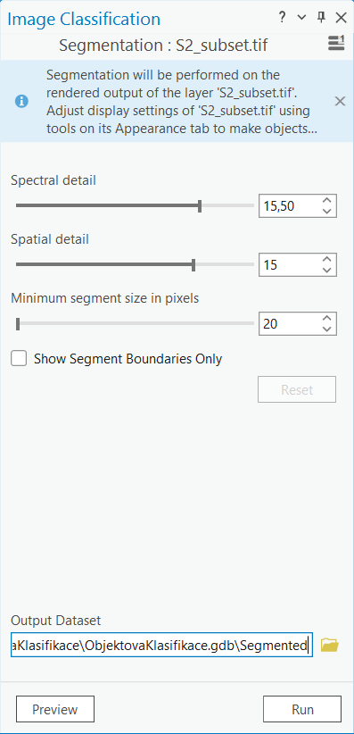

# Segmentace a objektová klasifikace

## Cíl cvičení

- Naučit se exportovat data ze SNAP
- Porozumnět principu segmentace a objektové klasifikace
- Umět toto téma zpracovat v ArcGIS Pro

## Základní pojmy

- **Segmentace** - Jedná se o proces, při kterém dochází k seskupování sousedních pixelů na samostatné a smysluplné oblasti nebo objekty na základě určitých společných vlastností, jakými jsou například barva, textura či tvarové charakteristiky.
- **Objektová klasifikace** - Jedná se o druh klasifikace, která kombinuje jak spektrální, tak i prostorové informace pro kategorizaci obrazových objektů, což jsou obvykle segmenty nebo oblasti obrazu, nikoli jednotlivé pixely.

## Export dat ze SNAP

Software SNAP nemá nástroje pro objektovou klasifikaci. Tu tedy budeme chtít provést v jiném softwaru, v našem případě v ArcGIS Pro. Proto si náš dříve vytvořený a převzorkovaný subset vyexportujeme do souboru, který budeme moct v ArcGIS Pro otevřít. Export produktu lze provést z menu **File** → **Export**, kde si vybereme jeden z nabízených formátů. Pokud bychom ale takto exportovali rovnou náš převzorkovaný subset, tak by se nám do výsledného souboru propsala veškerá data, který náš produkt obsahuje, tj. všechna pásma, vektorová data, masky, atd. Všechna tato data by poté tvořila jednotlivé vrstvy, čímž by se exportovaný soubor stal dosti nepřehledný a těžko používatelný. Proto si nejprve vytvoříme produkt, který bude obsahovat pouze ta data, která opravdu budeme chtít exportovat. Použijeme tedy funkci **Raster** → **Bands extractor**.

{ style="height:398px;"}
{: style="margin-bottom:0px;" align=center }

V záložce ***I/O Parameters*** nastavíme zdrojový produkt a název exportovaného produktu. A zároveň můžeme rovnou změnit typ souboru z *BEAM-DIMAP* na *GeoTIFF*. V ***Processing Parameters*** poté vybereme pásma, která chceme do exportovaného produktu zapsat. V tomto případě nám postačí jen původní pásma Sentinel-2.

{ style="height:313px;"}
{ style="height:313px;"}
{: .process_container}

Data se nám uloží do jednoho ***TIF*** souboru. Jedná se o klasický rastrový formát. V našem případě se navíc jedná ještě o tzv. *Multiband Layer*, protože v sobě obsahuje více než jednu vrstvu. Nyní již tedy můžeme otevřít ArcGIS Pro, vytvořit nový *Map* projekt a vložit exportovaný *TIF* soubor.

## Zobrazení dat DPZ v ArcGIS Pro

Při prvním vložení našeho exportovaného subsetu do ArcGIS Pro se mohou data zobrazit jen v jednotlité černé barvě, jako tomu je v následujícím obrázku.

{: style="margin-bottom:0px;" align=center }

Jako první by to mohlo evokovat, že je s daty něco v nepořádku. Není tomu ale tak, jen nejsou správně zobrazená. Přepneme se proto do záložky **Raster Layer** (je potřeba mít označenou naší rastrovou vrstvu) a zvolíme možnost **Stretch Type**. Vidíme, že jako defaultní nastavení zde byla vybrána možnost *None*. Zkusíme tedy zvolit jinou z nabízených možností.

{ style="height:458px;"}
{: style="margin-bottom:0px;" align=center }

V mém případě se nejlépe jevila možnost *Standard Deviation*.

{: style="margin-bottom:0px;" align=center }

Jsme tedy již schopni rozeznat, co na naší scéně vidíme, nicméně data se nám zobrazují v jakýchsi falešných barvách. Je tomu tak proto, protože ArcGIS Pro vkládá automaticky do RGB kombinace první tři pásma z *multiband* souboru. My ale již víme, že u dat Sentinel-2 tomu tak není. Červené pásmo zde odpovídá pásmu B4, zelené pásmo pásmu B3 a modré pásmo pásmu B2. Pokud si chceme data zobrazit ve skutečných barvách, musíme kanály vstupující do RGB kompozitu podle toho upravit. To uděláme pomocí **Raster Layer** → **Symbology**, kde poté zvolíme možnost **RGB**. Otevře se nám nový panel, kde si již můžeme správně nastavit RGB kombinaci. V případě potřeby je i zde možno měnit *Stretch type*.

{ style="height:251px;"}
{: .off-glb .process_icon}
{ style="height:496px;"}
{: .process_container}

Poté se již data zobrazí v přírodních barvách.

{: style="margin-bottom:0px;" align=center }

## Klasifikace v ArcGIS Pro

V ArcGIS Pro jsou dvě možnosti jak přistupovat ke klasifikování. První možností je, že už víme, jaké dostupné nástroje chceme použít, a vyhledáme si je sami v panelu ***Geoprocessing*** či z nabídky **Classification Tools**. Pokud geoprocesingový panel nemáme již připnutý u mapového okna, najdeme ho v menu **View** → **Geoprocessing**.

{ style="height:232px;"}
{: .off-glb .process_icon}
{ style="height:497px;"}
{: .process_container}

**Classification Tools** najdeme v menu pod záložkou **Imagery**, která je určená právě pro práci s daty DPZ.

{ style="height:360px;"}
{: style="margin-bottom:0px;" align=center }

Druhou možností je využít tzv. [:material-open-in-new: Image Classification Wizard](https://pro.arcgis.com/en/pro-app/latest/help/analysis/image-analyst/the-image-classification-wizard.htm){ .md-button .md-button--primary .button_smaller target="_blank"}, který najdeme rovněž v záložce **Imagery**. Tento nástroj uživatele postupně a přehledně provede všemi kroky klasifikace.

{ style="height:195px;"}
{: .off-glb .process_icon}
{ style="height:494px;"}
{: .process_container}

## Postup pro objektovou klasifikaci

V rámci cvičení využijeme první možnost a jednotlivé kroky si budeme spouštět postupně.

### Segmentace

Prvním krokem objektové klasifikace je segmentace obrazových dat. Jak název napovídá, výsledkem tohoto kroku bude segmentovaný obraz. Jednotlivé segmenty jsou tvořeny pixely, které jsou si barevně podobné. Segmentaci najdeme v menu **Imagery** → **Classification Tools** → **Segmentation** (alternativou může být funkce ***Segment Mean Shift***, kterou najdeme v geoprocesingovém panelu, a která se liší pouze větším množstvím zadávaných parametrů). Funkce **Segmentation** má zde na vstupu tři parametry. Parametr ***Spectral detail*** udává, jak moc důležité budou spektrální rozdíly jednotlivých prvků v obrazových datech. Čím vyšší je hodnota, tím větší je separabilita spektrálně podobných prvků do různých segmetů. Druhým parametrem je ***Spatial detail***, který nastavuje důležitost blízkosti jednotlivých objektů na obrazových datech mezi sebou. Vyšší hodnoty jsou vhodné pro menší seskupené objekty. Naopak nižší hodnoty vytvářejí více vyhlazené výstupy. Posledním parametrem je ***Minimum segment size in pixels***, který určuje, z jakého minimálního množství pixelů musí být daný segment tvořen. Nicméně neexistuje asi žádný obecný návad, jak jednotlivé parametry nastavit, a je potřeba si to pro zpracovávaná data vyzkoušet, jaká kombinace nám vyhovuje nejvíc. Pro začátek můžeme zkusit segmentaci spustit s defaultním nastavením.

{ style="height:271px;"}
{: .off-glb .process_icon}
{ style="height:493px;"}
{: .process_container}

[:material-open-in-new: Segmentation](https://pro.arcgis.com/en/pro-app/latest/help/analysis/image-analyst/segmentation.htm){ .md-button .md-button--primary .button_smaller target="_blank"}
{: align=center style="display:flex; justify-content:center; align-items:center; column-gap:20px; row-gap:10px; flex-wrap:wrap;"}

Po dokončení segmentace je vhodné výsledek porovnat s realitou. Můžeme buď jednoduše zapínat a vypínat vrstvy nebo můžeme použít funkci ***Swipe*** nacházející se v menu v záložce ***Raster Layer***.

{: .off-glb .process_icon}

{: .process_container}

Z mého výsledku je vidět, že především v zástavbě dochází k rozdělení obrazu na až zbytečně moc segmentů, a není tedy od věci zkusit parametry pozměnit.

### Tvorba trénovacích ploch