

# Ukázka VHR dat, pansharpening, řízená klasifikace v ArcGIS Pro

## Cíl cvičení

- Seznámit se některými daty s vysokým prostorovým rozlišením
- Získat povědomí o možnosti pansharpeningu
- Provést řízenou klasifikaci VHR dat v ArcGIS Pro

## Základní pojmy

- **VHR data** - Very High Resolution data, neboli data s vysokým prostorovým rozlišením
- **Panchromatické pásmo** - Pásmo obsahující veškeré viditelné odražené záření (šířka pásma tedy sahá do oblasti modrého, zeleného a červeného spektra). Takto velká šířka pásma umožňuje udržet vysoký poměr signálu a šumu, což dává možnost mít data ve vysokém prostorovém rozlišení (až čtyřikrát vyšší oproti multispektrálním datům).
- **Pansharpening** (panchromatic sharpening) - Jedná se o proces kombinující panchromatická data s daty multispektrálními, přičemž dochází k navýšení prostorového rozlišení multispektrálních dat se zachováním specifických spektrálních atributů.

## Data pro cvičení

Data pro toto cvičení si můžete stáhnout <a href="https://geo.fsv.cvut.cz/vyuka/155dprz/cv10/cv10_data.zip" target="_blank"> **zde**</a>. Zazipovaný soubor obsahuje tři scény ze stejného území v Grónsku. Vyberte si tedy jednu z nich, se kterou budete v rámci cvičení pracovat. Informace o jednotlivých scénách shrnuje následující tabulka.

<table>
  <thead>
    <tr>
      <th><strong>Datum snímání</strong></th>
      <th><strong>Družice</strong></th>
      <th><strong>Rozlišení multispektrálních pásem</strong></th>
      <th><strong>Rozlišení panchromatického pásma</strong></th>
    </tr>
  </thead>
  <tbody>
    <tr>
      <td>31. 5. 2019</td>
      <td>WorldView-3</td>
      <td>1,2 m</td>
      <td>0,3 m</td>
    </tr>
    <tr>
      <td>1. 8. 2020</td>
      <td>GeoEye-1</td>
      <td>1,6 m</td>
      <td>0,4 m</td>
    </tr>
    <tr>
      <td>30. 8. 2021</td>
      <td>GeoEye-1</td>
      <td>2 m</td>
      <td>0,5 m</td>
    </tr>
  </tbody>
</table>

Názvy složek bohužel o samotných scénách nic neříkají, nicméně jsou řazeny podle roku. První složka tedy obsahuje data pro rok 2019 a poslední složka data pro rok 2021. Každá složka poté obsahuje podsložky s názvem končícím na *MUL* a *PAN*, ve kterých naleznete *TIF* soubor s multispektrálními, resp. panchromatickými daty.

{: .off-glb .process_icon}

{: .process_container}

Multispektrální data obsahují celkem čtyři pásma, která jsou řazena v následujícím pořadí: modré, zelené, červené a blízké infračervené (B-G-R-NIR).

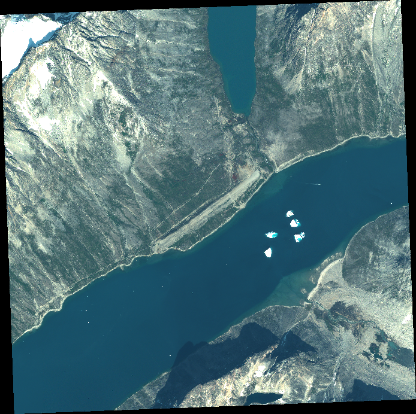{ style="height:554px;"}
{: style="margin-bottom:0px;" align=center }
<figcaption>Celá scéna z roku 2020</figcaption>

### Popis oblasti

Poskytnutá data zachycují bývalou vojenskou základnu z 2. světové války s názvem Bluie East Two, na které se mimo jiné nachází tisíce starých barelů. V roce 2019 započalo jejich odstraňování, tudíž jich je na každé scéně jiné množství. Naším cílem práce bude pomocí řízené klasifikace určit, kolik se v oblasti nachází barelů za předpokladu, že na jeden metr čtvereční plochy s barely připadá přibližně **2,12** barelů.

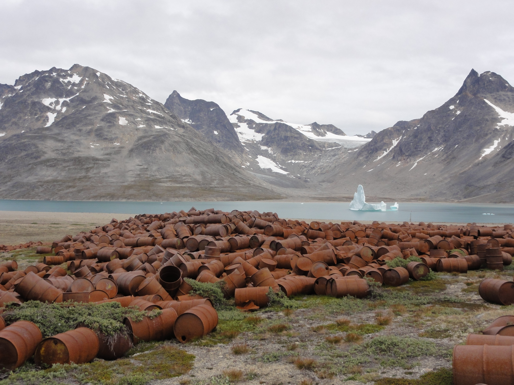{ style="width:80%;"}
{: style="margin-bottom:0px;" align=center }

## Příprava dat pro klasifikaci

Cvičení bude znovu probíhat v softwaru ArcGIS Pro. Začneme tedy tím, že si vytvoříme nový *Map* projekt, do kterého si vložíme multispektrální a panchromatická data z jednoho zvoleného roku. U multispektrálních dat zvolíme i nějakou vhodnou RGB kombinaci (a *Stretch type*) s ohledem na pořadí pásem: *B-G-R-NIR*.

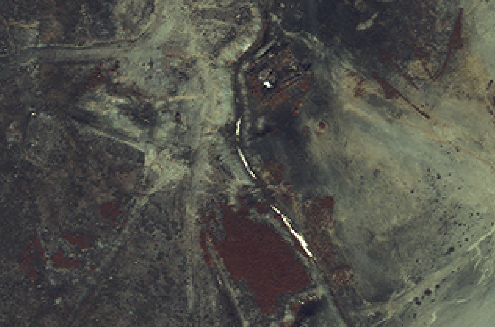
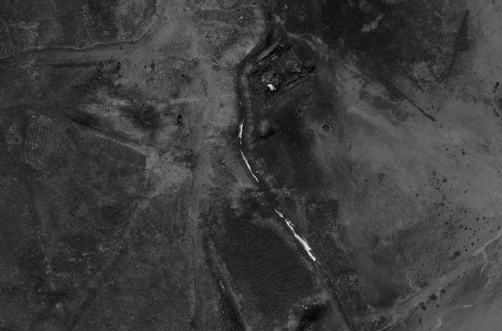
{: .process_container}
<figcaption>Ukázka VHR dat z roku 2019 (vlevo - multispektrální data, vpravo - panchromatická data)</figcaption>

### Pansharpening

Když už máme k dispozici panchromatické pásmo, které má v našem případě 4× vyšší rozlišení než multispektrální data, tak ho využijeme pro tzv. ***Pansharpening***. Jedná se o proces, který pomocí panchromatického pásma navýší prostorové rozlišení multispektrálních dat na stejnou úroveň jako má právě panchromatické pásmo. Na rozdíl od obyčejného převzorkování (*resampling*) zde multispektrální data převezmou i prostorové detaily panchromatického pásma. Pro pansharpening použijeme nástroj [:material-open-in-new: Create Pansharpened Raster Dataset](https://pro.arcgis.com/en/pro-app/latest/tool-reference/data-management/create-pansharpened-raster-dataset.htm){ .md-button .md-button--primary .button_smaller target="_blank"}, který najdeme přes panel ***Geoprocessing***. Zde poté zadáme multispektrální a panchromatická data a také jeden z nabízených algoritmů. V našem případě bych doporučil zvolit algoritmus *Gram-Schmidt*, kde můžete i nastavit, o jaký typ senzoru se jedná. Případně můžete i vyzkoušet, jak se budou výsledky s různými algoritmy pro pansharpening lišit.

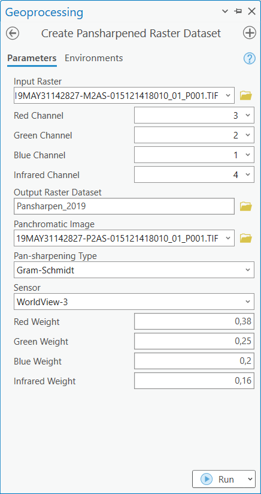{ style="height:494px;"}
{: style="margin-bottom:0px;" align=center }

Výsledkem budou pansharpovaná data, která můžeme porovnat s daty původními. Také je dobré všimnout si, že ArcGIS Pro změnil pořadí pásem v pansharpovaných datech na *R-G-B-NIR*.

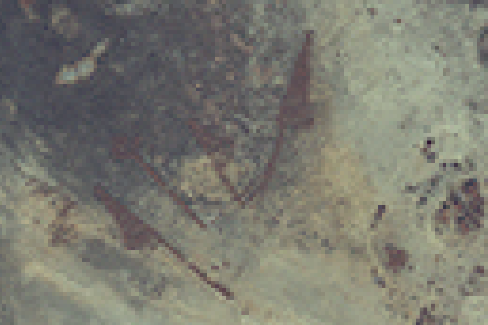
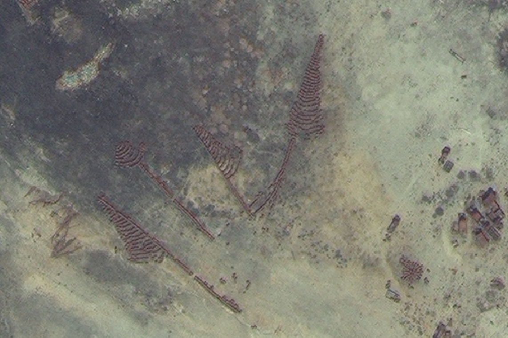
{: .process_container}

### Oříznutí na zájmovou oblast

Jelikož se barely nacházejí jen na části území, je zbytečné pracovat s celou scénou. Proto si scénu ořízneme jen na naše zájmové území. <a href="https://geo.fsv.cvut.cz/vyuka/155dprz/cv10/aoi.zip" target="_blank"> **Zde**</a> si tedy stáhněte shapefile, které toto zájmové území ohraničuje, a vložte si ho do vašeho projektu.

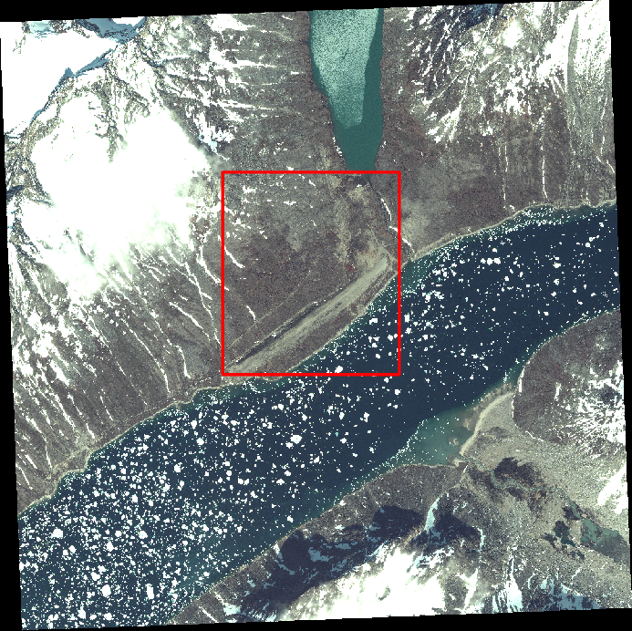{ style="height:554px;"}
{: style="margin-bottom:0px;" align=center }
<figcaption>Vyznačené zájmové území na scéně z roku 2019</figcaption>

Pansharpovanou scénu si ořízneme pomocí funkce [:material-open-in-new: Clip Raster](https://pro.arcgis.com/en/pro-app/3.1/tool-reference/data-management/clip.htm){ .md-button .md-button--primary .button_smaller target="_blank"}.

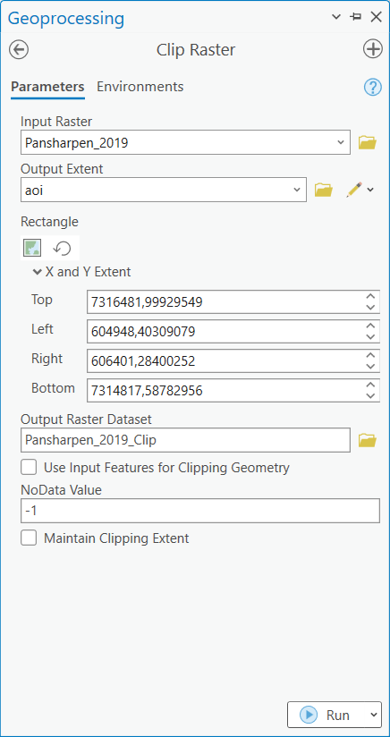{ style="height:494px;"}
{: .off-glb .process_icon}
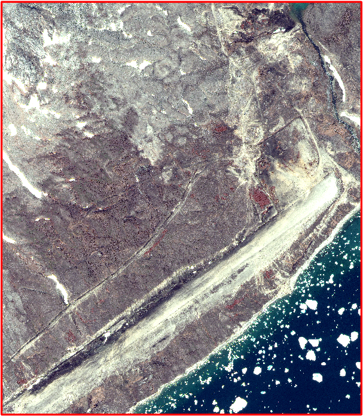{ style="height:417px;"}
{: .process_container}

### Vytvoření spektrálních indexů

Pro klasifikování máme k dispozici zatím jen 4 pásma a není tedy od věci si nějaké kanály dopočítat. Spočítáme si proto dva spektrální indexy; NDVI a NDWI. Nástroj pro výpočet NDVI najdeme v menu **Imagery** → **Indices** → **NDVI**. Zde poté stačí zadat, které pásmo odpovídá blizkému infračervenému pásmu (4), a které odpovídá červenému pásmu (1).

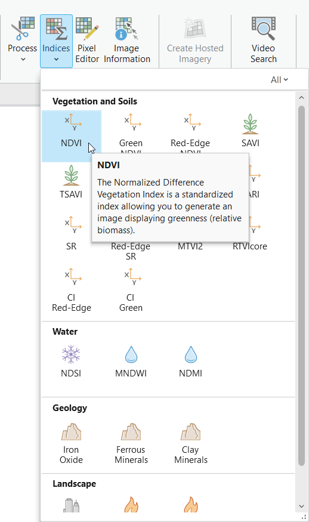{ style="height:525px;"}
{: .off-glb .process_icon}
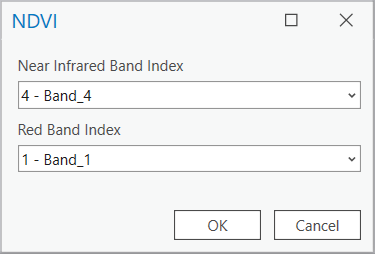{ style="height:203px;"}
{: .process_container}

Index NDWI zde bohužel předdefinován není, takže budeme muset použít jiný nástroj. Konkrétně tedy nástroj **Imagery** → **Raster Functions** → **Band Arithmetic**. Zde poté zvolíme, jakou metodu chceme použít (vybereme tedy NDWI), a zadáme pořadí potřebných pásem NIR a Green (4 2).

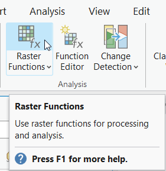
{: .off-glb .process_icon}
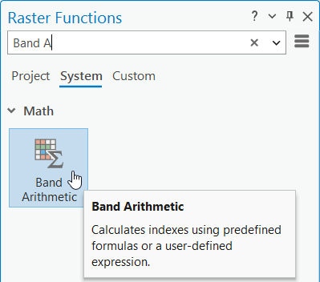
{: .off-glb .process_icon}
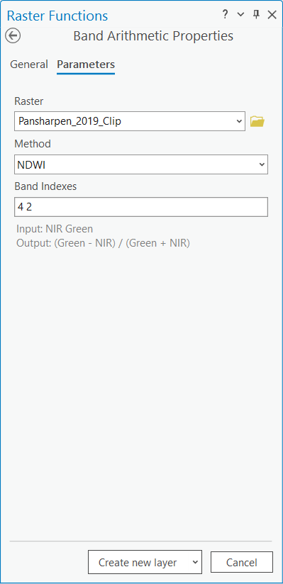
{: .process_container}

Takto vypočtené NDVI a NDWI kanály bohužel nejsou uložené v naší geodatabázi, a jedná se zřejmě jen o dočasné soubory. Pro jistotu si je tedy do geodatabáze uložíme. Klikneme pravým tlačítkem myši na daný raster v panelu *Contents* a zvolíme možnost **Data** → **Export Raster**. Zde poté nastavíme parametr ***Output Raster Dataset*** tak, aby se spočítaný spektrální index uložil právě do naší geodatabáze. Stejný postup provedeme pro oba indexy.

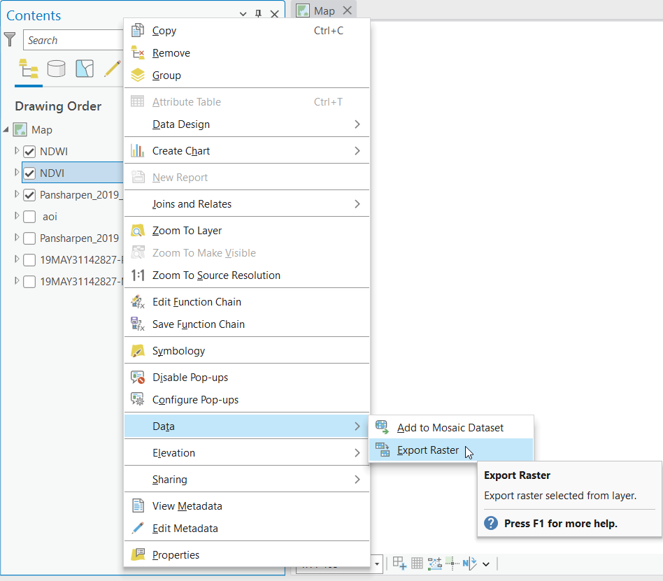
{: .off-glb .process_icon}
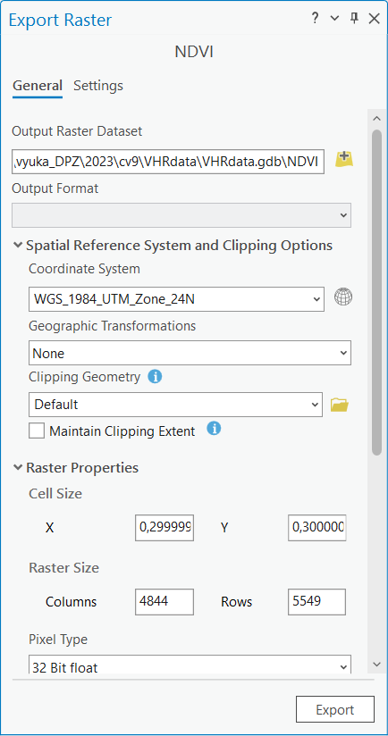
{: .process_container}

### Spojení více pásem do jednoho souboru

Posledním krokem před klasifikací je spojení pansharpovaných multispektrálních dat a vypočtených spektrálních indexů do jednoho multiband rastru. K tomu použijeme nástroj [:material-open-in-new: Composite Bands](https://pro.arcgis.com/en/pro-app/latest/tool-reference/data-management/composite-bands.htm){ .md-button .md-button--primary .button_smaller target="_blank"}. Zde pouze nastavíme pořadí jednotlivých pásem a výstupní rastr, který nejlépe znovu uložíme do geodatabáze.

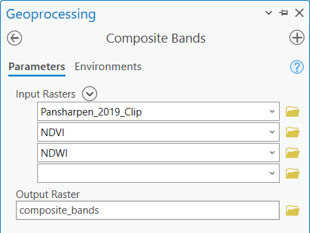{ style="height:271px;"}
{: style="margin-bottom:0px;" align=center }

Nyní můžeme všechny ostatní vrsty zavřít, protože dále již budeme pracovat pouze s tímto multiband rastrem.

## Řízená klasifikace

### Klasifikační třídy a trénovací plochy

V závislosti na zvolené scéně budeme klasifikovat buď 4 nebo 5 tříd. Konkrétně se bude jednat o následující třídy:

- Barely
- Vegetace
- Holá půda
- Voda
- Sníh a led (pouze v roce 2019)

Na RGB kompozitu se v tomto případě ale velmi těžko rozlišuje mezi vegetací a holou půdou. Proto doporučuji si data zobrazit ve falešných barvách v kombinaci NIR-R-G. U *Stretch Type* nastaveném na *Standard Deviation* je vhodné zkusit změnit i parametr *Number of standard deviations* na hodnotu 1 (minimálně na scéně z roku 2019 toto nastavení zvýrazní různé povrchy).

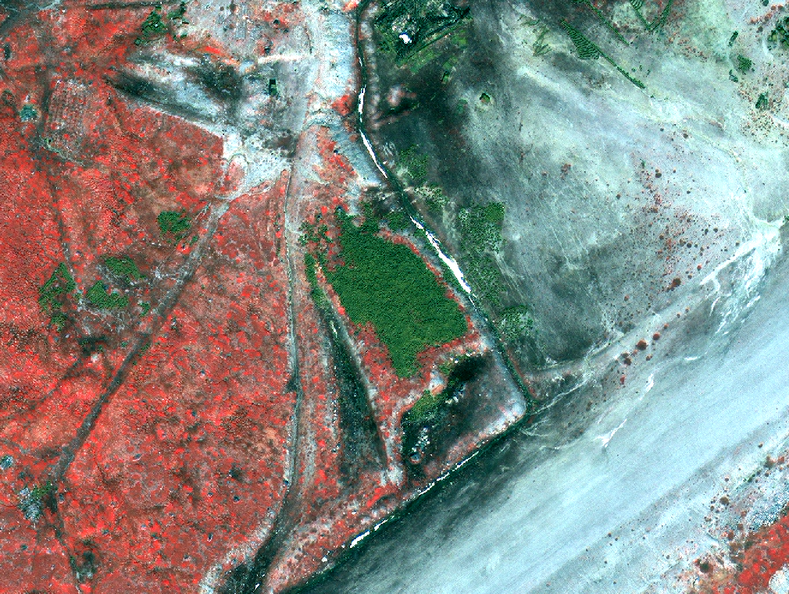
{: style="margin-bottom:0px;" align=center }

Poté již pomocí nástroje **Imagery** → **Classification Tools** → **Training Samples Manager** můžeme začít vytvářet jednotlivé trénovací plochy. Zde si vytvoříme nové klasifikační schéma pomocí funkce ***Create New Schema*** a následně si ho i uložíme (doporučuji začít číslovat klasifikační třídy od hodnoty 0, abychom později předešli jistým nepříjemnostem). Trénovací plochy jednotlivých tříd vytváříme pomocí nástroje ***Polygon***.

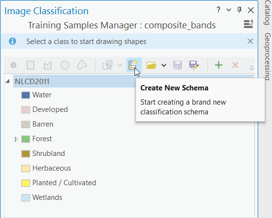{ style="height:268px;"}
{: .off-glb .process_icon}
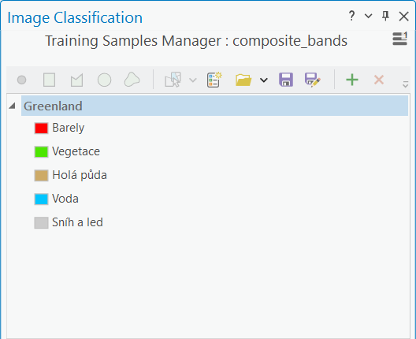{ style="height:258px;"}
{: .process_container}

Vytvořené trénovací plochy doporučuji uložit znovu do geodatabáze.

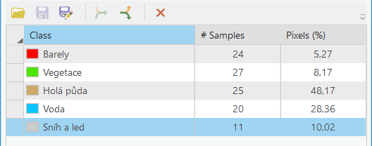{ style="height:166px;"}
{: style="margin-bottom:0px;" align=center }

### Klasifikace

Klasifikaci spustíme pomocí nástroje **Imagery** → **Classification Tools** → **Classify**. Zvolíme klasifikátor ***Random Trees*** a nastavíme parametry. Je dobré se zde zaměřit na parametr ***Maximum Number of Samples per Class*** a zvážit, jestli je 1000 dostatečný počet. Pokud se podíváme znovu do **Training Samples Manager** a ve spodní části najedeme myší na hodnotu *Pixels* u jedné z tříd, tak se nám zobrazí, kolik pixelů je danou třídou pokryto. V mém případě je to 38177 pixelů u nejméně zastoupené třídy. Proto je tedy na zvážení, jestli by se hodnota ***Maximum Number of Samples per Class*** neměla navýšit. Můžeme ale nejprve vyzkoušet, jaký bude výsledek klasifikace s 1000 vzorky, a v případě neuspokojivého výsledku počet vzorku zvýšit. Nicméně výpočet se zde zdá být poměrně rychlý, a nebál bych se tedy s parametry experimentovat a vložit do *Maximum Number of Samples per Class* klidně i hodnotu odpovídající nejvíce zastoupené třídě.

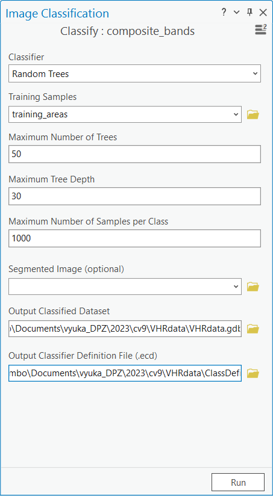{ style="height:494px;"}
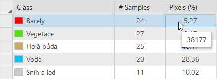{ style="height:128px;"}
{: .process_container}

V případě, že nejsme spokojeni s výsledkem ani po různých úpravách parametrů, nezbývá nic jiného, než upravit trénovací plochy. V takovém případě bych doporučil podívat se, kde se jednotlivé třídy klasifikují nesprávně (zejména třída s barely), a na takových místech přidat trénovací plochy pro správnou třídu, což by mělo výsledku pomoci. Nicméně pokud se jedná především o jednotlivé pixely, které se nesprávně zařadily do třídy *Barely*, jako je tomu na obrázku níže, tak není potřeba nic, protože se to vyřeší v postklasifikačních úpravách.

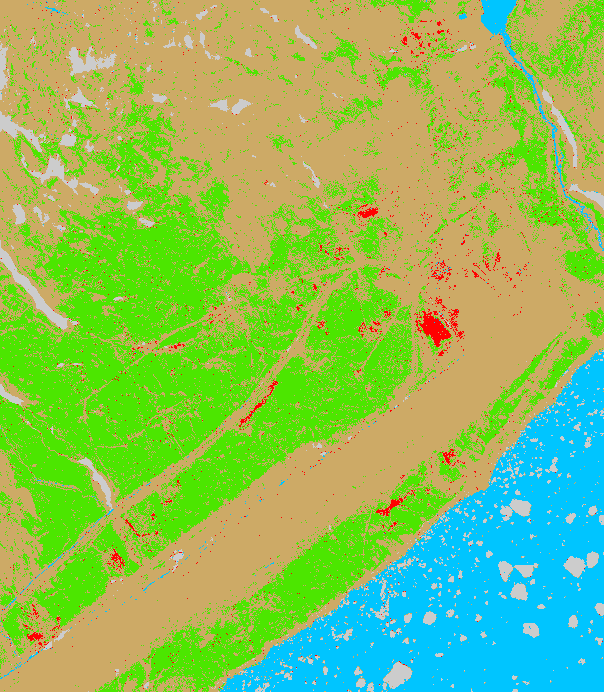
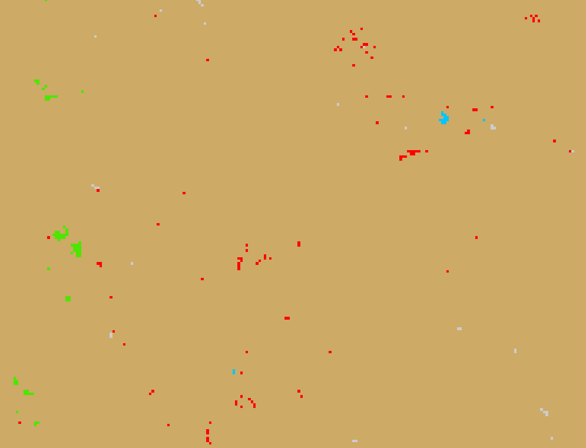
{: .process_container}
<figcaption>Výsledek klasifikace a detail na špatně klasifikované jednotlivé pixely</figcaption>

## Postklasifikační úpravy

Po dokončení klasifikace je někdy vhodné provést postklasifikační úpravy. V našem případě budou tyto úpravy zahrnovat odfiltrování špatně klasifikovaných pixelů či drobných skupin pixelů. K tomu se používá tzv. **Sieve** filtr, který tyto pixely odstraní a klasifikovaný výsledek vyhladí. Tento nástroj bohužel nativně v ArcGIS Pro není, nicméně byl vytvořen jedním z uživatelů a my si ho tak do ArcGIS Pro můžeme přidat. Na <a href="https://www.arcgis.com/home/item.html?id=d3d9deccd7e148eca9855deac0112452" target="_blank"> **tomto odkazu**</a> si jej tedy stáhněte. Stažený soubor odzipujte a následně jej přes **Catalog** → **Computer** najděte. Jedná se o klasický toolbox, který v sobě obsahuje dva nástroje. My použijeme nástroj **Regular Sieve**. Zde nastavíme vstupní a výstupní rastr a také minimální velikost shluku pixelů, kdy daný shluk nebude odfiltrován (velikost se udává v pixelech). Můžeme také měnit logický výraz, nicméně cokoliv jiného než *is less than* nebo *is less than or equal to* v tuto chvíli nemá asi smysl. Začneme např. s hodnotou 10 a uvidíme, jak bude klasifikovaný výsledek vypadat poté.

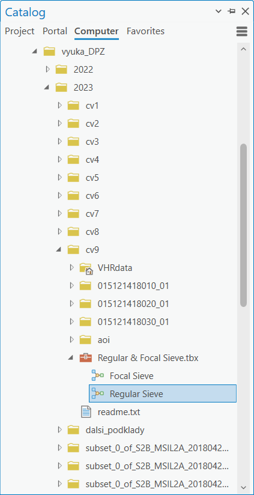{ style="height:494px;"}
{: .off-glb .process_icon}
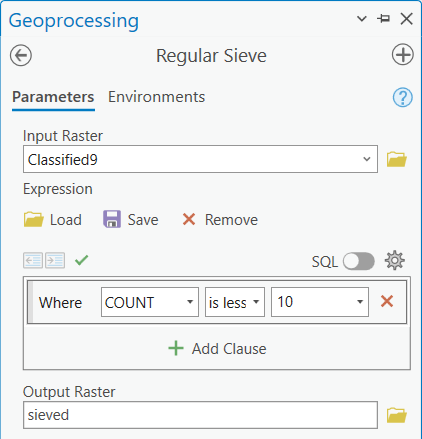{ style="height:354px;"}
{: .process_container}

Nástroj **Regular Sieve** bohužel z nějakého důvodu překlasifikovává data tak, aby číslování tříd začínalo od 0. Takže pokud jsme si je číslovali od 1, tak došlo k jejich přečíslování. Pokud jsme měli číslování od 0, ale došlo ke změně symbologie, můžeme použít nástroj [:material-open-in-new: Apply Symbology From Layer](https://pro.arcgis.com/en/pro-app/latest/tool-reference/data-management/apply-symbology-from-layer.htm){ .md-button .md-button--primary .button_smaller target="_blank"} k překopírování symbologie z původního klasifikovaného výsledku (ukázalo se ale, že moc nefunguje). Nicméně z následujícího porovnání je vidět, že aplikování sieve filtru výsledku výrazně pomohlo.

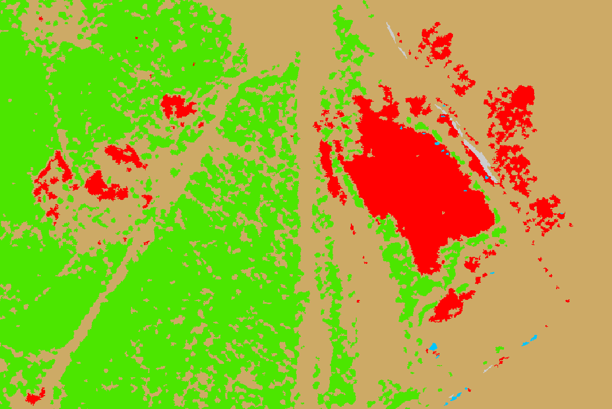
{: .process_container}
<figcaption>Porovnání výsledku klasifikace před použitím sieve filtru a po jeho aplikování</figcaption>

## Určení počtu barelů

Po dokončení klasifikace chceme zjistit, jakou celkovou plochu barely zabírají, a z toho následně odhadnout, kolik se v oblasti nachází celkem barelů. Pro určení celkové plochy nejprve zjistíme, kolik pixelů se klasifikovalo do třídy barelů. K tomu můžeme použít buď nástroj [:material-open-in-new: Summarize Categorical Raster](https://pro.arcgis.com/en/pro-app/latest/tool-reference/image-analyst/summarize-categorical-raster.htm){ .md-button .md-button--primary .button_smaller target="_blank"} nebo se jednoduše podívat do atributové tabulky vrstvy s aplikovaným sieve filtrem (atributová tabulka původní klasifikované vrstvy bohužel tuto informaci nenabízí, takže u ní by bylo potřeba použít zmíněný nástroj).

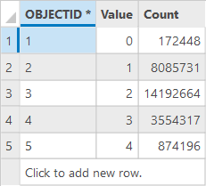{ style="height:167px;"}
{: style="margin-bottom:0px;" align=center }

Z této tabulky by se nyní dala vzít hodnota 172448, což je počet pixelů klasifikovaných jako barely, a určit z ní plochu a následně i počet barelů. Nicméně je potřeba vzít ale v potaz, že kromě barelů se do stejné třídy klasifikovaly i pozůstatky hangáru, nákladní auta a další zrezlý materiál.

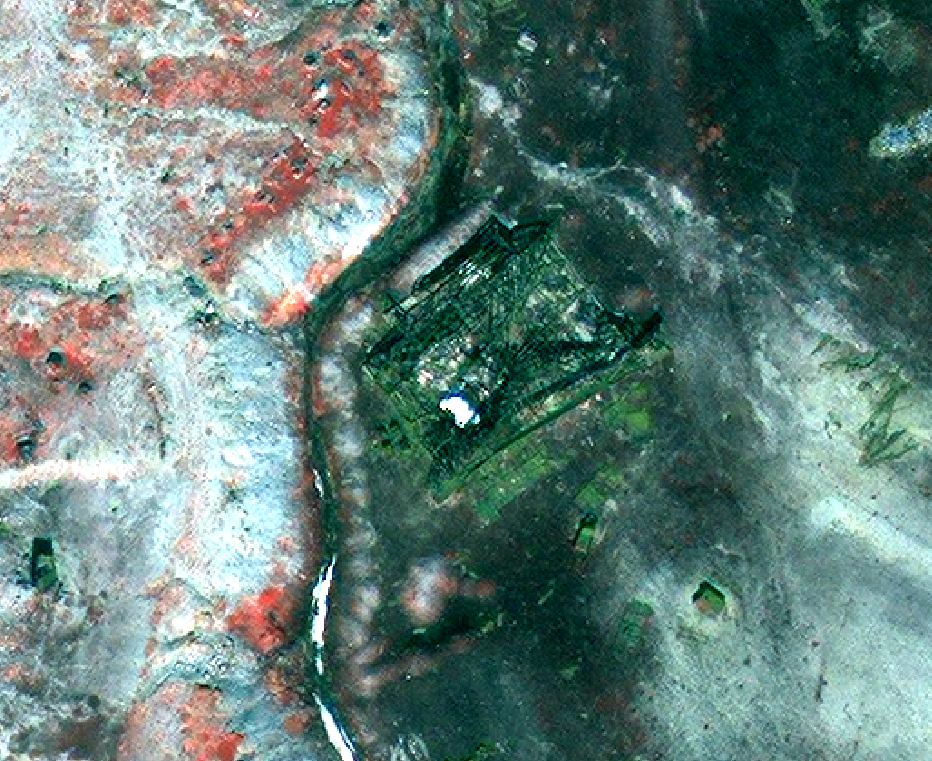
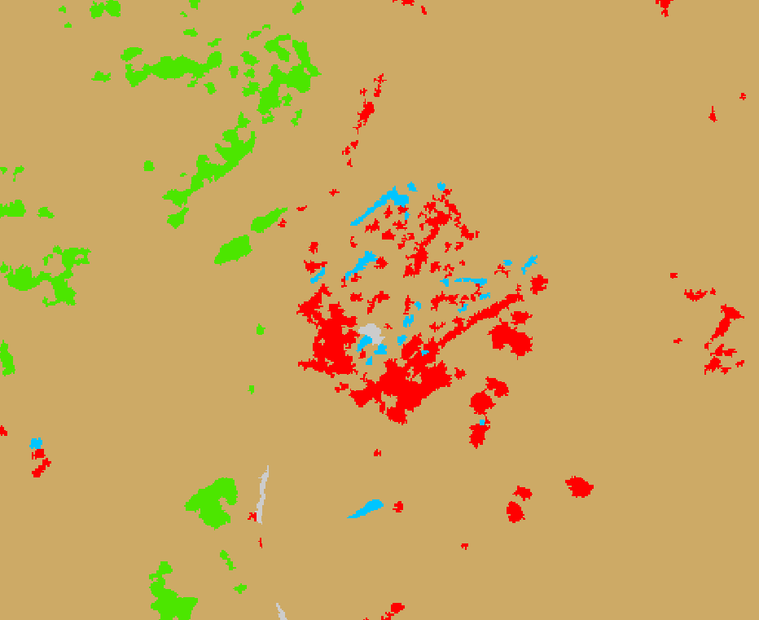
{: .process_container}

Abychom určili správnou plochu, kterou pokrývají barely, je potřeba tato místa zamaskovat. Vytvoříme si tedy v geodatabázi novou *Feature Class*, ve které následně vytvoříme polygony pokrývající hangár a další místa, klasifikovná jako barely. Nové prvky do polygonové vrstvy vkládáme přes menu **Edit** → **Create**. Vytvořené prvky si poté pro jistotu i uložíme v menu **Edit** → **Save**.

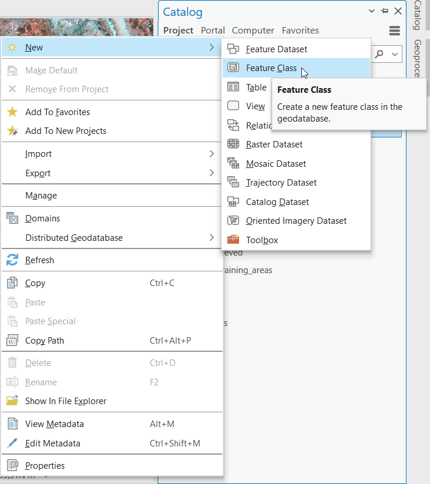
{: .off-glb .process_icon}
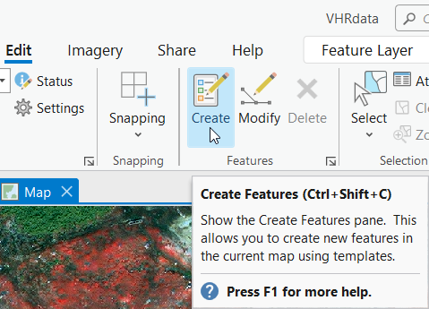
{: .off-glb .process_icon}
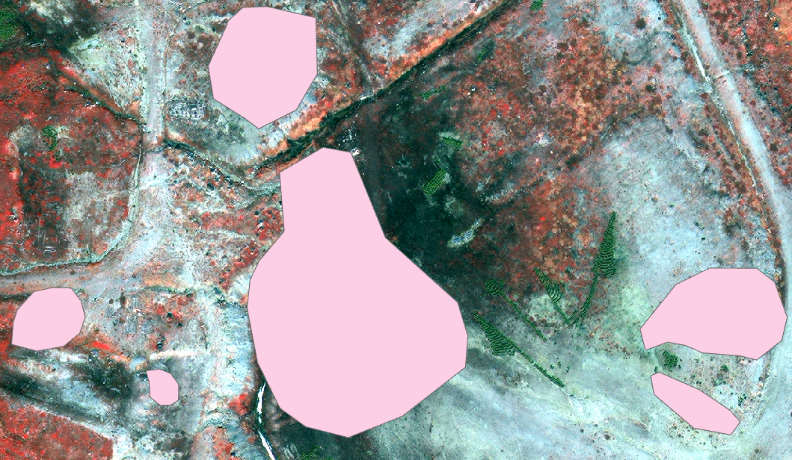
{: .process_container}

Po vytvoření polygonů použijeme již zmíněný nástroj **Summarize Categorical Raster**, do kterého vložíme klasifikovaný rastr a vytvořenou masku. Výslednou tabulku si následně otevřeme a sečteme hodnoty sloupce C_0 (případně jiného sloupce odpovídajícímu barelům).

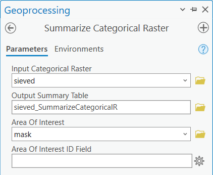{ style="height:277px;"}
{: .off-glb .process_icon}
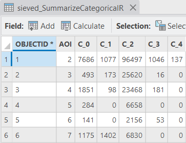{ style="height:223px;"}
{: .process_container}

V mém případě to dává hodnotu 11633. Tu odečteme od celkového počtu pixelů klasifikovaných jako barely a zjistíme správnou plochu. Výpočet by tedy vypadal zhruba takto:

**(172448 - 11633) × S**, kde S je plocha jednoho pixelu. V mém případě to vychází na nějakých **14473,35 m2**.

Tuto hodnotu poté vynásobíme číslem **2,12** (počet barelů na metr čtvereční) a získáme tak odhad celkového počtu barelů. V mém případě vyšlo, že se na území nacházelo přibližně **30684 barelů**.

## Úkol - VHR data

- Proveďte klasifikaci na vybrané scéně s cílem určit celkovou plochu, kterou pokrývají barely
- Určete, kolik se v oblasti nachází celkem barelů za předpokladu, že na jeden metr čtvereční připadá 2,12 barelů
- Do technické zprávy popište postup, pomocí kterého jste se k výslednému číslu dopracovali