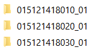
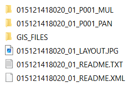

# Ukázka VHR dat, pansharpening, řízená klasifikace v ArcGIS Pro

## Cíl cvičení

- Seznámit se některými daty s vysokým prostorovým rozlišením
- Získat povědomí o možnosti pansharpeningu
- Provést řízenou klasifikaci VHR dat v ArcGIS Pro

## Základní pojmy

- **VHR data** - Very High Resolution data, neboli data s vysokým prostorovým rozlišením
- **Panchromatické pásmo** - Pásmo obsahující veškeré viditelné odražené záření (šířka pásma tedy sahá do oblasti modrého, zeleného a červeného spektra). Takto velká šířka pásma umožňuje udržet vysoký poměr signálu a šumu, což dává možnost mít data ve vysokém prostorovém rozlišení (až čtyřikrát vyšší oproto multispektrálním datům).
- **Pansharpening** (panchromatic sharpening) - Jedná se o proces kombinující panchromatická data s daty multispektrálními, přičemž dochází k navýšení prostorového rozlišení multispektrálních dat se zachováním specifických spektrálních atributů.

## Data pro cvičení

Data pro toto cvičení si můžete stáhnout <a href="https://geo.fsv.cvut.cz/vyuka/155dprz/cv10/cv10_data.zip" target="_blank"> **zde**</a>. Zazipovaný soubor obsahuje tři scény ze stejného území v Grónsku. Vyberte si tedy jednu z nich, se kterou budete v rámci cvičení pracovat. Informace o jednotlivých scénách shrnuje následující tabulka.

<table>
  <thead>
    <tr>
      <th><strong>Datum snímání</strong></th>
      <th><strong>Družice</strong></th>
      <th><strong>Rozlišení multispektrálních pásem</strong></th>
      <th><strong>Rozlišení panchromatického pásma</strong></th>
    </tr>
  </thead>
  <tbody>
    <tr>
      <td>31. 5. 2019</td>
      <td>WorldView-3</td>
      <td>1,2 m</td>
      <td>0,3 m</td>
    </tr>
    <tr>
      <td>1. 8. 2020</td>
      <td>GeoEye-1</td>
      <td>1,6 m</td>
      <td>0,4 m</td>
    </tr>
    <tr>
      <td>30. 8. 2021</td>
      <td>GeoEye-1</td>
      <td>2 m</td>
      <td>0,5 m</td>
    </tr>
  </tbody>
</table>

Názvy složek bohužel o samotných scénách nic neříkají, nicméně jsou řazeny podle roku. První složka tedy obsahuje data pro rok 2019 a poslední složka data pro rok 2021. Každá složka poté obsahuje podsložky s názvem končícím na *MUL* a *PAN*, ve kterých naleznete *TIF* soubor s multispektrálními, resp. panchromatickými daty.

{: .off-glb .process_icon}

{: .process_container}

Multispektrální data obsahují celkem čtyři pásma, která jsou řazena v následujícím pořadí: modré, zelené, červené a blízké infračervené (B-G-R-NIR).

### Popis oblasti

Poskytnutá data zachycují bývalou vojenskou základnu z 2. světové války s názvem Bluie East Two, na které se mimo jiné nachází tisíce starých barelů. V roce 2019 započalo jejich odstraňování, tudíž jich je na každé scéně jiné množství. Naším cílem práce bude pomocí řízené klasifikace určit, kolik se v oblasti nachází barelů za předpokladu, že na jeden metr čtvereční plochy s barely připadá přibližně **2,12** barelů.

{ style="width:80%;"}
{: style="margin-bottom:0px;" align=center }

## Příprava dat pro klasifikaci

### Pansharpening

### Oříznutí na zájmovou oblast

### Vytvoření spektrálních indexů

### Spojení více pásem do jednoho souboru

## Řízená klasifikace

### Klasifikační třídy a trénovací plochy

### Klasifikace

## Postklasifikační úpravy

- Sieve filter

## Určení počtu barelů

- Zamaskování hangáru a náklaďáků
- Summarize Categorical Raster

