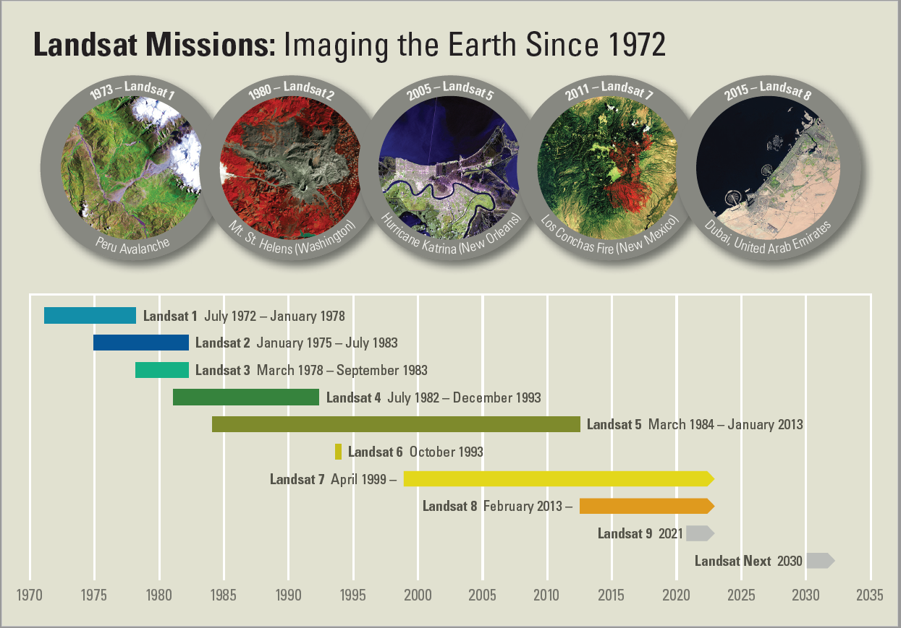
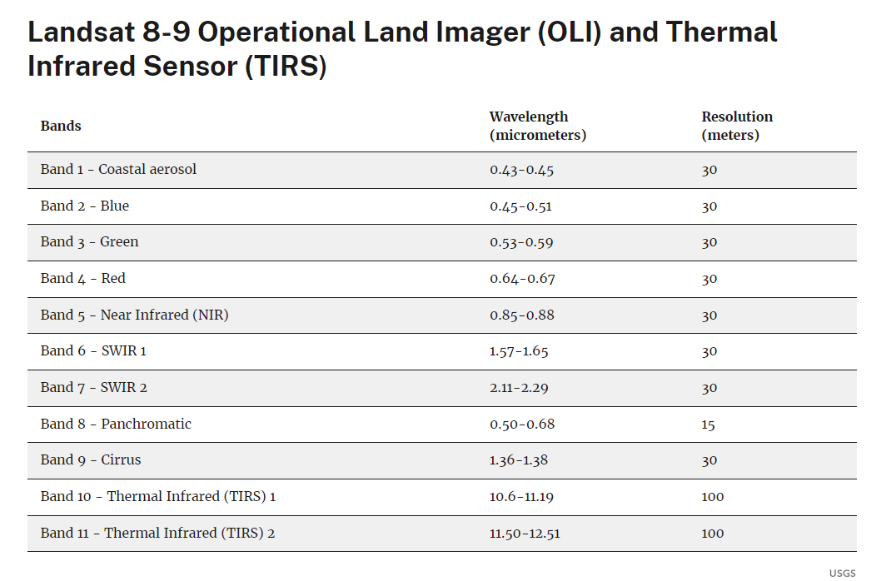

# Analýza tepelných ostrovů pomocí dat Landsat

## Cíl cvičení

- Seznámit se s daty Landsat
- Umět analyzovat tepelné ostrovy

## Základní pojmy

- **LST** - Land surface temperature - radiační teplota zemského povrchu měřená ve směru senzoru

### Program Landsat

Program Landsat je nejdéle probíhající projekt zaměřený na pozorování Země. Scény zobrazující zemský povrch poskytuje nepřetržitě již od roku 1972. Během více než padesáti let bylo postupně vypuštěno devět družic s názvy Landsat 1 až Landsat 9. V současné době jsou aktivní družice Landsat 8 a Landsat 9. Program společně řídí agentury <a href="https://www.nasa.gov/" target="_blank"> **NASA**</a> a <a href="https://www.usgs.gov/" target="_blank"> **U.S. Geological Survey**</a>. Veškerá data jsou volně dostupná. Více o historii, současnosti i budoucnosti programu Landsat se můžete dozvědět na následujích webových stránkách:

[:material-open-in-new: Landsat Satellite Missions](https://www.usgs.gov/landsat-missions/landsat-satellite-missions){ .md-button .md-button--primary .button_smaller target="_blank"}
{: align=center style="display:flex; justify-content:center; align-items:center; column-gap:20px; row-gap:10px; flex-wrap:wrap;"}

{: style="margin-bottom:0px;" align=center }
<figcaption>Mise Landsat</figcaption>

<iframe width="560" height="315" src="https://www.youtube.com/embed/7XKVSTX1vdE?si=HvOfNrfjRDOqKuzn" title="YouTube video player" frameborder="0" allow="accelerometer; autoplay; clipboard-write; encrypted-media; gyroscope; picture-in-picture; web-share" allowfullscreen></iframe>

[:material-open-in-new: youtube.com Landsat: Celebrating 50 Years (Extended Edition)](https://www.youtube.com/watch?v=gfUYFPWYwXI){ .md-button .md-button--primary .url-name target="_blank"}
{: align=center style="display:flex; justify-content:center; align-items:center; column-gap:20px; row-gap:10px; flex-wrap:wrap;"}

### Landsat 8/9

V rámci tohoto cvičení budeme pracovat s daty z jedné z těchto dvou družic. Obě družice nesou téměř identické vybavení s tím, že přístroje na Landsatu 9 jsou vylepšenými replikami přístrojů družice Landsat 8. Na obou družicích najdeme tedy dva senzory (OLI, resp. OLI-2 a TIRS, resp. TIRS-2). OLI je zkratkou pro **Operational Land Imager**, který snímá 8 spektrálních pásem a jedno pásmo panchromatické. TIRS je zktratkou pro **Thermal Infrared Sensor**, který měří tepelné záření vyzařované zemským povrchem ve dvou termálních infračervených pásmech.

<iframe width="560" height="315" src="https://www.youtube.com/embed/1DLDjxpPElA?si=5CCyCYFM_ArWyZ9o" title="YouTube video player" frameborder="0" allow="accelerometer; autoplay; clipboard-write; encrypted-media; gyroscope; picture-in-picture; web-share" allowfullscreen></iframe>
<iframe width="560" height="315" src="https://www.youtube.com/embed/DGE-N8_LQBo?si=Ofntz4jPTBGPvdi8" title="YouTube video player" frameborder="0" allow="accelerometer; autoplay; clipboard-write; encrypted-media; gyroscope; picture-in-picture; web-share" allowfullscreen></iframe>

[:material-open-in-new: youtube.com Landsat: Landsat 9: Continuing the Legacy)](https://www.youtube.com/playlist?list=PL_8hVmWnP_O3WFxfAa_xBlsmGq87HMhFW){ .md-button .md-button--primary .url-name target="_blank"}
{: align=center style="display:flex; justify-content:center; align-items:center; column-gap:20px; row-gap:10px; flex-wrap:wrap;"}

Jednotlivá pásma Landsat 8 a 9 shrnuje následující tabulka:

{ style="height:558px;"}
{: style="margin-bottom:0px;" align=center }

## Stažení dat Landsat