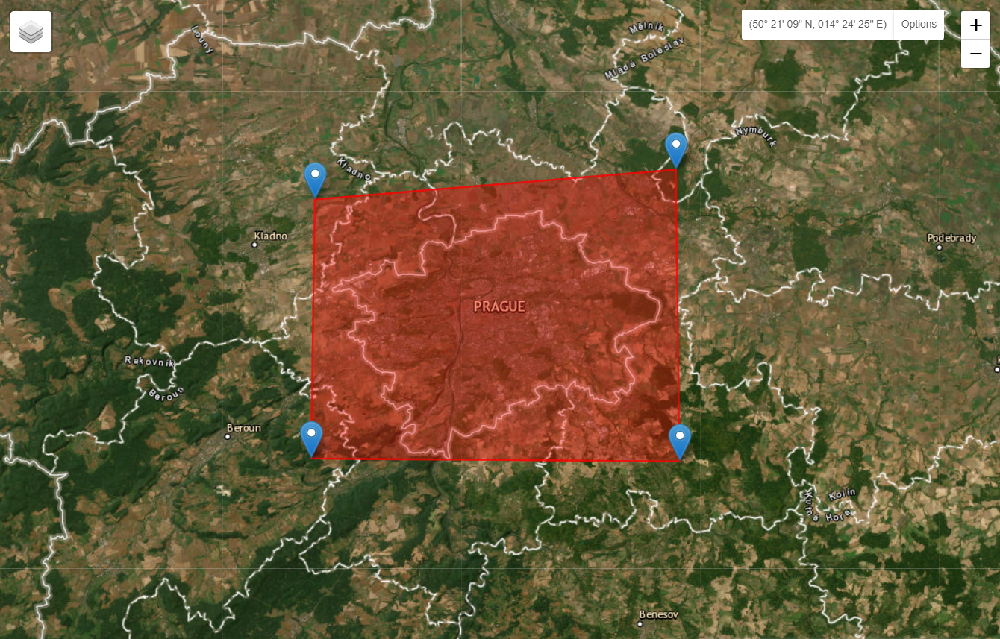
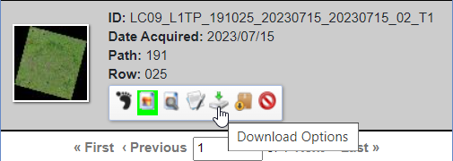
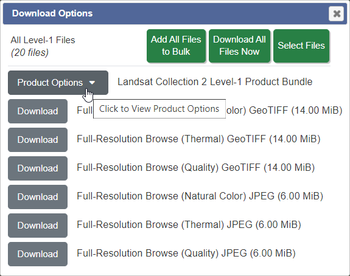
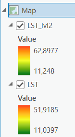

# Tepelná analýza pomocí dat Landsat

## Cíl cvičení

- Seznámit se s daty Landsat
- Umět spočítat povrchovou teplotu na základě dat Landsat

## Základní pojmy

- **LST** - Land Surface Temperature - radiační teplota zemského povrchu měřená ve směru senzoru
- **LSE** - Land Surface Emissivity - bezrozměrná veličina udávající jak účinně povrch vyzařuje tepelné infračervené záření

### Program Landsat

Program Landsat je nejdéle probíhající projekt zaměřený na pozorování Země. Scény zobrazující zemský povrch poskytuje nepřetržitě již od roku 1972. Během více než padesáti let bylo postupně vypuštěno devět družic s názvy Landsat 1 až Landsat 9. V současné době jsou aktivní družice Landsat 8 a Landsat 9 a z části i Landsat 7. Program společně řídí agentury <a href="https://www.nasa.gov/" target="_blank"> **NASA**</a> a <a href="https://www.usgs.gov/" target="_blank"> **U.S. Geological Survey**</a>. Veškerá data jsou volně dostupná. Více o historii, současnosti i budoucnosti programu Landsat se můžete dozvědět na následujích webových stránkách:

[:material-open-in-new: Landsat Satellite Missions](https://www.usgs.gov/landsat-missions/landsat-satellite-missions){ .md-button .md-button--primary .button_smaller target="_blank"}
{: align=center style="display:flex; justify-content:center; align-items:center; column-gap:20px; row-gap:10px; flex-wrap:wrap;"}

{: style="margin-bottom:0px;" align=center }
<figcaption>Mise Landsat</figcaption>

<iframe width="560" height="315" src="https://www.youtube.com/embed/7XKVSTX1vdE?si=HvOfNrfjRDOqKuzn" title="YouTube video player" frameborder="0" allow="accelerometer; autoplay; clipboard-write; encrypted-media; gyroscope; picture-in-picture; web-share" allowfullscreen></iframe>

[:material-open-in-new: youtube.com Landsat: Celebrating 50 Years (Extended Edition)](https://www.youtube.com/watch?v=gfUYFPWYwXI){ .md-button .md-button--primary .url-name target="_blank"}
{: align=center style="display:flex; justify-content:center; align-items:center; column-gap:20px; row-gap:10px; flex-wrap:wrap;"}

### Landsat 8/9

V rámci tohoto cvičení budeme pracovat s daty z jedné z těchto dvou družic. Obě družice nesou téměř identické vybavení s tím, že přístroje na Landsatu 9 jsou vylepšenými replikami přístrojů družice Landsat 8. Na obou družicích najdeme tedy dva senzory (OLI, resp. OLI-2 a TIRS, resp. TIRS-2). OLI je zkratkou pro **Operational Land Imager**, který snímá 8 spektrálních pásem a jedno pásmo panchromatické. TIRS je zktratkou pro **Thermal Infrared Sensor**, který měří tepelné záření vyzařované zemským povrchem ve dvou termálních infračervených pásmech.

<iframe width="560" height="315" src="https://www.youtube.com/embed/1DLDjxpPElA?si=5CCyCYFM_ArWyZ9o" title="YouTube video player" frameborder="0" allow="accelerometer; autoplay; clipboard-write; encrypted-media; gyroscope; picture-in-picture; web-share" allowfullscreen></iframe>
<iframe width="560" height="315" src="https://www.youtube.com/embed/DGE-N8_LQBo?si=Ofntz4jPTBGPvdi8" title="YouTube video player" frameborder="0" allow="accelerometer; autoplay; clipboard-write; encrypted-media; gyroscope; picture-in-picture; web-share" allowfullscreen></iframe>

[:material-open-in-new: youtube.com Landsat 9: Continuing the Legacy](https://www.youtube.com/playlist?list=PL_8hVmWnP_O3WFxfAa_xBlsmGq87HMhFW){ .md-button .md-button--primary .url-name target="_blank"}
{: align=center style="display:flex; justify-content:center; align-items:center; column-gap:20px; row-gap:10px; flex-wrap:wrap;"}

Jednotlivá pásma Landsat 8 a 9 shrnuje následující tabulka:

{ style="height:558px;"}
{: style="margin-bottom:0px;" align=center }

## Stažení dat Landsat

Data Landsat budeme stahovat z portálu <a href="https://earthexplorer.usgs.gov/" target="_blank"> **USGS EarthExplorer**</a>, kde je potřeba se nejprve zaregistrovat. Registraci provedeme přes tlačítko ***Login*** v pravé horní části webových stránek (vlastní zkušenost ukázala, že registrace zde není zrovna nejjednodušší proces).

{: style="margin-bottom:0px;" align=center }

Když se nám podařilo se zaregistrovat, můžeme přejít k vybrání oblasti, ze které budeme chtít data stáhnout. Cílem tohoto cvičení je analyzovat tepelné ostrovy, takže si najdeme nějaké větší město kdekoliv na světě. Následně si naše území vyznačíme obyčejným klikáním do mapového okna.

{: style="margin-bottom:0px;" align=center }

Zároveň si ve spodní části záložky **Search Criteria** nastavíme ***Date Range*** na období letních měsíců a ***Cloud Cover*** na nějakou rozumnou hodnotu (chceme ideálně bezoblačnou scénu).

{ style="height:350px;"}
{ style="height:161px;"}
{: .process_container}

Dále se přepneme do záložky **Data Sets**, kde zvolíme, jaká data budeme chtít stahovat. V našem případě zvolíme **Landsat** → **Landsat Collection 2 Level-1** → **Landsat 8-9 OLI/TIRS C2 L1**. Jedná se o data bez atmosferických korekcí, která pro analýzu povrchové teploty budeme potřebovat.

{ style="height:405px;"}
{: style="margin-bottom:0px;" align=center }

Záložku **Addittional Criteria** můžeme přeskočit a rovnou se přepnout do záložky **Results**. Zde si již můžeme vybrat jednu z nabízených scén. Pomocí funkce ***Show Browse Overlay*** se můžeme podívat, jak dobře se daná scéna s naším uzemím překrývá.

{: style="margin-bottom:0px;" align=center }

Pokud jsme se scénou spokojeni, klikneme na ikonu ***Download Options***. Zde si zvolíme, jaké soubory chceme stahovat. V našem případě si stáhneme všechny soubory. Klikneme tedy na ***Product Options*** a stáhneme si celou Landsat kolekci.

{: .off-glb .process_icon}

{: .off-glb .process_icon}

{: .process_container}

K *Level 1* produktu si nicméně stáhneme i *Level 2* produkt (pokud je k dispozici). V záložce **Data Sets** stačí jen změnit data na **Landsat** → **Landsat Collection 2 Level-2** → **Landsat 8-9 OLI/TIRS C2 L2** a poté kliknout zpátky do **Results**, kde si vybereme korespondující scénu s *Level 1* produktem. *Level 2* produkt v sobě má již pásmo odpovídající ***Land Surface Temperature***. K jeho hodnotám se ale došlo trochu jinak, než jak k nim dojdeme my. V závěru cvičení můžeme ale naše výsledky s již předzpracovaným pásmem porovnat.

## Otevření a zobrazení dat

Pokud jsme stahovali všechna data najednou (a ne třeba jen vybraná pásma), tak jsme data obdrželi ve formátu *TAR*. Jedná se o podobný formát jako *ZIP*, ale nedochází zde ke kompresi. Data v tomto formátu lze rozbalit např. pomocí nástroje <a href="https://www.7-zip.org/" target="_blank"> **7-Zip**</a>. Pokud 7-Zip v učebně není nainstalovaný, lze použít i **Total Commander**.

{ style="height:359px;"}
{: style="margin-bottom:0px;" align=center }

Po rozbalení dat si do ArcGIS Pro nahrajeme pásma B2, B3 a B4 a vytvoříme si z nich RGB kompozit pomocí funkce [:material-open-in-new: Composite Bands](https://pro.arcgis.com/en/pro-app/latest/tool-reference/data-management/composite-bands.htm){ .md-button .md-button--primary .button_smaller target="_blank"}. Připomínám, že pracujeme s *Level 1* daty.

{: style="margin-bottom:0px;" align=center }

## Výpočet povrchové teploty

Výpočet povrchové teploty se bude skládat z celkem šesti kroků, které si postupně projdeme. Základem výpočtu bude termální pásmo **B10**, které si nejprve tedy přidáme do ArcGIS Pro.

### 1) Převod digitálních hodnot na TOA záření

Prvním krokem je, že si převedeme digitální hodnoty pixelů v pásmu **B10** na hodnoty záření na vrcholu atmosféry (*TOA = Top of Atmospheric*). Vzoreček pro tento převod je následující:

**TOA = ML·B10 + AL**

kde:

**ML** je multiplikativní přeškálovací faktor, jehož hodnotu najdeme v metadatech daného Landsat produktu. Metada nalezneme v textovém souboru končícím na *_MTL.txt*. Konkrétně se pak jedná o hodnotu ***RADIANCE_MULT_BAND_10***

**B10** je termální pásmo B10

**AL** je aditivní přeškálovací faktor, který rovněž najdeme v metadatech, kde nese název ***RADIANCE_ADD_BAND_10***

K výpočtu použijeme nástroj [:material-open-in-new: Raster Calculator](https://pro.arcgis.com/en/pro-app/latest/tool-reference/image-analyst/raster-calculator.htm){ .md-button .md-button--primary .button_smaller target="_blank"}.

{ style="height:400px;"}
{: style="margin-bottom:0px;" align=center }

### 2) Převod TOA záření na jasovou teplotu

Pro výpočet jasové teploty (*Brightness Temperature*) použijeme následující vzorec:

**BT = K2 / ln(K1/TOA + 1) − 273.15**

kde:

**K2** a **K1** jsou konstanty tepelné konverze, které najdeme v metadatech pod názvy ***K1_CONSTANT_BAND_10*** a ***K2_CONSTANT_BAND_10***

{ style="height:400px;"}
{: style="margin-bottom:0px;" align=center }

### 3) Výpočet NDVI

V dalším kroku vypočteme index NDVI. Ten bude následně sloužit k určení emisivity povrchu. Vzoreček pro NDVI již všichi známe. Pokud ne, tak jeho podoba je následující (pozor na jiné pořadí pásem oproti Sentinel-2):

**(NIR - Red)/(NIR + Red) = (B5 - B4)/(B5 + B4)**

A jelikož máme pásma jednotlivě a ne v jedné vrstvě, použijeme znovu *Raster Calculator*.

{ style="height:400px;"}
{: style="margin-bottom:0px;" align=center }

### 4) Zjištění podílu vegetace

Vzorec pro určení podílu vegetace má následující tvar:

**PV = ((NDVI - NDVImin)/(NDVImax - NDVImin))2**

Hodnoty **NDVImin** a **NDVImax** zjistíme např. přímo z panelu *Contents*.

{: .off-glb .process_icon}
{ style="height:400px;"}
{: .process_container}

### 5) Výpočet emisivity povrchu

V předposledním kroku pomocí NDVI vypočteme emisivitu zemského povrchu. Vzoreček je následující:

**e = 0,004 · PV + 0,986**

{ style="height:400px;"}
{: style="margin-bottom:0px;" align=center }

### 6) Výpočet teploty povrchu

Posledním krokem je již výpočet samotné teploty povrchu.

**LST = BT / (1 + (λ·BT/14388)·ln(e))**

kde:

**λ** je vlnová délka vyzařovaného záření pásma B10. Použijeme průměrnou hodnotu z intervalu 10,6 - 11,19 → tedy **10,895** (hodnota je v mikrometrech, ale nemusíme ji převádět, protože konstanta 14388 je rovněž v mikrometrech).

{ style="height:400px;"}
{: style="margin-bottom:0px;" align=center }

## Zhodnocení výsledků

Takto vypočtenou teplotu povrchu jsme obdrželi rovnou ve °C. Pokud jsme nikde neudělali chybu, tak vidíme, že výsledky jsou realistické. Je ale dobré si uvědomit, že se nejedná o stejnou teplotu jako je teplota vzduchu.

{: style="margin-bottom:0px;" align=center }

Dále je vhodné si data obarvit nějakým rozumným barevným schématem, které bude pro zobrazení teploty ituitivnější. V mém případě barevnou škálu trochu zkresluje drobná oblačnost v severní části scény a pro lepší vyzualizaci teplot ve městě by stálo za to scénu oříznout.

{ style="height:565px;"}
{: style="margin-bottom:0px;" align=center }

Při porovnání s NDVI můžeme vidět, že nižší teploty odpovídají místům se zelení a naopak místa bez zeleně mají teplotu o poznání vyšší (což samozřejmě dává smysl, ale je vždy dobré mít to čím podpořit).

{: .process_container}
<figcaption>Vlevo - RGB scéna, uprostřed - povrchová teplota, vpravo - NDVI</figcaption>

## Porovnání s Level 2 produktem

*Level 2* Landsat produkt nabízí již předzpracované termální pásmo, a pro zjištění povrchové teploty ho lze pouze přeškálovat pomocí správných koeficientů. Přidáme si tedy do ArcGIS Pro pásmo B10 z *Level 2* produktu a pomocí následujícího vzorce ho přeškálujeme:

**LST = MT·B10 + AT - 273,15**

kde:

**MT** je multiplikativní přeškálovací faktor, který nalezneme v metadatech (textový soubor s koncovkou *_MTL.txt*) pod názvem ***TEMPERATURE_MULT_BAND_ST_B10***

**AT** je aditivní přeškálovací faktor, který nalezneme v metadatech pod názvem ***TEMPERATURE_ADD_BAND_ST_B10***

{ style="height:400px;"}
{: style="margin-bottom:0px;" align=center }

V mém případě se výsledky trochu liší. V zástavbě byl rozdíl až 10 °C, v oblastech s vegetací se zjištěná teplota lišila zhruba o 5 °C a na vodních plochách byl rozdíl přibližně 3 °C. Otázkou tak zůstává, proč se výsledky takto liší, a který výsledek je přesnější.

{ style="height:226px;"}
{: style="margin-bottom:0px;" align=center }

Pro zajímavost zde přidávám odstavec z oficiální <a href="https://d9-wret.s3.us-west-2.amazonaws.com/assets/palladium/production/s3fs-public/media/files/LSDS-1619_Landsat8-9-Collection2-Level2-Science-Product-Guide-v5.pdf" target="_blank"> **příručky**</a> *Landsat 8-9*:

*"The Landsat 8-9 Surface Temperature (ST) product is generated from the single channel algorithm version 1.3.0 (derived from June 2017 version of RIT ST code). The Landsat 8-9 Collection 2 ST is derived from the Collection 2 Level 1 Thermal Infrared Sensor (TIRS) band 10 using Top of Atmosphere (TOA) Reflectance, TOA Brightness Temperature (BT), Advanced Spaceborne Thermal Emission and Reflection Radiometer (ASTER) Global Emissivity Dataset (GED) data, ASTER Normalized Difference Vegetation Index (NDVI) data, and atmospheric profiles of geopotential height, specific humidity, and air temperature extracted from reanalysis data."*

## Úkol - Výpočet povrchové teploty

- Stáhněte si data Landsat 8/9 z doby letních měsíců pro nějaké větší město
- Spočtěte povrchovou teplotu jak z Level 1, tak i z Level 2 dat
- Výsledky vizualizujte pomocí vhodné barevné škály