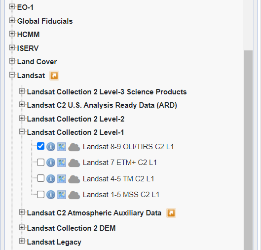
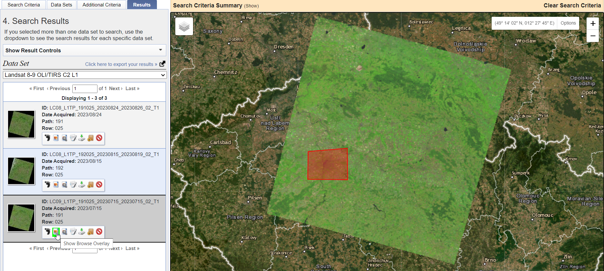
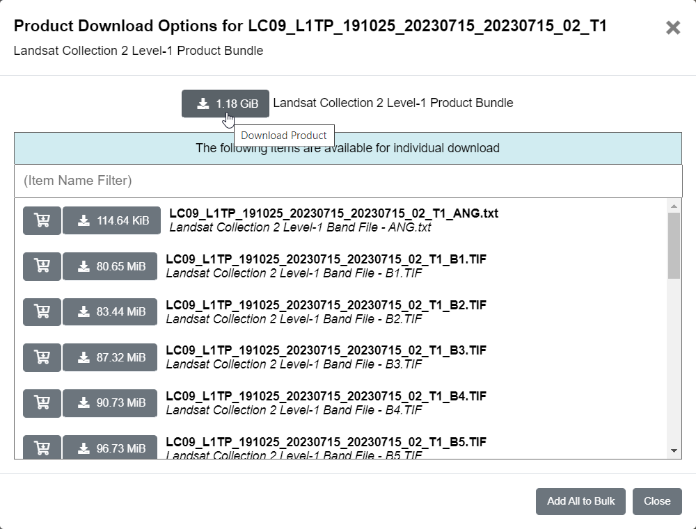

# Analýza tepelných ostrovů pomocí dat Landsat

## Cíl cvičení

- Seznámit se s daty Landsat
- Umět analyzovat tepelné ostrovy

## Základní pojmy

- **LST** - Land surface temperature - radiační teplota zemského povrchu měřená ve směru senzoru

### Program Landsat

Program Landsat je nejdéle probíhající projekt zaměřený na pozorování Země. Scény zobrazující zemský povrch poskytuje nepřetržitě již od roku 1972. Během více než padesáti let bylo postupně vypuštěno devět družic s názvy Landsat 1 až Landsat 9. V současné době jsou aktivní družice Landsat 8 a Landsat 9. Program společně řídí agentury <a href="https://www.nasa.gov/" target="_blank"> **NASA**</a> a <a href="https://www.usgs.gov/" target="_blank"> **U.S. Geological Survey**</a>. Veškerá data jsou volně dostupná. Více o historii, současnosti i budoucnosti programu Landsat se můžete dozvědět na následujích webových stránkách:

[:material-open-in-new: Landsat Satellite Missions](https://www.usgs.gov/landsat-missions/landsat-satellite-missions){ .md-button .md-button--primary .button_smaller target="_blank"}
{: align=center style="display:flex; justify-content:center; align-items:center; column-gap:20px; row-gap:10px; flex-wrap:wrap;"}

{: style="margin-bottom:0px;" align=center }
<figcaption>Mise Landsat</figcaption>

<iframe width="560" height="315" src="https://www.youtube.com/embed/7XKVSTX1vdE?si=HvOfNrfjRDOqKuzn" title="YouTube video player" frameborder="0" allow="accelerometer; autoplay; clipboard-write; encrypted-media; gyroscope; picture-in-picture; web-share" allowfullscreen></iframe>

[:material-open-in-new: youtube.com Landsat: Celebrating 50 Years (Extended Edition)](https://www.youtube.com/watch?v=gfUYFPWYwXI){ .md-button .md-button--primary .url-name target="_blank"}
{: align=center style="display:flex; justify-content:center; align-items:center; column-gap:20px; row-gap:10px; flex-wrap:wrap;"}

### Landsat 8/9

V rámci tohoto cvičení budeme pracovat s daty z jedné z těchto dvou družic. Obě družice nesou téměř identické vybavení s tím, že přístroje na Landsatu 9 jsou vylepšenými replikami přístrojů družice Landsat 8. Na obou družicích najdeme tedy dva senzory (OLI, resp. OLI-2 a TIRS, resp. TIRS-2). OLI je zkratkou pro **Operational Land Imager**, který snímá 8 spektrálních pásem a jedno pásmo panchromatické. TIRS je zktratkou pro **Thermal Infrared Sensor**, který měří tepelné záření vyzařované zemským povrchem ve dvou termálních infračervených pásmech.

<iframe width="560" height="315" src="https://www.youtube.com/embed/1DLDjxpPElA?si=5CCyCYFM_ArWyZ9o" title="YouTube video player" frameborder="0" allow="accelerometer; autoplay; clipboard-write; encrypted-media; gyroscope; picture-in-picture; web-share" allowfullscreen></iframe>
<iframe width="560" height="315" src="https://www.youtube.com/embed/DGE-N8_LQBo?si=Ofntz4jPTBGPvdi8" title="YouTube video player" frameborder="0" allow="accelerometer; autoplay; clipboard-write; encrypted-media; gyroscope; picture-in-picture; web-share" allowfullscreen></iframe>

[:material-open-in-new: youtube.com Landsat: Landsat 9: Continuing the Legacy)](https://www.youtube.com/playlist?list=PL_8hVmWnP_O3WFxfAa_xBlsmGq87HMhFW){ .md-button .md-button--primary .url-name target="_blank"}
{: align=center style="display:flex; justify-content:center; align-items:center; column-gap:20px; row-gap:10px; flex-wrap:wrap;"}

Jednotlivá pásma Landsat 8 a 9 shrnuje následující tabulka:

{ style="height:558px;"}
{: style="margin-bottom:0px;" align=center }

## Stažení dat Landsat

Data Landsat budeme stahovat z portálu <a href="https://earthexplorer.usgs.gov/" target="_blank"> **USGS EarthExplorer**</a>, kde je potřeba se nejprve zaregistrovat. Registraci provedeme přes tlačítko ***Login*** v pravé horní části webových stránek (vlastní zkušenost ukázala, že registrace zde není zrovna nejjednodušší proces).

{: style="margin-bottom:0px;" align=center }

Když se nám podařilo se zaregistrovat, můžeme přejít k vybrání oblasti, ze které budeme chtít data stáhnout. Cílem tohoto cvičení je analyzovat tepelné ostrovy, takže si najdeme nějaké větší město kdekoliv na světě. Následně si naše území vyznačíme obyčejným klikáním do mapového okna.

{: style="margin-bottom:0px;" align=center }

Zároveň si ve spodní části záložky **Search Criteria** nastavíme ***Date Range*** na období letních měsíců a ***Cloud Cover*** na nějakou rozumnou hodnotu (chceme ideálně bezoblačnou scénu).

{ style="height:350px;"}
{ style="height:161px;"}
{: .process_container}

Dále se přepneme do záložky **Data Sets**, kde zvolíme, jaká data budeme chtít stahovat. V našem případě zvolíme **Landsat** → **Landsat Collection 2 Level-1** → **Landsat 8-9 OLI/TIRS C2 L1**. Jedná se o data bez atmosferických korekcí, která pro analýzu povrchové teploty budeme potřebovat.

{ style="height:405px;"}
{: style="margin-bottom:0px;" align=center }

Záložku **Addittional Criteria** můžeme přeskočit a rovnou se přepnout do záložky **Results**. Zde si již můžeme vybrat jednu z nabízených scén. Pomocí funkce ***Show Browse Overlay*** se můžeme podívat, jak dobře se daná scéna s naším uzemím překrývá.

{: style="margin-bottom:0px;" align=center }

Pokud jsme se scénou spokojeni, klikneme na ikonu ***Download Options***. Zde si zvolíme, jaké soubory chceme stahovat. V našem případě si stáhneme všechny soubory. Klikneme tedy na ***Product Options*** a stáhneme si celou Landsat kolekci.

{: .off-glb .process_icon}

{: .off-glb .process_icon}

{: .process_container}

K *Level 1* produktu si nicméně stáhneme i *Level 2* produkt (pokud je k dispozici). V záložce **Data Sets** stačí jen změnit data na **Landsat** → **Landsat Collection 2 Level-2** → **Landsat 8-9 OLI/TIRS C2 L2** a poté kliknout zpátky do **Results**, kde si vybereme korespondující scénu s *Level 1* produktem. *Level 2* produkt v sobě má již pásmo odpovídající ***Land Surface Temperature***. K jeho hodnotám se ale došlo trochu jinak, než jak k nim dojdeme my. V závěru cvičení můžeme ale naše výsledky s již předzpracovaným pásmem porovnat.

## Otevření a zobrazení dat

Pokud jsme stahovali všechna data najednou (a ne třeba jen vybraná pásma), tak jsme data obdrželi ve formátu *TAR*. Jedná se o podobný formát jako *ZIP*, ale nedochází zde ke kompresi. Data v tomto formátu lze rozbalit např. pomocí nástroje <a href="https://www.7-zip.org/" target="_blank"> **7-Zip**</a>.

{ style="height:359px;"}
{: style="margin-bottom:0px;" align=center }

Po rozbalení dat si do ArcGIS Pro nahrajeme pásma B2, B3 a B4 a vytvoříme si z nich RGB kompozit pomocí funkce [:material-open-in-new: Composite Bands](https://pro.arcgis.com/en/pro-app/latest/tool-reference/data-management/composite-bands.htm){ .md-button .md-button--primary .button_smaller target="_blank"}.

{: style="margin-bottom:0px;" align=center }

## Výpočet povrchové teploty